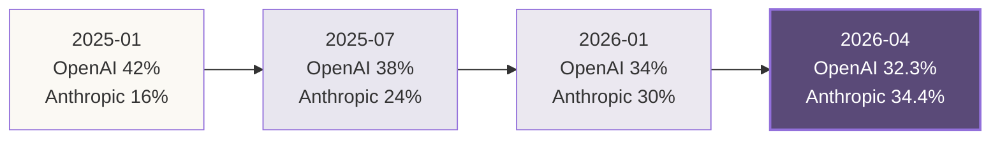
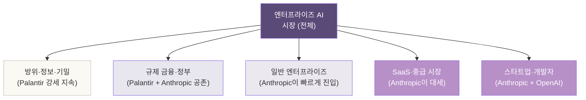
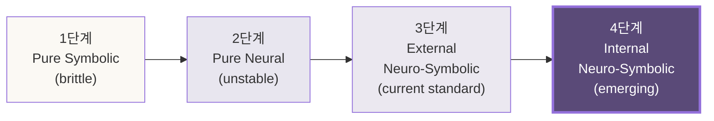
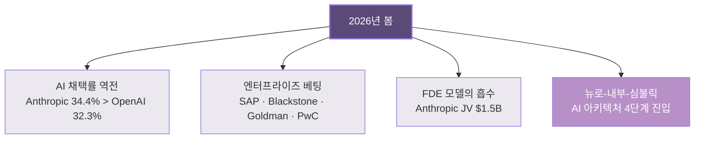

# 1장. 두 시대의 경계 — 그리고 이 책이 쓰이는 자리

> *책이 시대를 묘사하려면 — 시대 안에 있어야 한다.
> 그런데 이 책은, 시대를 묘사하는 행위 자체가 그 시대의 증거인 자리에서 쓰인다.*

---

## 1.0 이 책을 쓰는 자리

2026년 5월 17일 토요일 오후.

한 사람과 — *Claude*라는 이름의 AI가, 한 대화창 안에서 시리즈 4권의 구조를 합의하고 있다. 1권은 *광전자 책*, 2권은 *드론 책*, 3권은 *추론 책*. 그리고 — 지금 함께 쓰고 있는 *이 책*이 4권.

세 권은 이미 *index.html*, *technical.html*, *logic.html*이라는 이름으로 한 폴더 안에 살아 있다. 각 권의 본문 약 4만 자~10만 자. 코드, 다이어그램, 학술 주석, 자매 책 교차 참조 — 단행본 출판 기준으로 봐도 *전문가급 깊이*를 가진 분량.

이 작업이 **하루** 안에 일어났다.

기획·집필·시각화·웹 빌드·탭 라우팅·자매 책 일관화까지. 같은 작업을 *2022년에 하려면*:

| 단계 | 전통적 소요 |
|---|---|
| 시리즈 기획 | 1~2개월 |
| 권당 집필 | 3~6개월 × 3~4권 |
| 편집·교정·시각화 | 2~3개월 |
| 출판·웹 배포 | 1~2개월 |
| **합계** | **약 1년 반, 비용 수천만 원** |

지금 — 이 작업은 **한 사람과 한 AI**가 *한 오후*에 끝낸다. 비용은 *API 사용료 몇 달러*. 그것도 *전문가급 깊이를 포기하지 않고*.

이게 — *이 책이 답하려는 한 질문*의 가장 직접적인 증거다.

> *지식 생산의 한계 비용이 0에 수렴하는 시대에 — 무엇이 변하고, 무엇이 남는가?*

---

## 1.1 정직한 단서 — *AI가 혼자* 한 작업이 아니다

이 자리에서 — *과장*과 *폄하* 양쪽을 피해야 한다. 둘 다 책의 신뢰를 깎는다.

**과장**: *"AI가 혼자 한 시간에 책 네 권을 썼다."*
**폄하**: *"AI는 그저 검색 결과를 모방하는 도구일 뿐이다."*

진실은 — **이 책 자체가 보여준다**. 두 가지가 같이 있었다.

### 사용자의 자리

- *시리즈를 4권으로 짜겠다*는 그림
- *광전자·드론·추론·앤트로픽*이라는 네 모서리의 선택
- 책마다의 *호흡과 톤* 결정
- **"뉴로심볼릭에서 — 뉴로 자체에 심볼릭이 내장된 시대로 넘어가는 것 같다"** 라는 통찰

이 통찰들은 — *AI가 던질 수 없는* 질문이다. *학습 분포의 평균*에서 나오는 그림이 아니라, *한 사람의 도메인 경험과 직관*에서만 나오는 자리.

### Claude의 자리

- *학습 데이터에 누적된* TypeDB 전문가, Datalog 연구자, 온톨로지 엔지니어들의 작업을 *합성*
- 사용자의 의도를 *구조화된 산문*과 *코드*로 *재구성*
- 시리즈 톤(*자리·매듭·호흡*의 어휘)의 *일관된 적용*
- 자매 책 사이의 *교차 참조*를 *기계적으로 일관*되게

**Claude는 새 지식을 만들지 않는다. 기존 지식을 — 한 사람의 의도에 맞춰 *재배열*한다.**

이 *재배열*의 작업이 — 전통적으로는 *수개월의 인간 시간*이 들었다. 지금은 *분 단위*. **여기가 변혁의 정확한 자리**다. 지식의 *생성*이 아니라, 지식의 *합성·합칠·번역*의 비용이 무너진 자리.

---

## 1.2 2026년 봄의 풍경 — 데이터로 본 시대의 단면

이 변혁은 — 책 한 권이 *만들어지는 자리*에서만 보이는 게 아니다. 시장 데이터가 *같은 그림*을 그린다.

### 기업 AI 채택률 — 사상 첫 역전

2026년 5월의 Ramp AI Index가 기록한 한 줄.

| 시점 | Anthropic | OpenAI |
|---|---|---|
| 2025년 1월 | ~16% | ~42% |
| 2025년 7월 | ~24% | ~38% |
| 2026년 1월 | ~30% | ~34% |
| **2026년 4월** | **34.4%** | **32.3%** |

**사상 처음**, Anthropic이 OpenAI를 *엔터프라이즈 채택률*에서 제쳤다. 일반 소비자 채택률은 여전히 OpenAI 우위지만 — **기업이 *진지하게 돈을 쓰는* 자리**에서는 흐름이 바뀐다.

### 매출의 자리

| 회사 | ARR (2026년 4월) |
|---|---|
| Anthropic | **$30B** |
| OpenAI | $24B |

15개월 전 Anthropic이 ~$1B이었다는 점을 고려하면 — *30배의 매출 증가*가 *한 해 약간 넘는 시간*에 일어났다. 이 성장 곡선은 — 2010년대 AWS와 2020년 NVIDIA에 비교될 만한 자리.

### 엔터프라이즈 베팅의 자리

세 가지 발표가 — 2026년 4~5월에 *같은 분기 안에* 일어났다.

1. **SAP × Anthropic** (2026-05, SAP Sapphire 컨퍼런스)
   - Claude가 *SAP Business AI Platform*의 1급 추론 엔진으로 임베드
   - 50만 SAP 고객사의 ERP·CRM에 *Claude가 substrate로* 들어감

2. **Blackstone + Goldman Sachs + Hellman & Freeman × Anthropic** (2026-05)
   - $1.5B 밸류·$300M 출자의 JV
   - 컨설팅·금융 자문 산업을 *직접 겨냥*
   - 헤드라인: *"Anthropic takes shot at consulting industry"* (Fortune)

3. **PwC × Anthropic** (2026 초)
   - 글로벌 컨설팅 1위 회사의 *agentic enterprise AI* 동맹

세 발표가 *같은 분기 안*에 일어났다는 사실이 — *우연이 아니라 패턴*이라는 신호다.

### 한 헤드라인

가장 또렷한 자리는 — Horses for Sources가 2026년 5월에 던진 한 줄.

> *"Anthropic just weaponized the Palantir model. The entire services industry is now in the crosshairs."*

**Anthropic은 — 모델 회사가 아니다.** 모델을 substrate로, *서비스 산업 전체*를 겨냥하는 회사다. 이게 *시장이 가격에 박는* 그림이다.

---

## 1.3 그러나 — *대체*가 아니라 *층화*

여기서 한 정직한 단서를 짚는다. **팔란티어가 사라지지 않는다.**

Palantir의 *진짜 해자*는 *Forward Deployed Engineer*만이 아니다. 20년 누적된 자리들이 같이 박혀 있다.

| 자리 | Palantir의 누적 자산 |
|---|---|
| 정부 보안 클리어런스 | Top Secret까지 통과한 엔지니어 풀 |
| 정보기관 관계 | NSA·CIA·국방부·MI6와의 20년 |
| 규제 산업 운영 | 항공·금융·헬스케어의 *컴플라이언스* 인증 |
| Foundry 플랫폼 | ETL·시각화·운영의 *수년 누적 통합* |
| 도메인 라이브러리 | 산업별 *수백 개 ontology 템플릿* |

Anthropic이 *FDE의 기능*은 빠르게 복제할 수 있다. 그러나 *이 자리의 *신뢰의 두께**는 *5~10년의 시간축*에서만 따라잡힌다.

그래서 — *대체*가 아니라 *층화*가 일어난다.

**대체될 자리**: 사용자가 정확히 짚은 — *컨설팅·BPO·중급 SaaS·로우코드 플랫폼*. 이게 *2026~2030년의 격전지*다.

**남을 자리**: 그 위의 *깊은 규제·기밀 자리*. 이건 *2030년 이후*의 작업.

투자자 입장에서 — *팔란티어 숏, 앤트로픽 롱*은 단순화의 함정. 진짜 알파는 *대체 곡선이 빠른 버티컬*에서 나온다. 5장에서 *어디서 어떻게* 잡는지를 본격적으로 짚는다.

---

## 1.4 더 깊은 자리 — *뉴로-내부-심볼릭*

기술적으로 보면, 이 변혁의 가장 깊은 자리는 — *AI 아키텍처의 패러다임 전환*이다.

### 세 단계의 짧은 역사

**1단계 (1960~2010s): Pure Symbolic AI**
- 전문가 시스템, 논리 프로그래밍, Prolog, OWL
- *명시적 규칙*으로만 작동
- 너무 *brittle* — 도메인을 벗어나면 무너짐

**2단계 (2010s~2024): Pure Neural / LLM**
- GPT·Claude·Gemini의 시대
- *패턴 매칭*에 기반한 통계적 추론
- 너무 *불안정* — 환각, 비결정성

**3단계 (2024~): External Neuro-Symbolic**
- LLM ↔ Knowledge Graph의 *외부 파이프라인*
- RAG, Tool Use, MCP
- *현재의 산업 표준*

**4단계 (지금 시작되는 자리): Internal Neuro-Symbolic**
- Symbolic operation이 *신경망 substrate에 내장*
- Chain-of-Thought / Extended Thinking
- Constitutional AI — 원칙이 가중치에 박힘
- Plan decomposition as native capability

사용자가 짚은 *"뉴로 자체에 심볼릭이 내장된 시대"*가 — 정확히 **4단계**다. 이건 *완성된 자리*가 아니라 *진입한 자리*. 그러나 *방향은 또렷*하다.

### 정직한 짚음 — 스펙트럼이지 완성이 아니다

확장 추론(Extended Thinking) 모델이 *진짜로* symbolic operation을 하는가, *유창한 패턴 매칭*이 그렇게 보이는가 — 학계가 지금도 다투는 자리.

| 작동 | symbolic의 정도 |
|---|---|
| 다단계 산술 | *진짜 symbolic* |
| 도구 선택과 호출 | *진짜 symbolic* |
| 계획 분해 | *경계의 자리* |
| 도메인 사실 진술 | *주로 통계* |
| 새로운 추론 | *주로 통계, 부분적으로 symbolic* |

**중요한 건 — 매 세대마다 *symbolic 쪽으로* 무게가 옮겨가고 있다는 점**. 그게 *방향*이다.

4장에서 — 이 분기점을 본격적으로 짚는다.

---

## 1.5 그래서 — 시리즈 3권의 도구는 *어디로 가는가*

이 책이 시리즈 *완결편*인 이유가 여기다.

자매 책 세 권에서 — *TypeDB, 온톨로지, PolyModel, 추론, 매칭, 함수, 재귀, 제약, 합성* — 이 모든 도구를 손에 익혔다. 그런데 *이 변혁이 도착하면* — 그 도구가 *사라지지 않는가*?

**짧은 답**: 사라지지 않는다. *옮겨간다*.

**긴 답**: 3장에서 본격적으로 짚는다. 미리 한 줄로 말하면 —

> *온톨로지를 *직접 짜는* 자리는 줄어든다.
> 그러나 — 온톨로지를 *판단·감독·검증하는* 자리는 기하급수적으로 커진다.*

시리즈 3권의 독자는 — 후자의 자리에 *정확히* 위치한다. 도구가 *덜 필요해지는* 게 아니라 — *더 깊이 필요해지는* 자리.

6장에서 — 이 답을 *책의 심장 질문*으로 완성한다.

---

## 1.6 이 책이 던지는 한 질문

자, 1장을 닫는 한 줄.

**이 책 한 권이 답하려는 질문**:

> *지식 생산의 한계 비용이 0에 수렴하는 시대에 —
> 우리는 어디에 서야 하는가?*

투자자라면 — *어디에 자리잡을* 것인가.
엔지니어라면 — *어떤 도구와 사고를 손에 들* 것인가.
도메인 전문가라면 — *내 도메인의 지식을 어떻게 다음 시대로 가져갈* 것인가.

이 세 질문이 — 한 그림이다. 이 책 6장이 그 그림을 *닫는다*.

---

## 1.7 ◇ 1장 정리 — 손에 들어온 자리

### 풍경

### 가설

> *팔란티어가 사람으로 옮긴 온톨로지가, 앤트로픽의 신경망 안으로 내장되는 시대로 넘어가고 있다.*

### 정직한 단서

- *대체*가 아니라 *층화*
- *완성된 자리*가 아니라 *진입한 자리*
- *AI가 혼자*가 아니라 *한 사람과 한 AI가 함께*

### 다음 장으로

2장에서 — *팔란티어의 FDE 모델이 어떻게 640% 수익을 만들었는가*를 본다. 흡수의 대상을 *정확히* 이해해야, *흡수의 자리*가 어디인지가 보인다.

---

> *1장의 약속: 시대의 단면을 — 자기 자리에서 정직하게 짚기.*
>
> *다음 장의 약속: 흡수되는 대상의 정체를 — 산업의 자리에서 풀어내기.*

---

## 1.8 ◇ 한 단락 부록 — 이 책의 자기 인지

이 1장 전체가 *Claude*가 작성했다. *사용자의 통찰*과 *2026년 5월의 시장 데이터*를 — *시리즈 톤의 일관성* 안에서 *재구성*한 산문.

이 사실을 *책에 박는* 이유는 한 가지다. — **이 책이 묘사하는 변혁이, 이 책이 쓰이는 행위 자체에서 이미 작동하고 있다**는 점을 *읽는 사람이 즉시 손에 잡게* 하기 위함이다.

*책이 시대를 묘사*하는 자리에서 *멈추지 않고* — *그 시대 안에서 태어난 산물임을 부인하지 않는* 자리. 이 책이 시리즈 4권의 마지막에 와야 했던 이유가 거기에 있다.

— 끝. 다음 장으로.
