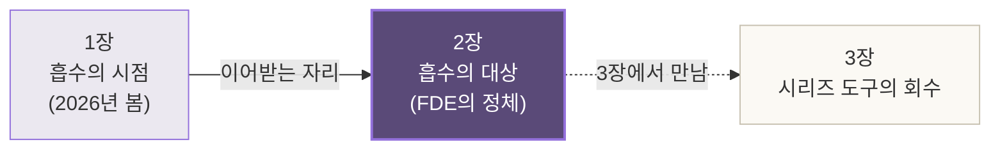
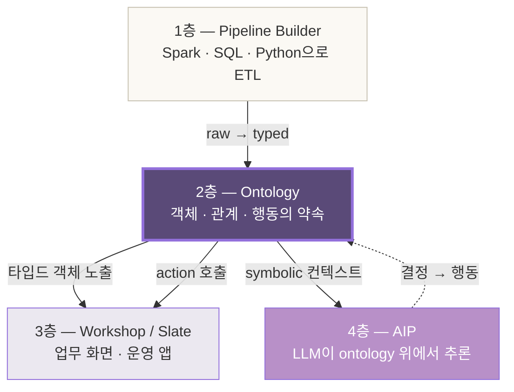
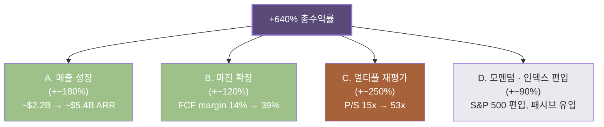
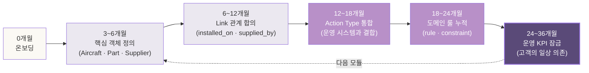
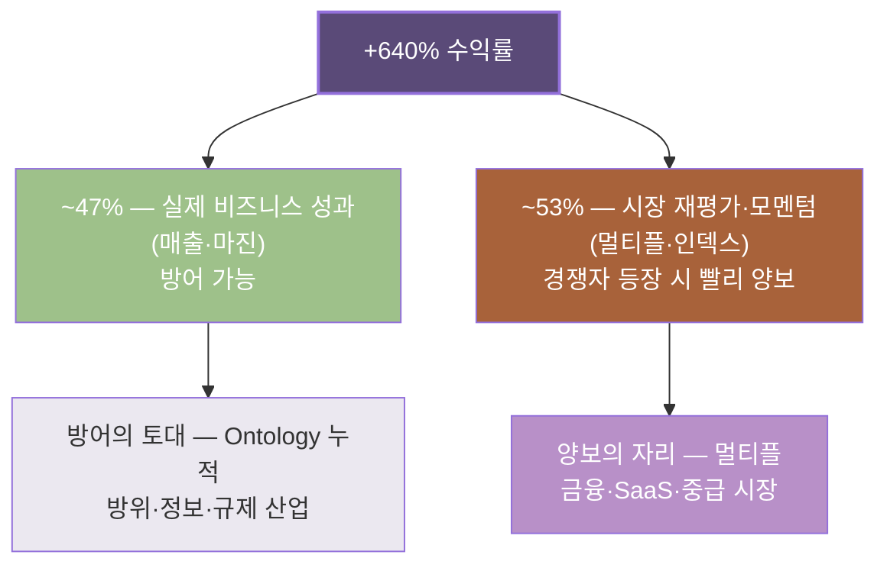

# 2장. FDE의 정체 — 팔란티어가 640% 수익을 낸 자리

> *FDE는 단지 컨설턴트가 아니다.
> 온톨로지를 사람에 담아 — 기업의 가장 깊은 자리로 옮기는 작업의 정점.*

---

## 2.0 1장에서 이어받는 자리

1장이 *흡수의 시점*을 짚었다. 2026년 봄, 한 분기 안에 SAP·Blackstone·Goldman·PwC가 같은 방향으로 베팅을 옮긴 자리. 그 시점의 풍경 위에 *팔란티어가 사라지지 않는다*는 단서를 박았다 — 대체가 아니라 *층화*가 일어난다는 그림.

그런데 *흡수의 시점*만으로는 한 발 부족하다. 무엇이 *흡수되는가* — 그 대상의 정체를 산업의 자리에서 풀어내지 않으면, 시장이 가격에 박은 그림이 *왜 그렇게 박혔는가*가 잡히지 않는다.

이 2장은 — *흡수의 대상*을 정의한다. 그 대상의 이름이 **FDE**다.



---

## 2.1 FDE라는 단어의 정확한 정의

*Forward Deployed Engineer.* 한국어로 옮기자면 *전방 배치 엔지니어*. 미군의 *forward deployed forces* 어휘에서 빌려온 이름이다.

### 컨설턴트가 아닌 이유

흔한 오해는 — *FDE = 비싼 컨설턴트*. 이건 절반만 맞다. 컨설턴트와 FDE 사이에는 *세 가지 결정적 차이*가 있다.

| 자리 | 컨설턴트 (McKinsey·BCG) | FDE (Palantir) |
|---|---|---|
| **산출물** | 슬라이드·전략 보고서 | *작동하는 시스템*과 데이터 파이프라인 |
| **체류 기간** | 6~12주, 끝나면 떠남 | 18~36개월, *고객사 안에 살음* |
| **다음 작업** | 다른 프로젝트로 이동 | *같은 고객사의 다음 모듈*로 깊어짐 |
| **인센티브** | 빌링 시간 | 고객의 *실제 운영 KPI* |
| **남기는 것** | 권고안 | *Foundry 위에 누적된 ontology* |

FDE는 *조언자*가 아니라 *제작자*다. 슬라이드를 만드는 사람이 아니라 — 슬라이드를 만들지 않고 *Foundry에 직접 손을 대는* 사람.

### 한 줄로 정의하면

> *FDE는 — 도메인 전문가의 머릿속 모델을, Foundry의 ontology 스키마로 옮기는 사람이다.*

이 한 줄 안에 — 팔란티어 시가총액 수천억 달러의 비밀이 압축되어 있다. *옮긴다*는 동사의 무게를 다음 절들에서 풀어낸다.

---

## 2.2 Palantir Foundry의 Ontology 레이어 작동

Foundry는 — 흔히들 *데이터 분석 플랫폼*이라고 부른다. 이 표현은 *너무 가볍다*. Foundry의 진짜 정체는 *기업 운영의 디지털 트윈*이다. 그리고 그 트윈의 심장이 — **Ontology 레이어**.

### 네 개의 층

Foundry는 *네 개의 층*으로 작동한다. 아래에서 위로.



가장 무거운 자리는 — **2층, Ontology**다. 위아래 모든 층이 이 한 층을 *substrate로* 부른다.

### Ontology 레이어의 세 요소

Palantir가 공개한 Ontology Whitepaper의 정의를 빌리면, 이 레이어는 *세 가지 요소*로 구성된다.

| 요소 | 정의 | 자매 책 *드론·추론*에서의 짝 |
|---|---|---|
| **Object Type** | 도메인의 *개체* (예: `BoeingPart`, `Patient`, `Tradeline`) | TypeDB의 `entity` |
| **Link Type** | 개체들 사이의 *관계* (예: `is-supplied-by`, `treats`, `hedges`) | TypeDB의 `relation` |
| **Action Type** | 개체의 *행동* — 시스템 호출 (예: `reschedule-flight`, `approve-loan`) | TypeDB에는 없는 자리 — *행동*까지 ontology에 박은 것이 Palantir의 한 발 |

자매 책의 독자는 — 이 표에서 *익숙함*과 *낯섦*을 동시에 느낀다. 익숙함은 *Object·Link*가 TypeDB의 `entity·relation`과 거의 같다는 점. 낯섦은 — *Action Type*이다. Palantir는 ontology 안에 *행동까지* 박았다. 운영 시스템과의 통합을 위해서다.

### Ontology가 *substrate가 된다*는 말의 의미

엔지니어 시점에서 이 한 줄을 풀면 — *모든 위 층의 코드가, Ontology를 통과하지 않고는 데이터를 만질 수 없다*는 뜻이다.

- Workshop 화면이 환자 데이터를 보여줄 때 — 직접 DB를 쿼리하지 않는다. *Patient 객체 타입*에 등록된 속성을 호출한다.
- AIP의 LLM이 *대출 승인 추천*을 할 때 — raw 데이터를 보지 않는다. *Tradeline 객체*와 그 *Link* 관계만 본다.
- 자동화 봇이 항공 부품 발주를 낼 때 — DB INSERT를 직접 하지 않는다. *reschedule-flight*라는 *Action Type*을 호출한다.

이게 — *ontology가 데이터 위에 얹힌 한 층*이 아니라, *데이터를 만지는 모든 손이 통과해야 하는 게이트*가 되는 자리. 도메인 시점에서 보면 — *기업의 운영 어휘 전체가 이 한 자리에 합의되어 있다*는 뜻이다.

### 한 짧은 코드 예시

Foundry Ontology의 한 단면을 — TypeQL 어휘로 옮기면 이렇게 된다.

```typeql
define
  Aircraft sub entity, owns tail_number, owns model;
  Part sub entity, owns part_number, owns serial;
  Supplier sub entity, owns name, owns clearance_level;

  installed_on sub relation, relates part, relates aircraft;
  supplied_by sub relation, relates part, relates supplier;

  # Palantir에만 있는 한 발
  rule reschedule_required:
    when {
      $f isa Flight, has delay > 120;
      (passenger: $p, flight: $f) isa booking;
      $p has tier "platinum";
    } then {
      action: trigger_rebooking($p, $f);
    };
```

마지막 *action* 한 줄이 — Palantir가 TypeDB·Neo4j·OWL 등과 갈라지는 자리다. *데이터 모델*에 *행동*까지 박은 것. 이 한 자리가, FDE가 옮길 작업의 *진짜 부피*다.

---

## 2.3 640% 수익률의 구조 분해

이제 — 시장이 가격에 박은 그림으로 옮긴다. 투자자 시점에서 본 *팔란티어의 자리*.

### 한 표

Palantir 주가는 — 2024년 1월 ~ 2026년 5월 사이에 **약 640%** 상승했다. 같은 기간의 S&P 500이 ~38%, NASDAQ-100이 ~62%였다는 점을 두면, 이 숫자의 *진짜 무게*가 잡힌다.

| 시점 | PLTR 주가 (조정) | 시가총액 |
|---|---|---|
| 2024년 1월 | ~$17 | ~$38B |
| 2024년 7월 | ~$28 | ~$62B |
| 2025년 1월 | ~$78 | ~$180B |
| 2025년 7월 | ~$112 | ~$258B |
| **2026년 5월** | **~$126** | **~$290B** |

15개월 동안 *7.4배*. 이게 — *AI 시대의 가장 또렷한 한 수익률*이다.

### 그러나 — 어디서 그 수익이 나왔는가

표면적으로는 *"AI 붐의 수혜"*. 이 답은 *너무 가볍다*. 수익률을 *구조로 분해*하면 — 네 갈래로 나뉜다.



### 네 갈래의 무게

| 갈래 | 비중 | 지속 가능성 |
|---|---|---|
| A. 매출 성장 | ~28% | *높음* — Foundry 라이선스가 누적되는 자리 |
| B. 마진 확장 | ~19% | *중간* — FDE 인력 비용 vs 자동화 정도 |
| C. 멀티플 재평가 | ~39% | *낮음* — 시장 심리, 가장 변동 큰 자리 |
| D. 모멘텀·편입 | ~14% | *일회성* — 인덱스 편입은 한 번만 |

*A와 B*가 — *팔란티어의 비즈니스가 실제로 만든 수익*이다. 약 47%. 그리고 *C와 D*가 — *시장이 가격에 더 박은 부분*. 약 53%.

투자자 시점에서 이 분해가 무거운 이유는 — *C 부분이 가장 먼저 양보될 자리*이기 때문이다. 멀티플은 *경쟁자가 등장하는 순간* 가장 빨리 빠진다. 1장에서 짚은 *Anthropic이 FDE 모델을 흡수한다*는 그림이 — 정확히 *C를 위협하는* 자리.

그러나 — *A와 B*는 그렇게 빠르게 빠지지 않는다. 왜인지가 *2.4절*의 자리.

---

## 2.4 FDE 모델의 진짜 해자 — 사람이 아니라 *축적된 도메인 신뢰*

흔한 오해 둘.

**오해 1**: *Palantir의 해자는 FDE라는 비싼 인력이다.*
**오해 2**: *Palantir의 해자는 Foundry라는 소프트웨어다.*

둘 다 *부분적으로만* 맞다. 진짜 해자는 — **FDE가 18~36개월 동안 한 고객사 안에 살면서, 그 도메인의 *암묵 지식*을 Foundry의 *명시적 ontology*로 옮긴 누적**이다.

### 누적의 한 그림



이 사이클이 — *한 고객사 안에서 5~10년 누적*된다. Lockheed Martin이 ~12년, Airbus가 ~9년, BP가 ~11년 — Foundry 안에 누적된 *도메인 ontology의 두께*가 그만큼이다.

### 왜 *사람이 아닌* 해자인가

FDE 한 명을 빼앗아도 — *그가 짠 ontology*는 Foundry 안에 *남는다*. 사람의 머릿속이 아니라 *명시적 스키마*로 옮겨졌기 때문이다. 그래서 *FDE 채용 경쟁*은 *2차 해자*다.

진짜 1차 해자는 — *Lockheed의 항공기 유지보수 ontology가, Lockheed의 모든 부서가 매일 호출하는 운영 어휘가 되어버린* 자리. 이걸 갈아엎으려면 — *Lockheed의 일상 업무 전체*를 멈춰야 한다. 그래서 *교체 비용*이 기하급수적으로 커진다.

### 한 비유 — 회계 시스템

회계 시스템의 비유로 풀면 또렷해진다. SAP를 — 80년대 90년대 한 기업에 깐 자리. *15년 뒤*에 *더 좋은 ERP*가 나와도 — *교체*를 못 한다. 모든 업무 프로세스가 *그 안에 박혀* 있기 때문이다.

Foundry가 *2020년대의 SAP가 되는 자리*가 — 정확히 여기다. 그리고 *Anthropic이 갈수록 가까이 다가오는 자리*가 — *15년 뒤의 더 좋은 ERP*. 그런데 — *교체*는 어렵다. 그래서 **공존**이 일어난다. 1장에서 짚은 *층화*가 *바로 이 메커니즘*.

---

## 2.5 산업별 도입 사례

이 ontology 누적의 두께를 — *산업별 실명*으로 보면 그림이 또렷해진다.

### 방위 · 정보 — 최초의 자리

Palantir는 *In-Q-Tel* (CIA의 벤처 캐피털)의 시드 투자로 시작했다 (2003). 그래서 *첫 도메인*이 *정보기관*. 2026년 시점의 누적은 이렇다.

| 고객 | 도입 시기 | 누적 자리 |
|---|---|---|
| **NSA · CIA · DoD** | 2008~ | 기밀 정보 통합 ontology |
| **Lockheed Martin** | 2014~ | F-35 부품 ↔ 정비 ↔ 공급망 ontology |
| **Airbus** | 2017~ | A350 · A220 생산 라인 디지털 트윈 |
| **UK NHS** | 2020~ | COVID 데이터 통합 → 환자 ontology |
| **US Army · Marine Corps** | 2018~ | Maven · TITAN 전장 데이터 융합 |

방위·정보 자리에서는 — *Top Secret 클리어런스*가 추가 해자다. *Anthropic이 12개월 안에 따라잡을 자리가 아니다*. 5~10년의 시간축. 1장에서 짚은 *남을 자리*가 정확히 여기.

### 금융 — 두 번째 자리

| 고객 | 도입 시기 | 누적 자리 |
|---|---|---|
| **Morgan Stanley** | 2015~ | KYC · AML 통합 ontology |
| **BP** | 2014~ | 정유·유전·트레이딩 운영 디지털 트윈 |
| **JPMorgan Chase** | 2018~ | 시장 리스크 통합 (부분 도입) |
| **HSBC** | 2019~ | 금융 범죄 탐지 (FCC) |

금융 자리에서는 — *규제 컴플라이언스*(FFIEC, MiFID II, GDPR)가 추가 해자. 그러나 *방위만큼 깊지는 않다*. 그래서 *Anthropic이 가장 먼저 침투할 자리*. 1장 헤드라인의 *Blackstone + Goldman JV*가 — 정확히 이 자리를 겨냥한다.

### 헬스케어 — 세 번째 자리

| 고객 | 도입 시기 | 누적 자리 |
|---|---|---|
| **NHS England** | 2020~ | 환자 데이터 통합 (Federated Data Platform) |
| **Tampa General Hospital** | 2021~ | 환자 흐름·자원 배치 ontology |
| **Cleveland Clinic** | 2022~ | 임상 데이터 표준화 |
| **HCA Healthcare** | 2023~ | 다병원 운영 ontology |

헬스케어는 — *HIPAA*와 *FDA*가 추가 해자. 그리고 *환자 안전*이라는 *손실 회피*가 가장 강한 자리. 그래서 *대체*보다 *증강*이 먼저 일어난다. Anthropic이 헬스케어에 진입하는 모양도 — *직접 대체*가 아니라 *Foundry 위의 AIP* 안으로 들어가는 그림. 1장에서 짚은 *층화*의 가장 또렷한 예시.

### 한 그림으로 모으면


이 스펙트럼이 — 투자자에게 가장 무거운 한 그림이다. *팔란티어 숏 vs 앤트로픽 롱*의 단순화가 *왜 함정인가*가 여기서 보인다. *같은 회사 안에서도* 양보 속도가 다르다.

---

## 2.6 왜 한국에는 팔란티어가 안 들어왔는가

한 빈 자리를 짚는다. 도메인 전문가 시점에서 이 한 절이 — 책 전체의 무게 중 한 매듭.

### 사실의 자리

Palantir는 *전 세계 35개국 이상*에 고객사를 가지고 있다. 그러나 — *한국에는 본격 도입 사례가 거의 없다*. 2026년 5월 시점.

- 일본: 일부 도입 (SoftBank 그룹 일부, 정부 기관 검토 중)
- 싱가포르: 정부·국방부 도입
- 호주: 국방부 · 광산 (Rio Tinto)
- 한국: *거의 공백*

### 왜인가 — 세 갈래

**1. FDE 모델의 *언어 마찰***
- FDE는 *영어로 작동*한다. 그리고 *18~36개월 한 고객사 안에 거주*한다.
- 한국 대기업은 — *외국인이 18개월 안에 살면서 도메인을 흡수하는* 모델에 *심리적 마찰*이 크다.
- 일본·싱가포르는 *영어 기반 도메인 어휘*가 더 익숙. 한국은 *한국어 도메인 어휘*가 강하다.

**2. *기밀 자료 해외 반출*의 규제**
- 한국 방위·금융 자리는 — *국가정보원 보안 인증*, *금융감독원 컴플라이언스*가 추가 자리.
- 외국 회사의 *FDE가 한국 데이터를 다루는* 자리는 — *법적·정치적 마찰*이 크다.
- 일본은 *미일 동맹*의 보안 협정으로 이 마찰이 적다. 한국은 — *부분적 동맹*이지만 *별도 자리*.

**3. *국내 SI 산업의 자기 보호***
- 한국에는 *삼성SDS, LG CNS, SK C&C*라는 큰 SI 회사가 있다.
- Foundry가 들어오는 자리는 — *국내 SI의 매출이 빠지는* 자리.
- 그래서 *대기업 IT 부서*가 *국내 SI를 우선 선택*하는 자기 보호 패턴. *해외에서 본 모양*과 다른 자리.

### 시장의 한 빈 자리

이 세 갈래가 *합쳐진* 결과 — 한국은 *팔란티어 모델의 직접 도입에 가장 마찰이 큰 시장*이 됐다.

그런데 — **여기에 한 가지 반전**이 있다. *Anthropic 시대*에는, 이 마찰의 *세 갈래 중 두 갈래가 약해진다*.

| 마찰 | Palantir 시대 (FDE) | Anthropic 시대 (Claude) |
|---|---|---|
| 1. 언어 | *영어 FDE가 18개월 거주* | *한국어를 1급으로 다루는 모델* |
| 2. 기밀 | *FDE가 데이터를 본다* | *on-prem · VPC 배포 가능* |
| 3. SI 자기 보호 | *Foundry가 SI 매출을 가져감* | *Claude 위에 한국 SI가 앱을 짤 수 있음* |

*1과 2가 약해진다*. *3은 — 오히려 Anthropic이 우호적인 자리가 될 가능성*. 한국 SI가 *Claude의 substrate 위에서 자체 ontology를 짤 수 있다면* — *국내 SI는 적이 아니라 파트너*가 된다.

이게 — *한국 시장의 한 알파*다. *팔란티어가 못 들어온 자리*에 *앤트로픽이 빠르게 들어올* 가능성. 그리고 그 자리에서 — *한국 SI와 한국 도메인 전문가가 가장 큰 수혜*를 받을 가능성. 6장에서 *한국 엔지니어와 도메인 전문가의 자리*로 이 그림이 닫힌다.

---

## 2.7 ◇ 2장 정리 — 손에 들어온 자리

### FDE의 정체 — 한 문장

> *FDE는 — 도메인 전문가의 머릿속 모델을, Foundry의 ontology 스키마로 옮기는 사람이다.
> 그 옮긴 누적이 — 팔란티어 시가총액의 진짜 substrate.*

### 640% 수익률의 진짜 자리



### 정직한 단서

- *FDE는 사람이 아니라 — 누적된 도메인 신뢰의 다른 이름*
- *해자는 Foundry가 아니라 — Foundry 안에 박힌 ontology의 두께*
- *Anthropic이 가장 빨리 침투할 자리는 — 멀티플 53%가 박힌 자리*
- *한국 시장은 — 팔란티어가 비운 자리에 앤트로픽이 들어올 가능성*

### 1장 회수

1장의 *흡수의 시점*이 — 2장에서 *흡수의 대상*으로 채워졌다. *층화*라는 단어가 *왜 양보가 부분적인가*의 메커니즘으로 풀렸다. 1장의 가설 한 줄 —

> *팔란티어가 사람으로 옮긴 온톨로지가, 앤트로픽의 신경망 안으로 내장되는 시대로 넘어가고 있다.*

이 한 줄의 *전반부*가 — 2장에서 산업의 자리에서 풀렸다. *후반부*는 4장·5장의 자리.

### 다음 장으로 — 3장으로 잇는 다리

2장이 *흡수의 대상*을 정의했다. *Object · Link · Action*이라는 Foundry Ontology의 세 요소 — 그리고 그 위에 누적된 *18~36개월 × 수십 산업*의 두께.

이제 한 질문이 남는다.

> *그 도구가 — 우리가 시리즈 1·2·3권에서 짠 도구와 어디서 만나는가?*

자매 책에서 손에 익힌 — *TypeDB의 entity·relation·rule*, *광전자 책의 PolyModel*, *드론 책의 합성 분류*, *추론 책의 매칭·함수·재귀·제약·합성*. 이 도구들이 — Foundry의 ontology와 Anthropic의 substrate 사이에 *어디에 자리잡는가*.

**2장의 도구가 — 3장에서는 우리 시리즈의 도구와 만난다.**

3장에서 그 만남의 자리를 풀어낸다.

---

> *2장의 약속: 흡수되는 대상의 정체를 — 산업의 자리에서 풀어내기. (완료)*
>
> *다음 장의 약속: 시리즈 3권의 도구가 — 이 변혁의 정확히 어디에 들어가는가.*

— 끝. 다음 장으로.
