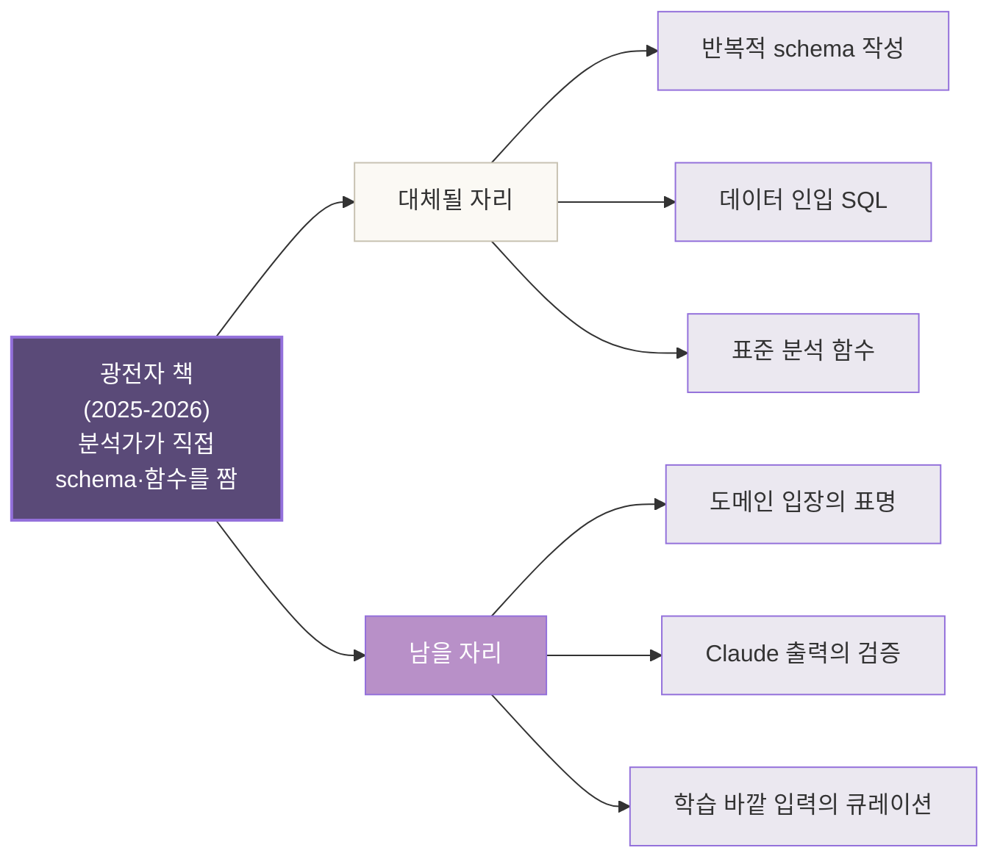
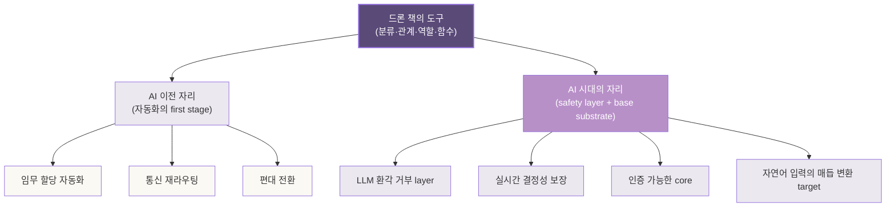
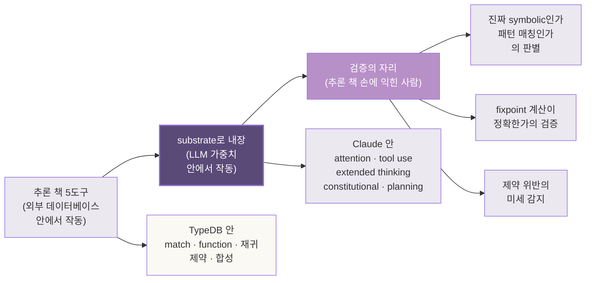
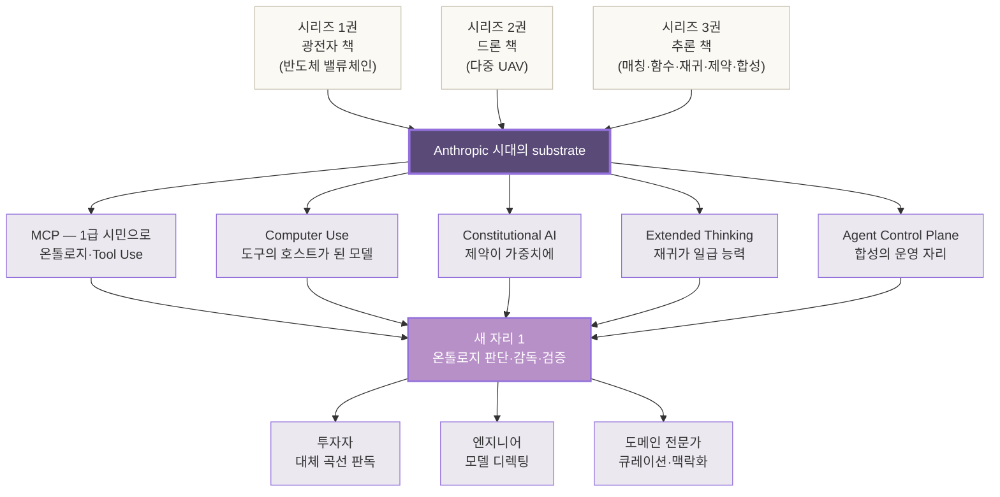
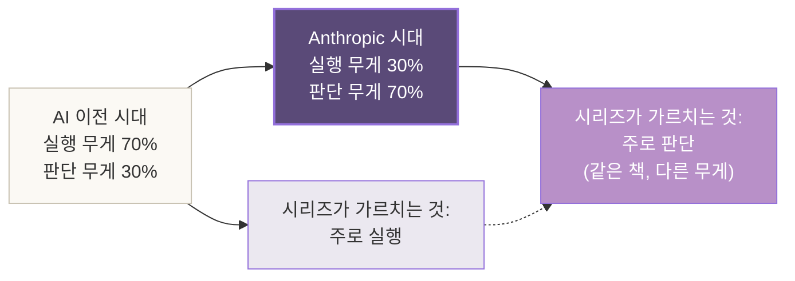
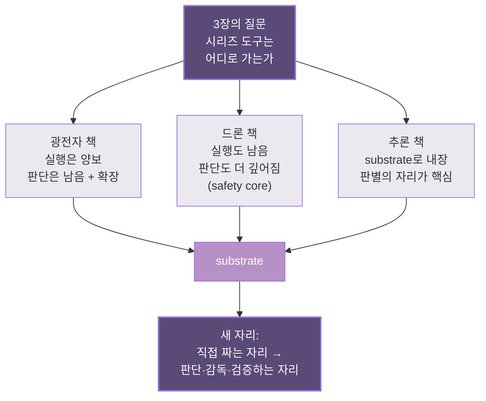

# 3장. 우리가 본 도구들 — 시리즈 3권의 회수

> *시리즈 1·2·3권에서 짠 도구들은 — 이 변혁의 정확히 어디에 들어가는가.
> 도구가 사라지는 것이 아니라 — 자리를 옮긴다.*

---

## 3.0 이 장이 답하는 질문

2장에서 — 팔란티어가 *FDE라는 사람의 자리*에 온톨로지를 담아 옮긴 모델을 보았다. 640%의 수익률이 어디서 나왔는지, 왜 그 모델이 *기업 가치의 정점*을 만들었는지, 그리고 — 왜 그 자리가 *지금* 양보될 수밖에 없는지까지.

이 3장이 답할 질문은 — 그 변혁의 *건너편 자리*에 서 있는 한 가지다.

> **시리즈 1·2·3권에서 짠 도구들은 — 이 변혁이 도착하면 *어떻게 되는가*?**

세 권에서 손에 익힌 TypeDB, 온톨로지, PolyModel, 분류·관계·역할·함수·재귀·제약·합성. 이 모든 도구가 — *Anthropic의 신경망 안으로 내장되는 시대*가 도착하면 *덜 필요해지는가*? 시리즈 독자가 *허탈하게 책을 덮어야* 하는가?

짧은 답은 — **사라지지 않는다**. *옮겨간다*.

긴 답은 — 이 장 전체다.

---

## 3.1 들어가며 — 짧은 회수 한 단락

자매 책 세 권이 짠 도구를 — 한 단락으로 모아본다.

*광전자 책*은 한 분석가의 시점에서 *반도체 밸류체인 온톨로지*를 짰다. NVIDIA가 설계하고 TSMC가 생산하고 ASML이 EUV를 공급하는 — 그 다층 매듭이 *PolyModel의 네 원소*로 어떻게 풀리는지를 24장에 걸쳐 회상했다. *드론 책*은 다중 UAV의 임무 할당·역할 동적 재배치·통신 토폴로지를 한 도메인의 *전체 사이클*로 보였다. 6개 장에 걸쳐 *스키마→데이터→분석 함수→손실 시나리오*가 한 그림으로 닫혔다. *추론 책*은 그 두 권에서 *암묵적으로 작동하던 추론*을 끄집어내, *매칭→함수→재귀→제약→합성*의 다섯 켜로 천천히 풀어냈다.

세 권이 짠 도구의 목록은 짧다. 그러나 — 그 짧은 목록이 *데이터에서 지식으로 가는 한 사이클의 전부*다.

| 권 | 주된 도구 | 도구가 박힌 자리 |
|---|---|---|
| 1권 광전자 | PolyModel 4원소, 회상의 호흡 | 반도체 밸류체인의 다층 매듭 |
| 2권 드론 | 분류·관계·역할·함수 | 다중 UAV 임무 할당의 전체 사이클 |
| 3권 추론 | 매칭·함수·재귀·제약·합성 | 추론이라는 단어의 정확한 무게 |

이 세 권의 도구가 — 지금 *어디로 가는가*를 차례로 본다.

---

## 3.2 *광전자 책*의 회수 — 반도체 밸류체인 온톨로지의 두 자리

먼저 1권. *광전자 책*에서 짠 NVIDIA 향 반도체 밸류체인 온톨로지를 — 2026년 봄의 시점에서 다시 짚는다.

### 이 온톨로지가 *대체될 자리*

광전자 책에서 우리는 다음 같은 매듭들을 짰다.

```typeql
relation supply,
  relates supplier @card(1..1),
  relates customer @card(1..1),
  relates supplied_product @card(1..1),
  owns since_year @card(0..1),
  owns revenue_share @card(0..1);
```

*공급 사건*을 5자리 매듭으로 잡고, *매출 비중*과 *시작 연도*를 속성으로 단 자리. 그 위에서 *NVIDIA의 모든 직간접 공급자*를 재귀 함수로 펼쳤고, *EUV 한 노드가 끊기면 어디까지 전파되는가*를 도출했다.

이 작업이 — *직접 짜는 자리*에서 *대체될 자리*다.

**왜 대체되는가?**

2026년 봄의 Claude 4.7이 할 수 있는 작업의 한 예. 분석가가 자연어로 묻는다.

> *"NVIDIA의 직간접 공급 사슬을 4단계까지 펼치고, 각 노드의 매출 비중과 단일 공급자 리스크를 평가해 줘. SEC 10-K와 최근 6개월 컨퍼런스 콜 발언을 근거로."*

15분 뒤 — Claude가 답한다. 매듭 구조, 재귀 펼침, 리스크 평가, 출처 인용까지. *분석가가 광전자 책의 7장을 짤 때 사용한 사고의 전체 사이클*이 — 한 명령에 들어간다. 그것도 *온톨로지 스키마를 미리 짜둘 필요 없이*. Claude가 *자연어 안에서 매듭을 즉석으로 구성*한다.

이게 *대체*다. 분석가가 *TypeDB schema를 작성하고 데이터를 인입하고 함수를 짜는* 작업 — 그 *직접적인 손의 자리* — 가 *큰 모델 + Tool Use*의 한 호출로 압축된다.

투자자의 시점에서 보면 — 이건 *분석 보고서의 한계 비용*이 무너지는 자리다. 골드만삭스나 모건스탠리의 주니어 애널리스트가 *2주간 작업*해야 했던 산업 보고서가 — *한 오후의 Claude 세션*으로 끝난다. 5장에서 *컨설팅 산업의 흡수*가 본격적으로 짚어지는 이유가 여기다.

### 이 온톨로지가 *남을 자리*

그러나 — *전부*가 대체되지는 않는다. 광전자 책의 도구 중 *남을 자리*는 또렷하다.

**1. 도메인 입장의 표명**

광전자 책 5장에서 분석가는 한 매듭을 짤 때 — *공급 사건을 N항 관계로 잡을지, 2항 관계 두 개로 분해할지* 결정했다. 그 결정이 — 이후 모든 쿼리의 *답의 모양*을 결정했다.

이 결정은 — *학습 분포의 평균*에서 나오지 않는다. *NVIDIA의 매출 분기 보고서를 5년 누적해서 읽어본 한 사람의 직관*에서만 나온다. *공급 사건*을 *시점 있는 매듭*으로 잡아야 *재고 사이클 회전*이 보이고, *매출 비중을 속성으로 달아야* *집중 리스크*가 보인다. 이 입장의 표명이 — Claude가 *알아서* 해주는 자리가 아니다.

대신 — *Claude가 그 입장에 따라 schema를 즉석에서 합성*한다. 분석가의 자리는 *직접 schema를 작성*하는 자리에서, *어떤 schema가 도메인을 정직하게 담는가를 판단하는 자리*로 이동한다.

**2. Claude의 출력을 검증하는 자리**

Claude가 답한 *NVIDIA 공급 사슬 4단계*가 — *진짜 그런가*? 환각이 끼지 않았는가? *Foxlink가 H100의 직접 공급자가 아닌데도 그렇게 답하지 않았는가*?

이 검증의 자리는 — *직접 짜본 사람*만 한다. 광전자 책 24장을 읽은 분석가가 *Claude의 출력에서 매듭의 모양이 흔들리는 자리를 즉시 알아본다*. *역할의 일관성*이 깨지는 자리, *카디널리티가 비논리적으로 박힌 자리*, *재귀가 잘못된 base case에서 끊긴 자리* — 이런 미세 균열을 잡는 눈은 *3장 추론 책의 5장 합성*을 손에 익힌 사람만 가진다.

엔지니어의 시점에서 보면 — 이건 *코드 리뷰의 자리가 자연어 리뷰의 자리로 옮겨가는* 모양이다. *코드를 직접 쓰는 시간*은 줄어들고, *Claude가 합성한 schema를 검토하는 시간*은 늘어난다. 그러나 — *검토의 깊이*는 *직접 짜본 경험*에서 나온다. 광전자 책을 읽은 사람과 읽지 않은 사람의 격차가 — *여기서* 벌어진다.

**3. 입력의 큐레이션**

Claude가 *NVIDIA 공급 사슬*을 답할 때 — 입력은 *학습된 평균*과 *Tool Use로 가져온 SEC 10-K* 두 자리에서 온다. 그런데 — *진짜 가치 있는 신호*는 그 두 곳에 없다. 한국 한 분석가가 *대만 화방의 한 점심자리에서 들은 한 마디*가 — 6개월 뒤 매출 가이던스에 박힌다. 그 한 마디를 — *Claude가 알 길이 없다*.

도메인 전문가의 자리는 — *Claude가 닿지 못하는 입력을 큐레이션하는 자리*다. *어떤 신호가 매듭에 박혀야 하는가*. *어떤 자리가 학습 분포 바깥에 있는가*. 이 큐레이션이 *없으면* Claude의 답은 *평균적인 답*에 머문다. 큐레이션이 *있으면* — *알파가 생기는 자리*가 된다.

### 광전자 책의 두 자리 — 요약



분석가의 *시간 배분*이 바뀐다. *직접 짜는 시간*이 70%에서 20%로. *판단·검증·큐레이션의 시간*이 30%에서 80%로. 그러나 — *전체 산출량*은 *10배 이상* 늘어난다. 광전자 책 한 권을 쓰는 데 6개월이 걸리던 자리에서, *3주에 다섯 권*을 짜는 자리로.

---

## 3.3 *드론 책*의 회수 — 다중 UAV가 *왜 AI 시대에 더 무거워지는가*

다음 2권. *드론 책*은 — 1권과 사뭇 다른 운명을 가진다.

광전자 책의 일부 자리가 *대체*된다면 — 드론 책의 자리는 *대체되지 않는다*. 오히려 *더 무거워진다*. 이 절에서 그 이유를 짚는다.

### 다중 UAV의 본질적 무게

드론 책 4장에서 우리는 — 다중 UAV 임무 할당의 네 가지 *표준 문제*를 보았다.

| 문제 | 본질 |
|---|---|
| 능력 매칭 (Capability-Based Task Allocation) | 한 임무의 요구 능력을 *어떤 드론 조합*이 충족하는가 |
| 역할 동적 할당 (Role Reassignment) | 비행 중 한 드론이 손실되면 *누가 어떤 역할*로 옮기는가 |
| 통신 토폴로지 (Mesh Networking) | 끊긴 링크 위에서 *어떤 경로*로 메시지가 흐르는가 |
| 편대 변경 (Formation Switching) | 임무 단계마다 *어떤 편대*로 *누가 어디*에 서는가 |

이 네 가지가 — *동시에 변하는 자리*다. 한 드론이 손실되면 — *능력 충족*도 흔들리고, *역할 배치*도 흔들리고, *통신 토폴로지*도 흔들리고, *편대*도 흔들린다. 네 변수가 *연쇄*로 흔들린다.

### 왜 AI가 *이걸 자동으로 풀지 못하는가*

여기가 — 이 절의 핵심이다. *2026년 봄의 Claude 4.7*이 — *드론 군집의 임무 재할당*을 *혼자* 풀 수 있는가?

**짧은 답: 못 푼다.**

이유는 *세 가지*가 겹친다.

**1. 실시간 제약**

드론 책 8장의 손실 시나리오에서 — *손실 드론의 역할을 즉시 대체*해야 했다. 그 *즉시*가 *초 단위*다. 풍속·배터리·통신 지연이 *1초마다* 바뀐다. *Claude의 한 추론 호출이 평균 8~15초*를 잡는 자리에서, *비행 중인 드론의 통신 토폴로지를 즉시 재계산*하는 작업은 — *모델 호출의 시간 단위*가 *맞지 않는다*.

이 자리에서 — *온톨로지 기반 추론 엔진*이 *더 빠르고 더 결정적이다*. TypeDB의 `alternate_path` 함수가 *밀리초 단위*로 답한다. 그 답이 *Claude의 답*보다 *덜 풍부*하지만, *충분히 빠르고 충분히 결정적*이다. 비행 중인 드론에게는 — *풍부함*보다 *결정성*이 *생명*이다.

**2. 안전 보장의 자리**

드론 책 8.5에서 우리는 *시스템이 답하지 않는 자리*를 짚었다. *충돌 회피·통신 신뢰도·인간 관제사의 판단 영역*. 이 자리는 — *환각이 끼면 안 되는 자리*다. *Claude가 99.9%의 정확도로 답한다*고 해도, *0.1%의 환각*이 *드론 충돌*을 만든다면 — *그 시스템은 인증을 받지 못한다*.

방위·항공 분야가 *온톨로지 기반 결정적 시스템*을 고집하는 이유가 여기다. NASA UTM, DARPA OFFSET, EU SESAR U-space — 이 모든 표준이 *symbolic reasoning*을 *core safety layer*에 둔다. *LLM은 보조 자리*다. *결코 core가 되지 않는다.* 2030년까지도.

**3. 통신 대역의 한계**

드론 군집 안에서 — *각 드론이 24/7로 클라우드의 LLM에 호출*할 대역폭이 없다. 비행 중인 드론은 *근거리 메시 네트워크*만 가진다. 그래서 — *온보드 추론 엔진*이 필수다. *TypeDB 3.0의 Rust 엔진*이 *드론 한 대 위에 임베드*되는 자리. 이 자리에서 *작동하는 추론*이 — *드론 책 7장의 분석 함수 네 개*다.

### 그러면 AI는 어디에 들어오는가

대신 — *AI가 들어가는 새 자리*가 또렷이 있다. *세 군데*다.

**A. 임무 자연어 입력의 매듭 변환**

지휘관이 자연어로 명령한다. "*북동쪽 4km 지점에서 야간 광학 정찰. 화재 흔적 탐지. 3대 편대로 V형. 1시간 임무.*" — 이 한 줄을 *드론 책 5장의 schema가 인정하는 매듭*으로 *자동 변환*한다.

```typeql
insert
  $m isa mission,
    has mission_type "surveillance",
    has start_time "2026-05-17T22:00",
    has duration_hours 1,
    has target_location "37.5, 127.4";
  $m has required_capability "night_optical_sensing";
  $m has formation_type "V";
  $m has drone_count 3;
```

이 변환이 — *Claude가 잘 하는 자리*다. 자연어를 정확한 매듭으로 옮기는 작업. *드론 책 9.3*에서 *다음 발걸음*으로 언급된 *LLM과의 결합*이 — 정확히 이 자리다.

**B. 임무 후 보고서 합성**

비행 후 — 각 드론의 *센서 로그, 통신 로그, 영상*이 쌓인다. 이걸 *임무 보고서*로 옮기는 작업. 광전자 책에서 분석가가 *반도체 공급 변화*를 보고서로 옮긴 작업과 *같은 모양*이다. *Claude가 잘 한다*. *그러나 — 원천 데이터의 매듭 구조*는 *TypeDB 안에 그대로 있다*. Claude는 *그 매듭을 읽고 자연어로 풀어낸다*.

**C. 시나리오 학습 — 손실 사례의 누적**

10년간 누적된 *드론 손실 시나리오 1000건*. 각각이 — *어떤 능력 매칭 실패*에서, *어떤 역할 동적 재배치*에서, *어떤 통신 단절*에서 발생했는가. 이 누적 데이터에서 *패턴*을 뽑아 *임무 계획 단계의 위험 평가*에 쓰는 자리. 여기서 — *Claude의 통계적 추론*이 *symbolic 매듭*과 결합한다.

### 드론 책의 회수 — 더 무거워지는 자리



*결정적이고 안전한 작동*이 *필수인 자리*. 방위·항공·의료·금융 거래 시스템 — 이 자리들에서 *온톨로지 기반 추론*은 *대체되지 않는다*. AI가 *보조하는 자리*로 들어오고, *symbolic core는 남는다*.

도메인 전문가의 시점에서 보면 — 이건 *학습의 가치가 더 높아지는* 자리다. 드론 책 7·8장을 손에 익힌 엔지니어는 — *2030년 한국 방위 산업의 핵심 인력*으로 자리잡는다. *직접 짜는 일*이 줄어드는 게 아니라 — *짤 수 있는 사람이 부족해서 더 귀해진다*.

---

## 3.4 *추론 책*의 회수 — 매칭·함수·재귀·제약이 *LLM 안에 내장될 때*

마지막 3권. *추론 책*은 — 가장 흥미로운 자리다. 이 책의 도구가 *Claude의 내부 자체*에 *내장되고 있는* 자리에 있기 때문이다.

### Claude의 내부에서 작동하는 4도구

추론 책에서 우리는 — *매칭, 함수, 재귀, 제약, 합성*을 차례로 짚었다. 1장에서 *match가 이미 추론이다*, 2장에서 *function이 변환의 작은 단위*, 3장에서 *재귀가 직접 관계에서 간접 관계로*, 4장에서 *constraint가 사실의 자격을 정한다*, 5장에서 *네 도구가 한 쿼리에서 동시에 작동한다*.

이 다섯 도구가 — *2026년 봄의 Claude 4.7 내부*에서 *어떤 자리*에 있는가? Anthropic이 공개한 자료와 학계의 분석을 모아보면 — 정확히 *대응하는 자리*가 있다.

| 추론 책의 도구 | Claude 4.7 안의 대응 자리 |
|---|---|
| `match` — 매칭 (다형성) | Attention 메커니즘의 *유사도 검색* |
| `function` — 변환의 작은 단위 | Tool Use의 *함수 호출 구조* |
| 재귀 (`or`로 분기되는 fixpoint) | Extended Thinking의 *자기 호출 사고* |
| `@card`, `@range` — 제약 | Constitutional AI의 *원칙이 가중치에 박힌 자리* |
| 합성 — 네 도구가 동시에 | Plan decomposition의 *계획 분해 능력* |

이 대응이 — *우연이 아니다*. *symbolic reasoning의 표준 어휘*가 — *LLM 아키텍처의 표준 어휘*와 *겹치는* 자리다. 1장에서 말한 *AI 아키텍처 4단계*의 *internal neuro-symbolic*이 — *정확히 이 겹침*에서 일어난다.

### 정직한 짚음 — *내장*의 두 가지 무게

여기서 — 1장의 정직한 짚음을 다시 가져온다. *Claude 안의 symbolic*은 — *완성된 자리*가 아니라 *진입한 자리*다. 다섯 도구가 *Claude 안에서* 작동하는 *정도*는 — 다 다르다.

| Claude의 작동 | symbolic의 정도 | 대응되는 추론 책 |
|---|---|---|
| Tool Use에서 함수 호출 | *진짜 symbolic* | 2장 function |
| 다단계 산술·논리 추론 | *진짜 symbolic* | 1장 match + 2장 function |
| Plan decomposition | *경계의 자리* | 5장 합성 |
| 도메인 사실 진술 | *주로 통계, 부분적 symbolic* | — |
| Constitutional 원칙 적용 | *symbolic 가까이* | 4장 constraint |
| Extended Thinking 재귀 | *symbolic 가까이* | 3장 재귀 |

**중요한 건 — *방향*이다.** 매 세대마다 *symbolic 쪽으로* 무게가 옮겨간다. Claude 4.7이 4.6보다 더 symbolic하고, 다음 세대가 더 그러할 것이다.

### 추론 책이 *더 무거워지는* 이유

이 자리에서 — *추론 책을 손에 익힌 사람*이 *가장 깊은 자리*에 선다. 왜?

**Claude 안의 symbolic이 어디까지 진짜인가를 판별하는 눈** — 이게 *추론 책의 다섯 장*을 손에 익힌 사람만 가지는 능력이다.

한 예. Claude가 자연어로 답한다. *"A가 B의 공급자이고 B가 C의 공급자라면, A는 C의 직간접 공급자입니다."* — 이게 *진짜 재귀 추론*인가, *학습 분포에서 그 패턴을 본 적이 있는* 통계 추론인가?

이 판별이 — *추론 책 3장*을 손에 익히지 않은 사람은 못 한다. *Knaster-Tarski의 fixpoint 의미론*을 손에 익힌 사람만, *Claude의 출력이 *진짜 fixpoint를 계산했는지* — *얕은 패턴 매칭으로 그렇게 보였는지* 구별*한다.

투자자의 시점에서 보면 — 이건 *AI 신뢰도 평가의 새 직군*이 열리는 자리다. *AI auditor*, *AI safety analyst*, *symbolic-neural alignment researcher*. 이 직군의 시급은 — *2025년의 데이터 사이언티스트*를 *훌쩍 넘는다*. 추론 책 5장을 읽은 사람이 — 그 직군의 핵심 후보다.

### 추론 책의 회수 — substrate로 옮겨가는 자리



추론 책은 — *외부 도구의 책*이 아니다. *내부 도구의 책*으로 옮겨간다. 그 옮겨감이 — *추론 책 독자가 정확히 변혁의 한가운데에 위치하는* 이유다.

---

## 3.5 substrate가 된 도구들 — Anthropic 시대의 새 자리

세 권을 차례로 짚었다. 이제 — *한 그림*으로 모은다.

자매 책 세 권에서 *직접 짜는 도구*였던 것들이 — Anthropic 시대에 *substrate*로 옮겨간다. *substrate*라는 단어는 *기반*이라는 뜻이지만, 더 정확히는 — *그 위에서 다른 것이 자라나는 자리*다.

### 세 권의 도구가 옮겨가는 자리 — 전체 그림



### 세 권 비교 — 남는 부분과 옮겨가는 부분

| 권 | 직접 짜는 자리 (양보) | 판단·감독하는 자리 (남음 + 확장) |
|---|---|---|
| 1권 광전자 | 반복적 schema 작성, 표준 분석 함수 | 도메인 입장의 표명, 출력 검증, 학습 바깥 입력 큐레이션 |
| 2권 드론 | (양보 없음 — *오히려 더 무거워짐*) | Safety core, 결정적 작동, 자연어 매듭 변환의 target |
| 3권 추론 | (양보 없음 — *Claude 안으로 옮겨감*) | symbolic 진위 판별, fixpoint 검증, 제약 미세 감지 |

광전자 책의 일부는 — *양보한다*. 드론 책과 추론 책은 — *양보하지 않는다*. 오히려 *substrate의 자리에서 더 깊어진다*. 이 비대칭이 — 시리즈 4권 전체가 답하려는 *한 가지*다.

> **도구는 사라지지 않는다. 옮겨간다. 그리고 — 옮겨간 자리에서 *직접 짜본 사람*만이 *판단할 수 있다*.**

### Palantir와의 한 줄 대비

2장에서 본 *Palantir의 FDE 모델*. 사람이 온톨로지를 *기업으로 옮기는* 모델. 그 모델이 — *Anthropic의 신경망 안*으로 *옮겨가는* 자리에서, *FDE의 핵심 능력 — 온톨로지 사고력 — 은 여전히 필요하다*. 그러나 그 능력이 *기업으로 옮기는 사람*에게서 *모델을 디렉팅하는 사람*에게로 *재배치*된다.

이게 — *대체*가 아니라 *재배치*다. 1장에서 짚은 *층화*가, 이 자리에서 *기능의 재배치*로 다시 나타난다.

---

## 3.6 시리즈가 자기 모순으로 닫히지 않는 자리

이 절에서 — 한 정직한 질문을 던진다.

> *시리즈 1·2·3권을 쓰는 동안 — Claude의 능력이 폭발적으로 자라났다.
> 그러면 그 세 권은 — 자기 모순적인 책인가?*

*"이 도구를 직접 짜라"*고 가르치는 책을 — *"이 도구가 Claude 안으로 옮겨간다"*고 말하는 4권으로 닫는 자리. 1·2·3권이 *낡은 책*이 되는가?

**짧은 답: 그렇지 않다.** *낡은 책*이 아니라 — *더 정확히 자리잡은 책*이 된다.

### 이유 — 도구의 두 무게

도구에는 *두 가지 무게*가 있다.

**1. 도구의 실행 무게** — *이 도구로 무엇을 직접 짤 수 있는가*.
**2. 도구의 판단 무게** — *이 도구가 어떻게 작동하는지를 안다는 사실 자체의 가치*.

광전자 책·드론 책·추론 책이 가르치는 것은 — *둘 다*다. 그러나 *두 무게의 비율*이, *AI 이전 시대*에는 *7:3*이었다면, *Anthropic 시대*에는 *3:7*로 *뒤집힌다*.

*실행 무게*가 줄어든다는 이유로 *책이 낡았다*고 말하는 자리는 — *판단 무게의 7할*을 *못 본 자리*다.

> **시리즈는 — 실행 무게에서 판단 무게로 *비율이 옮겨갈* 자리에 *정확히 놓여 있다*.**

광전자 책에서 *PolyModel 4원소를 손에 익힌 사람*은, *Claude가 합성한 schema의 4원소 균형이 맞는가*를 *즉시 판단*한다. 드론 책에서 *손실 시나리오의 합성을 손에 익힌 사람*은, *Claude의 자연어 매듭 변환이 일관성 있는가*를 *즉시 감지*한다. 추론 책에서 *fixpoint를 손에 익힌 사람*은, *Claude의 재귀 추론이 진짜인가*를 *즉시 검증*한다.

*판단의 자리*는 — *직접 짜본 경험*에서만 자란다. 책이 그 경험을 *3주에 압축*해 준다.

### 자기 모순으로 닫히지 않는 자리 — 한 그림



*같은 책*이 — *다른 시대*에 *다른 무게*로 작동한다. *책은 변하지 않는다*. 시대가 변하고, 책의 *어느 면이 빛나는가*가 바뀐다. 광전자 책의 회상 24장이 — *AI 이전 시대*에는 *실행을 가르치는 회상*이었다면, *Anthropic 시대*에는 *판단을 가르치는 회상*으로 *옮겨 읽힌다*.

이게 — *시리즈가 자기 모순으로 닫히지 않는* 정확한 이유다.

---

## 3.7 ◇ 3장 정리 — 손에 들어온 자리

### 짚은 그림



### 한 줄 답

> *시리즈 3권의 도구는 — 사라지지 않는다. 옮겨간다.
> 실행의 자리에서 — 판단·감독·검증의 자리로.*

### 정직한 단서

- *광전자 책*의 일부는 *양보*. 그러나 *입장의 표명*과 *검증*은 *남는다*.
- *드론 책*은 *양보하지 않는다*. *safety core*의 자리가 *AI에 의해 더 무거워진다*.
- *추론 책*은 *substrate로 옮겨간다*. Claude 안에 *내장*되는 자리에서, *진위 판별의 눈*이 가장 깊은 자리를 차지한다.
- 시리즈는 *낡지 않는다*. 도구의 *두 무게*가 *시대에 따라 뒤집힐 뿐*이다.

### 세 시점에서의 한 줄

**투자자의 자리** — *추론 책 5장을 손에 익힌 사람*이 *AI auditor 직군*의 핵심 후보다. *간접 노출의 알파*는 *판단의 자리*에서 나온다.

**엔지니어의 자리** — *코드를 직접 짜는 시간*이 줄어드는 게 *덜 필요해지는 것*이 아니다. *시간이 줄어든 만큼* *판단·검증의 시간*이 *기하급수적으로 늘어난다*. 시리즈 3권은 *그 판단의 어휘*를 손에 쥐어준다.

**도메인 전문가의 자리** — *학습 바깥의 입력*을 *큐레이션*하는 자리가 *알파의 원천*이다. 광전자 책 24장에서 분석가가 *대만 화방의 점심자리에서 들은 한 마디*가 — *Claude가 닿지 못하는 입력*의 표준 예다.

### 다음 장으로

이 3장에서 — *도구가 옮겨간다*는 그림을 그렸다. 그러나 — *옮겨가는 자리의 정확한 모양*은 *아직 흐릿하다*. *symbolic이 LLM 안에 내장되는* 자리가 — *진짜로 어떤 모양인가*? *학계와 산업이 지금 어디에 서 있는가*?

4장에서 — 이 분기점을 본격적으로 짚는다. **뉴로심볼릭의 두 모양** — *외부 결합* vs *내부 내장*. 사용자가 짚은 핵심 분기점에 *학술과 산업의 좌표*를 *정확히* 박는 자리다.

---

> *3장의 약속: 시리즈 3권의 도구가 어디로 가는가 — 한 그림으로 짚기.*
>
> *다음 장의 약속: 도구가 옮겨가는 자리의 정확한 모양 — 학계·산업의 좌표 위에서 짚기.*

— 끝. 다음 장으로.
