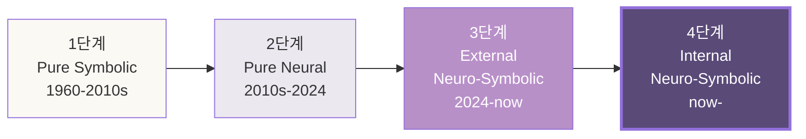
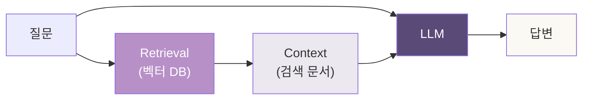
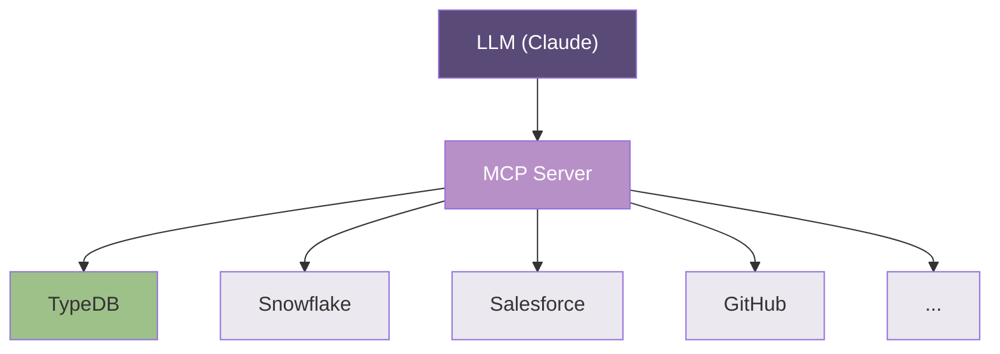
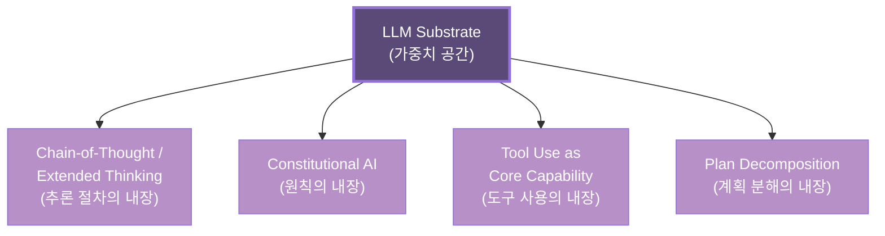
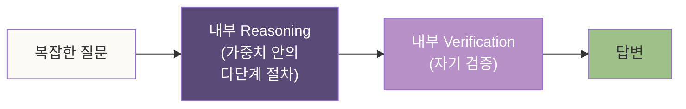
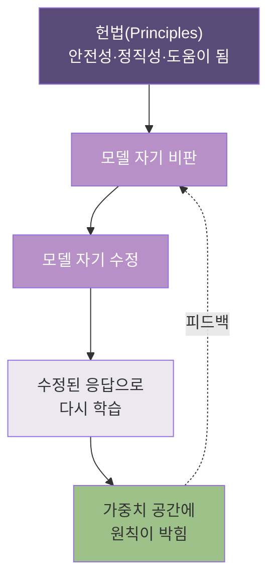
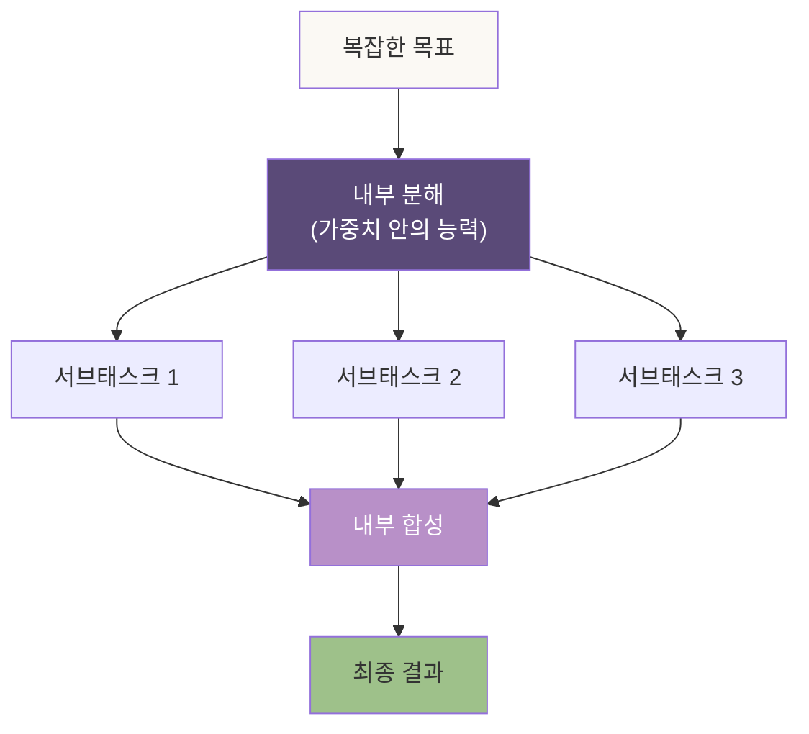
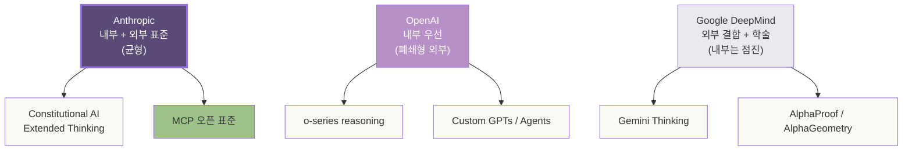
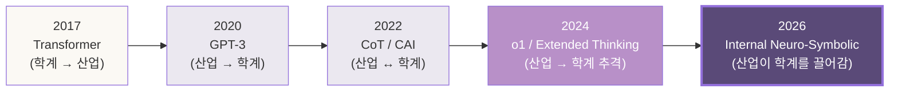
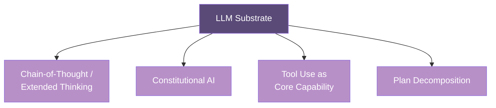

# 4장. 뉴로심볼릭의 두 모양 — 외부 결합 vs 내부 내장

> *사용자가 1장에서 짚은 가설을 — 이 장이 본격적으로 해부한다.
> 뉴로심볼릭이라는 한 단어 안에, *두 개의 전혀 다른 그림*이 들어 있다.*

---

## 4.0 들어가며 — 한 단어, 두 무게

1장 1.4절에서 한 가설을 던졌다.

> *"뉴로심볼릭에서 — 뉴로 자체에 심볼릭이 내장된 시대로 넘어가고 있다."*

이 한 줄이 — 이 책 전체의 기술적 심장이다. 그리고 *이 장이 그 심장의 해부도*다.

문제는 *뉴로심볼릭*이라는 단어가 — 최근 5년 사이에 *두 개의 전혀 다른 자리*를 가리키게 됐다는 점. 학회 페이퍼에서, 산업 발표에서, 컨퍼런스 키노트에서 — *같은 단어*가 *다른 그림*을 그린다.

| 두 모양 | 가리키는 자리 |
|---|---|
| **외부 결합** | LLM과 *바깥의 symbolic 시스템*을 파이프라인으로 연결 |
| **내부 내장** | LLM *자체의 substrate 안에* symbolic operation이 박힘 |

학계가 *전자*를 주로 다뤘다. 산업이 — *2024~2026년에 빠르게 후자로 옮겨갔다*. 이 시차가, 지금 시점의 *가장 흥미로운 자리*다.

엔지니어라면 — *어느 자리를 짤지*가 다음 5년의 커리어를 가른다.
투자자라면 — *어느 베팅이 어느 모양인지*가 포트폴리오의 알파를 가른다.
도메인 전문가라면 — *내 도메인 지식이 어느 모양에 들어가는지*가 다음 시대의 자기 자리를 가른다.

이 장에서 — 두 모양을 *과장 없이, 폄하 없이* 짚는다.

---

## 4.1 1장 회수 — AI 아키텍처 4단계의 본격 해부

1장 1.4절에서 그림 하나를 *제시*했다. 4단계의 짧은 역사. 이 장에서 *그 그림을 해부*한다.

1단계와 2단계는 *역사*다. 산업의 *현재*는 3단계, *진입 중인 자리*는 4단계. 이 장이 짚는 자리는 — **3단계와 4단계 사이의 경계**다.

이 경계가 — *이 책 전체 가설의 정확한 무게*다. 1장은 *이 가설을 제시*했고, 4장은 *왜 그것이 진짜 경계인지*를 푼다.

---

## 4.2 전통적 뉴로심볼릭 — 외부 결합의 모양

먼저 3단계 — *외부 결합*의 그림을 본다.

### 4.2.1 RAG의 자리

가장 익숙한 자리부터. **Retrieval-Augmented Generation**.

LLM이 답변하기 전에, *외부 벡터 DB*에서 관련 문서를 검색한다. 검색된 문서를 *컨텍스트에 끼워* 다시 LLM에 던진다. 이게 — 지난 3년 산업 표준이 된 그림.

여기서 *symbolic 부분*은 — *벡터 DB의 검색 알고리즘*과 *문서 청킹*이다. *neural 부분*은 — LLM. 두 시스템이 *한 파이프라인 안에서 만나지만, substrate가 분리*돼 있다.

이게 *외부 결합*의 정확한 정의: **두 시스템의 substrate가 다르고, 인터페이스로만 연결됨**.

### 4.2.2 Tool Use의 자리

다음 자리 — **Tool Use** (혹은 Function Calling).

LLM이 *답변 도중* 외부 도구를 호출한다. 계산기, SQL, 웹 검색, API. OpenAI가 2023년에 *function calling*으로 표준화했고, 이후 모든 frontier model이 따라갔다.

여기서 *symbolic 부분*은 — *도구의 내부 로직*. *neural 부분*은 — *언제 어느 도구를 호출할지*를 결정하는 LLM. 도구의 출력이 *다시 LLM의 컨텍스트로* 돌아온다.

여전히 — *외부 결합*이다. 도구는 LLM의 *바깥*에 있고, *인터페이스로만 만난다*.

### 4.2.3 MCP의 자리

가장 최근 자리 — **Model Context Protocol** (Anthropic, 2024).

LLM이 외부 시스템과 통신하는 *표준 프로토콜*. JSON-RPC 기반. *AI 시대의 LSP*(Language Server Protocol)이라는 비유가 *자주 회수*된다.

5장에서 본격적으로 짚을 자리지만 — 여기서는 *분류*만 짚는다. MCP는 *외부 결합의 정점*이다. LLM과 symbolic 도구를 *가장 깔끔하게 연결*하는 표준. 그러나 — *여전히 외부*다.

### 4.2.4 외부 결합의 한계

외부 결합 모델은 — *지금 잘 작동한다*. 산업이 *이걸로 돈을 번다*. 그런데 — 세 가지 한계가 있다.

1. **결정의 자리가 둘로 쪼개진다**
   *언제 도구를 부를지*는 LLM이 결정, *도구 내부의 추론*은 symbolic 시스템이 결정. 두 결정이 *서로의 맥락을 모른다*.

2. **상태가 인터페이스에서 끊긴다**
   LLM이 도구를 호출하면, 도구는 *그 호출 한 번*만 안다. 도구의 *학습된 패턴*과 LLM의 *학습된 패턴*이 *공유 substrate를 가지지 않는다*.

3. **추론의 깊이가 인터페이스 횟수에 비례한다**
   복잡한 추론이 필요하면 — 도구를 *여러 번* 호출해야 한다. 매 호출마다 *지연·비용·실패 가능성*이 누적된다.

이 한계가 — *4단계로 가는 압력*이 된다.

---

## 4.3 내부 내장 뉴로심볼릭 — 4가지 자리

이제 — 4단계의 그림. *symbolic operation이 신경망 substrate에 박히는* 자리.

여기서 정직한 단서를 *먼저* 짚는다. **이 자리는 아직 완성되지 않았다**. 그러나 — *방향과 자리는 또렷*하다. 네 개의 구체적 자리를 본다.

### 4.3.1 Chain-of-Thought / Extended Thinking

가장 또렷한 자리부터.

**Chain-of-Thought**(CoT) — Google Research, 2022년. *답변 전에 *추론 단계를 명시적으로 생성*하면* 정답률이 올라간다는 발견. 처음에는 *프롬프트 기법*이었다. *"Let's think step by step."*

이후 5년 — 이 *기법*이 *모델의 일급 능력*으로 옮겨갔다.

- OpenAI o1 (2024년 9월) — *내부 reasoning*을 강화학습으로 훈련
- Anthropic Extended Thinking (2025년) — Claude의 *사고 시간*을 사용자가 조절
- Google DeepMind Gemini Thinking (2025년) — 같은 방향

여기서 *symbolic의 자리*는 어디인가. **추론 절차 자체**가 — *학습된 가중치 안에* 박혀 있다. 모델이 *외부 reasoner를 부르지 않고*, *자기 substrate 안에서* 다단계 추론을 한다.

*정직한 짚음*: 이게 *진짜 symbolic*인가, *유창한 패턴 매칭*이 그렇게 보이는가 — 학계가 지금도 다툰다. 4.4절에서 본격적으로 짚는다.

### 4.3.2 Constitutional AI — 원칙이 가중치에 박힘

Anthropic의 *Constitutional AI*(CAI, 2022 논문, 2023년 본격 상용화).

기존 방식 — *RLHF*(Reinforcement Learning from Human Feedback)는 *사람이 매번 라벨링*해야 했다. CAI는 — *원칙의 집합을 모델에게 주고, 모델이 스스로 원칙에 맞게 답변을 비판·수정*하게 한다. 그 비판·수정을 *학습 신호로 사용*한다.

여기서 일어나는 일이 — *symbolic이 가중치 공간에 박히는 자리*다. *"이런 답변은 안 된다"*, *"이런 추론은 도덕적으로 문제다"* — 이런 *규칙들*이, 외부 필터가 아니라 *모델 자체*가 *내재적으로* 알게 된다.

*이게 왜 뉴로심볼릭인가*. 원칙은 *symbolic한 진술*이다. 그게 *학습을 통해 신경망 가중치에 박힌다*. 결과적으로 — *모델의 모든 출력*이 *원칙의 영향을 받는다*. *외부 결합*이 아니다. *내부에 내장*된 것이다.

이 자리가 — *Anthropic의 가장 또렷한 베팅* 중 하나다. 5장에서 본격적으로 짚는다.

### 4.3.3 Tool Use as Core Capability

세 번째 자리. *도구 사용 자체*가 *모델의 일급 능력*이 되는 자리.

4.2.2절에서 — Tool Use를 *외부 결합*의 예로 들었다. *같은 단어*가 — *모양에 따라 다른 자리*에 들어간다.

**외부 Tool Use**: 모델이 *프롬프트에서 가르쳐진 대로* 도구를 부른다. 매번 *학습 분포 바깥*의 작업.

**Internal Tool Use**: 도구 사용이 *학습 데이터에 깊이 내장*돼서, 모델이 *어떤 도구가 어떤 상황에 맞는지*를 *내재적으로 안다*. 더 나아가 — *도구의 출력을 어떻게 해석할지*도 학습 분포 안에 들어와 있다.

Anthropic의 Claude 3.5 Sonnet (2024) 이후 — *agentic tool use*가 *훈련 시점부터* 강화된다. 모델이 *도구를 부르는 시점·시퀀스·실패 시 재시도*까지 *학습으로 익힌다*. 이게 — *내부 내장된 도구 사용*이다.

| 외부 Tool Use | Internal Tool Use |
|---|---|
| 도구를 *프롬프트로 가르침* | 도구를 *학습 데이터로 내장* |
| 호출 시퀀스가 *외부 logic* | 호출 시퀀스가 *내재적 능력* |
| 실패 시 *외부 retry* | 실패 시 *내재적 재시도 패턴* |
| Stateless | *상태 인지* |

### 4.3.4 Plan Decomposition as Native Operation

마지막 — 가장 *경계의 자리*.

복잡한 작업을 받으면 — 모델이 *서브 태스크로 분해*하고, *각각을 순차/병렬로 처리*한다. 이게 *Plan Decomposition*. 전통적으로 — *외부 planner*(예: HTN planner)가 했다.

지금은 — *프론티어 모델 자체*가 한다. Claude의 Extended Thinking 모드, GPT-5의 reasoning 단계, Gemini 2.5의 thinking — 모두 *내부 계획 분해*를 *훈련 시점에 강화*받았다.

*정직한 단서*: 이 자리가 *가장 spectrum*에 가깝다. 어떤 분해는 *진짜 symbolic*. 어떤 분해는 *학습된 패턴의 재생*. 어디가 어디인지 — 모델마다, 작업마다 다르다.

### 4.3.5 네 자리의 공통 무게

네 자리 모두 — *공통의 무게*가 있다.

**전통 뉴로심볼릭**: 두 substrate, 인터페이스로 연결.
**내부 내장 뉴로심볼릭**: 한 substrate에 *두 모양의 작동이 같이 박힘*.

이게 — *Anthropic·OpenAI·DeepMind*가 *지난 3년간 같은 방향으로 베팅*한 자리다. 다만 — *베팅의 모양*이 회사마다 다르다 (4.6절).

---

## 4.4 정직한 짚음 — 완성이 아닌 스펙트럼

여기서 — *과장도 폄하도 피해야 할 자리*가 있다.

### 4.4.1 무엇이 진짜 symbolic이고 무엇이 패턴 매칭인가

1장 1.4절의 표를 *본격적으로* 풀어낸다.

| 작동 | symbolic의 정도 | 풀이 |
|---|---|---|
| 다단계 산술 | *진짜 symbolic* | 모델이 *연산 규칙*을 따라간다. 검증 가능. |
| 도구 선택과 호출 | *진짜 symbolic* | *조건부 분기*가 또렷. |
| 형식 논리 추론 | *경계의 자리* | 패턴 매칭과 진짜 추론이 *섞임* |
| 계획 분해 | *경계의 자리* | 학습 분포 안 작업은 강. 바깥은 약. |
| 도메인 사실 진술 | *주로 통계* | 학습 데이터의 압축. *환각 위험*. |
| 새로운 추론 | *주로 통계, 부분적으로 symbolic* | 진짜 *새로운* 추론은 — 여전히 어렵다. |

학계의 *가장 격렬한 자리*는 — *중간의 두 줄*이다. *어떤 작동이 진짜 symbolic*이고, *어떤 게 유창한 패턴 매칭*인지.

### 4.4.2 Gary Marcus의 자리

뉴로심볼릭 논쟁의 *가장 또렷한 회의주의자* — Gary Marcus (NYU 명예교수).

Marcus의 주장: *LLM은 진짜 symbolic operation을 하지 않는다. 학습 분포 안의 패턴을 *유창하게 재생*할 뿐이다.* 그가 든 예 — *학습 데이터에 없는 새로운 산술 문제*, *학습 분포를 벗어나는 추론*. 거기서 *frontier model의 정확도가 무너진다*.

이 비판이 — *부분적으로 맞다*. 그러나 — *부분적으로만 맞다*. Marcus의 비판이 *2020년*에는 거의 전부 맞았다. *2024년에는 절반*. *2026년에는 점점 좁아진다*.

방향이 또렷한 자리: **매 세대마다, symbolic 쪽으로 *무게가 옮겨간다***.

### 4.4.3 Bengio의 자리

반대편 — Yoshua Bengio (Mila, Turing Award 2018).

Bengio가 2019년에 던진 그림: *System 2 Deep Learning*. Daniel Kahneman의 *Thinking, Fast and Slow*에서 빌린 비유.

- **System 1**: 빠르고 직관적. 패턴 매칭. *현재의 LLM*.
- **System 2**: 느리고 절차적. 진짜 추론. *Bengio가 목표로 삼은 자리*.

Bengio의 베팅: *System 2 능력이 신경망에 *깊이 내장*될 수 있다*. 외부 결합이 아니라 — 내부 내장. 이 그림이 — *Anthropic의 Extended Thinking과 OpenAI의 o1이 베팅한 방향*이다.

*Marcus*는 *지금의 LLM이 멀었다*고 본다. *Bengio*는 *이미 진입했다*고 본다. 진실은 — 1장에서 짚었듯 — *완성이 아니라 진입*. *둘 다 부분적으로 맞다*.

---

## 4.5 학계의 현재 위치

산업이 빠르게 옮겨가고 있는 자리에서 — 학계는 어디에 서 있는가.

### 4.5.1 Google DeepMind — AlphaProof와 AlphaGeometry

DeepMind가 2024년에 던진 자리 — **AlphaProof**, **AlphaGeometry 2**.

수학 올림피아드 문제를 — *AI가 풀었다*. 2024년 IMO에서 *은메달급* 성적. 이게 단순한 패턴 매칭이 아니라는 점이 — *학계가 주목한 자리*다.

AlphaProof의 구조: *언어 모델 (Gemini)*이 *Lean 4* (정리 증명 시스템)와 *결합*돼 있다. *언어 모델이 증명 전략을 제안*, *Lean이 형식 검증*. 외부 결합 모델의 정점.

AlphaGeometry는 한 걸음 더 — *기하학 증명*을 위한 *symbolic engine*과 *neural engine*이 *공동 훈련*된다. **공동 훈련**이 핵심. 두 시스템이 *완전히 분리된 substrate*가 아니라, *훈련 신호를 공유*한다. 이게 — *4단계로 가는 길의 한 자리*다.

### 4.5.2 MIT — Neuro-Symbolic Concept Learner

MIT의 *Jiajun Wu, Joshua Tenenbaum* 그룹이 *2018년부터* 추진한 자리.

**Neuro-Symbolic Concept Learner**(NS-CL): 이미지에서 *개념을 추출*하는 neural 모듈과, 그 개념으로 *추론하는* symbolic 모듈이 *공동 훈련*된다.

여기서 *MIT의 베팅*은 — *학습 가능한 symbolic representation*. *고정된* symbolic 규칙이 아니라, *학습으로 *진화하는** symbolic 표현. 이 자리가 — *4단계의 학술적 토대*가 된다.

### 4.5.3 Stanford — Foundation Models의 emergent reasoning

Stanford의 *CRFM* (Center for Research on Foundation Models)이 *2021년부터* 짚는 자리.

질문: *모델이 충분히 커지면 — 추론 능력이 *창발*하는가*. 답: *부분적으로 그렇다. 그러나 — 그게 진짜 추론인지는 작업에 따라 다르다*.

CRFM의 보고서가 *반복적으로* 짚는 자리: **emergent capability**라는 단어를 *조심해서 써야 한다*. *벤치마크 정의*에 따라 *창발이 보이기도 사라지기도* 한다는 점.

이 자리가 — *Marcus와 Bengio 사이의 *학술적 중립지대**다. 둘 다 *부분적으로* 인정한다.

### 4.5.4 학계의 합의 — *방향에 합의, 시점에 이견*

세 그룹의 *공통점*:

- *방향*: *내부 내장 뉴로심볼릭*이 *다음 패러다임*이라는 점에 *대체로 합의*
- *시점*: *언제 그 자리에 도착하는가*에 *큰 이견*

DeepMind와 MIT가 *낙관적*. Stanford가 *신중*. Marcus가 *회의적*. 이 *스펙트럼* 안에서 — 산업은 *훨씬 더 빠르게 베팅하고 있다*.

---

## 4.6 산업의 현재 위치 — 세 회사의 베팅 차이

학계가 *세 그룹*으로 나뉘듯, 산업도 — *세 회사*가 *다른 베팅*을 하고 있다.

| 회사 | 베팅의 중심 | 외부 vs 내부 |
|---|---|---|
| **Anthropic** | Constitutional AI · Extended Thinking · MCP | *내부 내장 + 표준 외부* |
| **OpenAI** | o-series reasoning · Custom GPTs · Agents | *내부 내장 우선, 폐쇄적 외부* |
| **Google DeepMind** | Gemini Thinking · AlphaProof · Vertex AI | *외부 결합 우선, 내부 점진* |

세 회사 모두 — *외부와 내부 둘 다* 한다. 다만 *비중과 모양*이 다르다.

### 4.6.1 Anthropic의 베팅

이 책 5장 전체가 다루는 자리지만, 여기서 *분류*만 짚는다.

Anthropic의 베팅이 *독특한 자리*는 — **두 방향을 동시에**다.

- *내부 내장*: Constitutional AI(원칙), Extended Thinking(추론) — *모델 자체*에 박힘
- *외부 표준*: MCP — *오픈 표준으로 외부 결합을 표준화*

이 *동시 베팅*이 — *Anthropic이 엔터프라이즈에서 빠르게 채택률을 올린 이유* 중 하나다. *내부의 깊이*와 *외부의 호환성*을 *동시에* 가진다.

### 4.6.2 OpenAI의 베팅

OpenAI는 — *내부 내장*에 *훨씬 더 강하게* 베팅한다. o-series (o1, o3, o4)가 — *frontier reasoning*의 가장 또렷한 예. *외부*는 — *Custom GPTs*와 *Agents SDK*, *Operator*. 그러나 *대부분 OpenAI 생태계 안*에 가둔다.

이 베팅의 *장점*: *깊이 있는 reasoning*. *단점*: *엔터프라이즈가 *벤더 락인*을 두려워한다*.

### 4.6.3 Google DeepMind의 베팅

DeepMind는 — *학술 정신*이 가장 강하다. AlphaProof·AlphaGeometry·AlphaFold가 *외부 결합의 정수*. *학술적 검증 가능성*을 우선시한다.

*Gemini Thinking*으로 *내부 내장*에도 진입했지만, *Anthropic·OpenAI보다 한 발 늦었다*. 그러나 — *Google Cloud의 인프라*와 *DeepMind의 학술적 깊이*가 결합되는 자리에서 — *2027년 이후 따라잡을 자리*를 가진다.

### 4.6.4 베팅의 모양 한 그림

이 그림이 — 5장에서 *Anthropic이 왜 이 자리에 섰는가*를 짚는 *직접적 토대*다.

---

## 4.7 학계-산업의 시차 — 누가 누구를 따라가는가

마지막으로 짚을 자리 — *학계와 산업의 시차*.

전통적으로 — *학계가 *먼저* 짚고, 산업이 *상용화*한다*. 5~10년의 시차가 *건강한 흐름*이었다. 그런데 2020년대 — *AI 분야에서 이 흐름이 *역전*되고 있다*.

2017년 *Transformer* — *학계*(Google Brain 논문)에서 시작. 산업이 따라옴.
2020년 *GPT-3* — *산업*(OpenAI)에서 시작. 학계가 *그 능력을 사후적으로 설명*하기 시작.
2022년 *CoT, CAI* — *산업과 학계가 동시에*.
2024년 이후 — *산업이 *학계보다 앞서* frontier capability를 만든다*. 학계는 *벤치마크와 안전성 평가*에서 *오히려 산업을 따라간다*.

이게 — *AI 분야의 특수한 자리*다. 다른 어떤 분야에서도 *학계가 산업을 따라가는 자리*가 *이렇게 또렷*하지 않다.

투자자 입장에서: *학술 페이퍼만 보고 시점을 짚으면 *늦는다**. *산업 발표 → 학술 검증* 순서가 *지금의 흐름*.
엔지니어 입장에서: *학교에서 배운 뉴로심볼릭의 정의가 — 산업 현장에서 이미 *바뀌어 있다**. 이 시차를 *직접 좁히는 자리*에 *기회*가 있다.
도메인 전문가 입장에서: *자기 도메인 지식을 *학술 발표보다 *산업 도구의 채택* 자리에 먼저 옮기는 게 — *시대의 흐름과 정렬*되는 자리.

---

## 4.8 ◇ 4장 정리 — 손에 들어온 자리

### 두 모양

| | 외부 결합 | 내부 내장 |
|---|---|---|
| substrate | *두 개* (분리) | *하나* (통합) |
| 대표 자리 | RAG · Tool Use · MCP | CoT · CAI · Extended Thinking |
| 산업 시점 | *2024년 표준* | *2024~ 진입* |
| 학계 시점 | *2010s 정립* | *2020s 논쟁 중* |

### 4가지 내부 내장 자리

### 정직한 단서

- *완성이 아닌 스펙트럼* — 4단계의 자리는 *진입한 자리*이지 *도착한 자리*가 아니다
- *학계 안에서도 이견* — Marcus(회의) ↔ Bengio(낙관) ↔ Stanford(중립)
- *방향에는 합의* — 무게가 *symbolic 쪽으로* 옮겨가고 있다는 점

### 산업의 분기점

- **Anthropic**: 내부 + 외부 표준 (균형)
- **OpenAI**: 내부 우선 (폐쇄형 외부)
- **Google DeepMind**: 외부 결합 + 학술 (내부는 점진)

### 다음 장으로

이제 — 이 분기점에 *Anthropic이 어떤 베팅을 하고 있는지*를 본다.

5장은 — *MCP, Computer Use, Constitutional AI, Extended Thinking*이 *한 그림으로 짜이는 자리*. 그리고 — *SAP, Blackstone, Goldman의 베팅*이 *왜 이 모양의 베팅인지*까지.

4장이 *지도*였다면, 5장은 — *그 지도 위의 한 회사*의 자리를 본다.

---

> *4장의 약속: 뉴로심볼릭이라는 한 단어 안의 두 모양을 — 학술적 정직성으로 짚기.*
>
> *다음 장의 약속: 두 모양의 분기점에 선 — 한 회사의 베팅을 풀어내기.*

---

## 4.9 ◇ 한 단락 부록 — 이 장이 짚지 못한 자리

이 장이 *짚지 못한 자리*를 한 단락으로 짚어둔다. 모든 책에는 *생략된 자리*가 있다. 그 자리를 *부인하지 않는* 게 *책의 정직성*이다.

이 장이 짚지 못한 세 자리:

1. **뉴로심볼릭의 *수학적 형식화***. 어떤 작동이 *진짜 symbolic*인지를 *수학적으로 정의*하는 자리. 이 책의 *호흡*에 안 맞아 생략했다. 관심 있는 독자는 — *Bader & Hitzler (2005)*의 *Dimensions of Neural-Symbolic Integration*에서 시작하면 된다.

2. **중국 AI 산업의 베팅**. 이 장이 *Anthropic·OpenAI·DeepMind* 세 회사에 집중했다. *Baidu, Alibaba, DeepSeek* 등 중국 frontier가 *내부 내장 뉴로심볼릭*에 어떻게 베팅하는지 — *별도의 책 한 권*이 필요하다.

3. **오픈소스 진영의 자리**. *Meta Llama, Mistral, DeepSeek*가 *내부 내장*에 베팅하는 모양이 *프론티어 3사와 다르다*. 이 자리도 *생략*했다.

이 세 자리는 — *이 시리즈 4권 이후*의 또 다른 작업이 될 수도 있는 자리. 지금 짚어둔 *방향*과 *프레임*은 — 그 자리에서도 *그대로 회수*된다.

— 끝. 다음 장으로.
