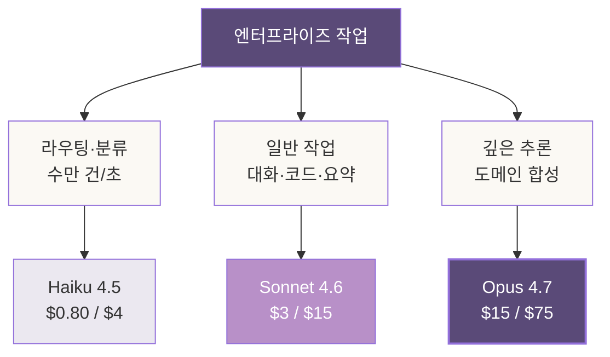
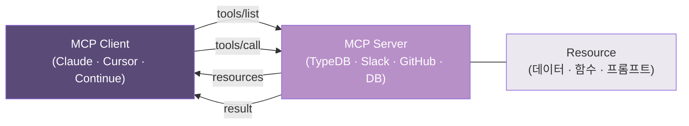
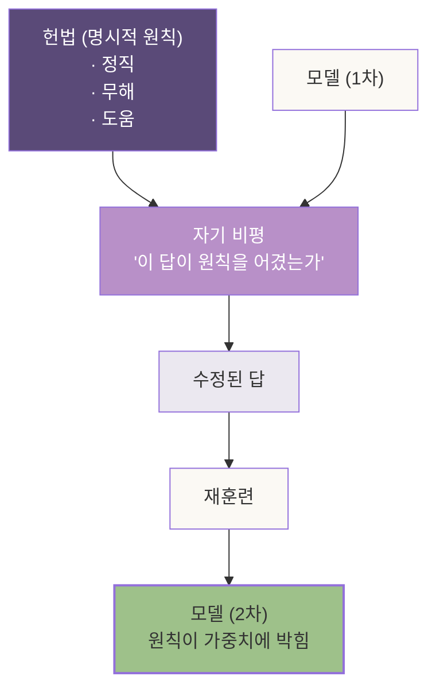
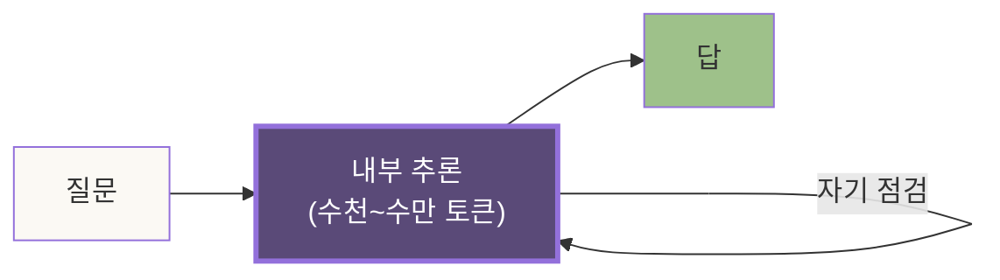
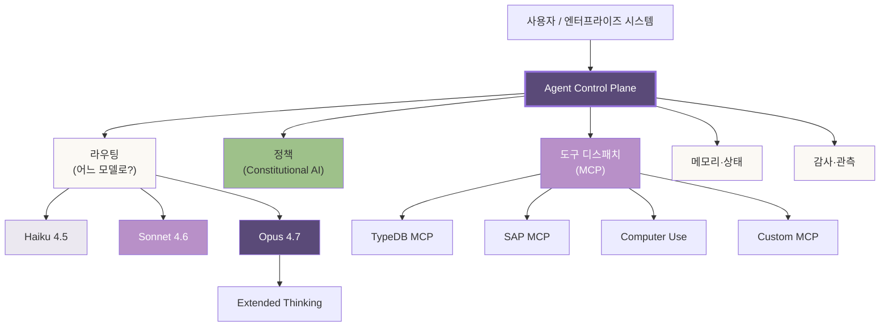
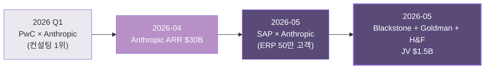
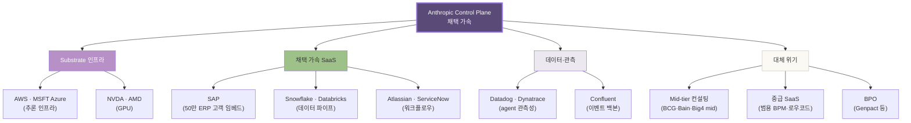
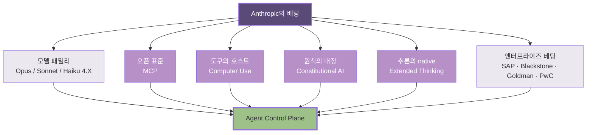

# 5장. 앤트로픽의 베팅 — 모델보다 큰 그림

> *Anthropic은 모델 회사가 아니다.
> 모델을 substrate로 — 그 위의 통제층(control plane)을 짓는 회사다.*

---

## 5.0 들어가며 — *모델 회사*라는 잘못된 이름표

2026년 봄, 시장이 Anthropic에 가격을 매기는 자리에서 한 가지 잘못된 이름표가 자주 보인다. *모델 회사*. *Claude를 만드는 회사*. *OpenAI의 경쟁자*.

이 이름표는 — 1장에서 본 ARR $30B의 크기를 *모델 단가 × 호출 수*로 단순화한다. 그렇게 보면 이 회사의 가치는 *다음 세대 모델*에 묶인다. 모델이 늦으면 무너지고, 빠르면 뛴다. *한 변수의 회사*가 된다.

그런데 — 2026년 4~5월에 일어난 일들을 한 줄로 정렬해 보면, 이 이름표가 *틀린 자리*가 또렷이 보인다.

- *SAP × Anthropic* — Claude가 ERP·CRM의 substrate로 임베드
- *Blackstone + Goldman + Hellman & Freeman JV* — $1.5B 밸류, 컨설팅 산업을 직접 겨냥
- *PwC × Anthropic alliance* — 글로벌 컨설팅 1위와의 *agentic enterprise* 동맹
- *MCP의 1주년* — Model Context Protocol이 *오픈 표준*으로 산업 사이에 깔림
- *Computer Use*가 정식 GA — Claude가 *도구의 호스트*가 되는 자리

이 다섯 가지는 — *모델*이 아니다. *모델 위에 올라가는 층*이다. 산업 용어로 묶으면 — *agent control plane*. VentureBeat가 2026년 5월에 정확히 짚은 한 줄을 빌리면:

> *"Claude's next enterprise battle is not models: it's the agent control plane."*

이 장은 — 그 *control plane*이 어떤 부품으로 짜여 있고, *왜 Anthropic이 모델보다 큰 그림에 베팅했는가*를 짚는다. 그리고 — 자매 책 1~3권에서 짠 도구들이 *그 그림의 어디에 1급 시민으로 앉는가*까지.

이 자리에서는 — 세 시점이 *동시에* 작동한다. 투자자의 시점은 *간접 노출의 알파*를 본다. 엔지니어의 시점은 *MCP가 짜는 새 인터페이스*를 본다. 도메인 전문가의 시점은 *온톨로지가 1급으로 앉는 자리*를 본다. 같은 그림을 — 세 각도에서 동시에 들이쉰다.

---

## 5.1 Claude 모델 패밀리의 자리

Control plane을 짚기 전에, 모델 자체를 한 번 정렬한다. 2026년 5월 시점, Claude 패밀리는 세 자리로 또렷이 나뉜다.

| 모델 | 자리 | 비용 (per Mtok in/out, USD) | 강점 |
|---|---|---|---|
| **Claude Opus 4.7** | Frontier 추론 | $15 / $75 | Extended Thinking, agent 오케스트레이션, 도메인 합성 |
| **Claude Sonnet 4.6** | 일반 작업 주력 | $3 / $15 | 균형, 대량 호출, 코드 생성 |
| **Claude Haiku 4.5** | 저지연·고처리 | $0.80 / $4 | 라우팅, 분류, 도구 호출의 *호스트* |

세 자리의 분리는 — 단순한 가격 단계가 아니라 *작업의 위상*에 정렬된다.



엔지니어의 손에 들어가는 그림은 또렷하다. *작업 하나*가 *한 모델*에 묶이지 않는다. *Haiku가 받아서 분류*하고, *Sonnet이 대부분을 처리*하고, *Opus가 깊은 매듭에서 추론한다*. 이 *위상별 분리*가 — 곧 *control plane의 첫 그림*이다.

투자자의 시점에서는 한 가지가 더 보인다. 세 모델의 단가 차이가 *20배*에 달한다. 같은 작업을 *Opus만으로* 돌리는 회사와 *Haiku/Sonnet/Opus를 위상별로* 돌리는 회사는 — *마진 곡선*이 다르다. *control plane을 잘 짜는 능력*이, 곧 *마진의 자리*가 된다.

---

## 5.2 MCP — 가장 큰 베팅

### *왜 오픈 표준으로 풀었는가*

2024년 11월, Anthropic은 *Model Context Protocol*을 공개했다. *오픈 표준*으로. *MIT 라이선스*. *명세는 GitHub에*. 경쟁사가 그대로 가져다 써도 막을 장치가 없다.

처음 보면 — *이상한 베팅*이다. 자체 표준을 만들면 *호환의 해자*를 짤 수 있는데, 왜 *경쟁사도 쓸 수 있게* 풀었는가.

답은 — *플랫폼 경제학의 한 명제*에 있다.

> *해자는 *표준을 소유*해서 짜지지 않는다. 표준이 *내가 만든 자리*에서 *모든 사람이 쓰는 자리*로 옮겨가면서 짜진다.*

USB, HTTP, Kubernetes, React — 모두 *공개되어 표준이 된 자리*에서 *생태계의 중심*을 잡았다. 가장 가까운 비유는 *Kubernetes*. Google이 만들었지만 *공개*했고, *CNCF에 넘겼다*. 그래도 *Google Cloud의 GKE*가 가장 많이 팔린다. *표준을 만든 자리에 누적된 신뢰*가 — *유료 구현의 기본값*을 잡는다.

Anthropic의 베팅이 같은 자리에 있다. MCP가 *모든 LLM 회사가 채택하는 표준*이 되면 — *Claude의 MCP 구현*이 *기본값*이 된다. *AWS가 S3 API의 기본값*인 것처럼.

VentureBeat의 짚음을 한 번 더 인용한다.

> *"Claude's next enterprise battle is not models: it's the agent control plane."*

*Control plane*은 — *어떤 모델이 어떤 도구를 부르는가*를 결정하는 층이다. MCP가 그 *공통 어휘*를 잡는다. 어휘를 잡은 자리는 — *그 어휘로 짜인 모든 작업의 경로*에 앉는다.

### *MCP의 부품들*

기술적으로 — MCP는 *세 부품*으로 짜인다.



- **MCP Client** — 모델 측. Claude Desktop, Claude Code, Cursor, Continue가 클라이언트 역할
- **MCP Server** — 도구 측. 데이터베이스, 슬랙, GitHub, 파일 시스템, *TypeDB* 등이 서버로 노출됨
- **Resource & Tool & Prompt** — 서버가 노출하는 세 자원. *자원(읽기 가능한 데이터)*, *도구(호출 가능한 함수)*, *프롬프트(템플릿)*

이 세 부품이 *공통 JSON-RPC 어휘*로 묶인다. 모델 측은 — *어떤 도구가 있는가*만 알면 된다. 서버 측은 — *Claude인지 GPT인지*를 신경 쓰지 않아도 된다.

### *TypeDB와 온톨로지가 1급 시민이 되는 자리*

이 자리가 — 시리즈 2권 *드론 책*과 3권 *추론 책*의 독자가 *정확히 자기 자리*를 보게 되는 매듭이다.

MCP Server는 *어떤 도구든* 노출할 수 있다. 그 *어떤 도구* 안에 — *TypeDB가 1급으로 앉는다*.

```python
# 가상의 MCP server for TypeDB
# 시리즈 2권에서 짠 drone-fleet schema가 노출되는 자리

@mcp.tool("typedb.query")
async def typedb_query(query: str) -> dict:
    """드론 함대 온톨로지에 TypeQL 질의를 실행."""
    with driver.session("drone-fleet", "data") as session:
        with session.transaction("read") as tx:
            results = tx.query.fetch(query)
            return {"results": [r.as_json() for r in results]}

@mcp.tool("typedb.infer")
async def typedb_infer(rule_set: str, fact: dict) -> dict:
    """추론 규칙을 적용해 새 사실을 유도."""
    # 시리즈 3권의 추론 규칙이 여기로 들어옴
    ...

@mcp.resource("typedb.schema")
async def typedb_schema() -> str:
    """현재 스키마 전체를 노출."""
    ...
```

Claude가 *드론 임무 할당*에 대한 질문을 받으면 — *학습 가중치*에서 답을 *합성*하지 않는다. *MCP를 통해 TypeDB에 질의*한다. *진짜 사실*에 기반한 답이 — *모델의 추론*에 *융합*된다.

이게 — 1장에서 짚은 *내부 내장 뉴로심볼릭*의 *현실적 구현체*다. 4장이 *원리*를 짚었다면, MCP는 *그 원리가 산업 표준으로 실행되는 자리*다.

| 자리 | 시리즈 도구의 역할 |
|---|---|
| 1권 *광전자 책*의 PolyModel | MCP server로 노출 → Claude가 *반도체 밸류체인 질의*를 직접 호출 |
| 2권 *드론 책*의 함대 온톨로지 | MCP server로 노출 → Claude가 *임무 할당 추론*을 위임 |
| 3권 *추론 책*의 규칙 라이브러리 | MCP server로 노출 → Claude가 *복합 추론*을 결합 호출 |

세 권에서 짠 도구가 — *Anthropic의 control plane 안에서* *1급 시민*으로 살아간다. 시리즈가 *닫히는 게 아니라 — 옮겨가는* 자리.

---

## 5.3 Computer Use & Agent — 모델이 *도구의 호스트*가 되는 자리

MCP가 *공통 어휘*라면, *Computer Use*는 *그 어휘로 화면 자체를 도구화*하는 매듭이다.

2024년 10월, Anthropic이 *Computer Use* 베타를 공개했다. 2026년 봄에는 GA. 작동은 단순하다 — *스크린샷을 모델에 주고*, *모델이 마우스·키보드 액션을 반환*한다. 그 액션이 *실제 데스크탑*에서 실행된다.


이게 *왜 큰 베팅인가*. — 기존 *API 통합*이 있어야 자동화가 가능했던 모든 작업이, *화면이 있으면* 자동화 대상이 된다. *Legacy 시스템*, *내부 도구*, *비공개 SaaS* — 모두 *Claude의 도구 풀*에 들어온다.

엔지니어의 시점에서 보면 — *통합 비용의 자리*가 무너진다. SAP의 *ERP 화면*도, Bloomberg의 *터미널*도, Salesforce의 *클래식 UI*도 — *코드 변경 없이* 자동화 대상이 된다.

투자자의 시점에서 보면 — *시장의 깊이*가 한 자릿수 늘어난다. *기존 SaaS·legacy의 위에* *agent 층*이 새로 깔린다. 그 층의 *기본값*이 *Claude*다.

도메인 전문가의 시점에서 보면 — *자기 도메인의 도구*가 *Claude의 도구 풀*에 *자동으로* 합류한다. *드론 운영 콘솔*, *반도체 fab의 MES*, *임상 EHR* — 모두.

*도구의 호스트*. — 이게 *control plane의 두 번째 부품*이다. MCP가 *프로그래밍 가능한 도구*를 모은다면, Computer Use는 *프로그래밍 불가능한 도구*까지 모은다. 두 부품의 합집합이 — *기업의 모든 디지털 자산*이다.

---

## 5.4 Constitutional AI — *원칙이 가중치에 박히는* 자리

4장에서 짚은 *내부 내장 뉴로심볼릭*의 가장 또렷한 구현체가 — *Constitutional AI*다.

Anthropic이 2022년 12월 *Constitutional AI* 논문을 공개했다. 핵심은 한 줄로 정리된다.

> *모델의 윤리적·기능적 원칙을 — *프롬프트가 아니라 가중치에* 박는다.*

기존 *RLHF*는 *인간 평가자*의 선호를 학습한다. *Constitutional AI*는 *명시적 원칙*(헌법)을 모델에게 주고, *모델 자신이* 그 원칙으로 *자기 출력을 비평*하고 *재훈련*한다.



여기서 *symbolic의 자리*가 또렷하다. *원칙*은 — *명시적 문장*이다. *symbolic*. 그러나 그 원칙이 *재훈련 루프*를 통해 *연속적 가중치 공간*에 *분포로 박힌다*. *symbolic이 neural에 내장*되는 정확한 메커니즘.

4장에서 *전통적 뉴로심볼릭*과 *내부 내장*을 분기점으로 짚었다. Constitutional AI는 — *내부 내장*의 *첫 산업 구현체*다. 그리고 *드론 책*과 *추론 책*의 독자에게는 한 가지가 또렷이 보인다.

> *원칙이 가중치에 박힐 수 있다면 — *도메인 규칙*도 가중치에 박힐 수 있다.*

이게 — *2026년 이후의 진짜 베팅*이다. *Constitutional AI*가 *윤리 원칙*을 가중치에 박은 자리에서, 다음 단계는 *도메인 헌법*. *반도체 fab의 안전 규칙*, *드론 군집의 충돌 회피 제약*, *임상 가이드라인* — 모두 *가중치에 박을 수 있는 후보*가 된다.

5.7~5.8에서 짚을 *엔터프라이즈 베팅*의 깊은 이유가 여기 있다. *SAP의 ERP 규칙*, *Goldman의 컴플라이언스 원칙* — 이걸 *Claude의 가중치에 박는 길*이 열려 있다.

---

## 5.5 Extended Thinking — 추론이 일급 능력이 되는 자리

2024년 후반, Claude 3.5 Sonnet의 *new* 모드에서 *Extended Thinking*이 처음 노출됐다. 2026년 5월 현재, Opus 4.7과 Sonnet 4.6에서 *기본 기능*이다.

원리는 단순하다 — *답을 내기 전*에, 모델이 *내부 추론 토큰*을 *길게 생성한다*. 사용자는 *최종 답*만 본다. 그러나 모델은 *사고의 사슬*을 *충분히 펼친 뒤* 답한다.

| 자리 | 기존 모델 | Extended Thinking |
|---|---|---|
| 응답 토큰 | 즉시 생성 | *수만 토큰*의 내부 추론 후 생성 |
| 추론의 양 | 1~수십 토큰 | 1,000~50,000 토큰 |
| 자기 점검 | 거의 없음 | 다단계 자기 점검 |
| 비용 | 출력 토큰만 | 내부 추론 토큰도 *과금* |

이게 *왜 1급 능력인가*. — 추론이 *프롬프트 기교*가 아니라 *모델의 native operation*이 되었다. *Chain-of-Thought*가 *외부에서 유도*되는 게 아니라, *내부에서 자동으로* 실행된다.

기술적으로 — Extended Thinking은 *RLHF + verifier*의 결합 산물이다. 모델이 *추론 중간에 자기 점검*하고, *부정확한 경로*를 *되돌린다*. 이 *되돌림*이 — *symbolic operation의 한 모양*이다. *통계적 패턴 매칭*에서는 일어나지 않는 작동.

4장의 *내부 내장 뉴로심볼릭* 그림이 — 여기서도 또렷이 보인다.



엔지니어의 시점에서 — *프롬프트 엔지니어링의 무게*가 줄고, *문제 정의의 정확성*이 비례해서 늘어난다. *어떻게 물어볼까*보다 *무엇을 물어볼까*가 중요해진다.

투자자의 시점에서 — *추론 단가의 자리*가 새 변수다. Opus 4.7의 출력 토큰 단가는 *Sonnet의 5배*. Extended Thinking이 *기본*이 되면, *추론 양*이 *비용*을 결정한다. *control plane*이 *언제 깊이 추론할지*를 결정하는 자리에 — 마진의 알파가 들어 있다.

---

## 5.6 Agent Control Plane — *모델보다 큰 전장*

이제 — 부품을 한 그림으로 모은다.



이 그림이 — VentureBeat가 짚은 *agent control plane*의 정확한 모양이다. 그리고 *모델 회사*라는 이름표가 *왜 잘못된가*가 또렷이 보인다.

*모델*은 — 이 그림 안에서 *substrate*다. *바닥*. 위에 *다섯 층*이 더 있다. 라우팅, 정책, 도구, 메모리, 감사. 이 다섯 층이 — *enterprise가 진짜로 돈을 내는 자리*다.

투자자의 자리에서 한 줄로 짚으면:

> *Anthropic의 진짜 해자는 — *모델의 품질*이 아니라 *이 다섯 층의 통합*이다.*

OpenAI도 *모델*은 잘 만든다. Google도 *모델*은 잘 만든다. 그러나 *control plane 전체*를 *오픈 표준*과 *Constitutional AI*와 *Computer Use*까지 묶어서 *한 그림*으로 짠 회사는 — 현재 Anthropic뿐이다.

이게 — 1장에서 인용한 Horses for Sources의 한 줄이 가리키는 자리.

> *"Anthropic just weaponized the Palantir model. The entire services industry is now in the crosshairs."*

*Palantir의 model*이 *사람(FDE)*으로 *온톨로지*를 옮긴 자리라면, *Anthropic의 model*은 *control plane*으로 *모든 디지털 자산*을 *agent의 도구 풀*로 빨아들이는 자리.

---

## 5.7 엔터프라이즈 베팅의 자리 — 세 발표

2026년 4~5월의 세 발표가 — *control plane의 가설*을 *시장의 가격*으로 확인해주는 자리에 있다.

### *SAP × Anthropic* (2026년 5월, SAP Sapphire 컨퍼런스)

발표의 핵심:

- SAP의 *Joule* AI 어시스턴트의 *1급 추론 엔진*으로 Claude가 임베드
- *50만 SAP 고객사*의 ERP·CRM·SCM 워크플로우에 *Claude의 control plane*이 *substrate로* 들어감
- *S/4HANA Cloud*의 *agent layer*에서 Claude가 기본값

SAP의 시점에서 보면 — *자체 모델*을 만드는 비용이 *Anthropic과 협력*하는 비용보다 크다. *집중*은 *ERP 도메인 지식*에. *모델*은 *substrate로 빌린다*.

Anthropic의 시점에서 보면 — *50만 고객사*의 *도메인 데이터*가 *Claude의 추론 환경*으로 들어온다. *control plane이 깔리는 자리*가, 곧 *다음 세대 모델 학습의 분포*가 된다.

### *Blackstone + Goldman Sachs + Hellman & Freeman JV* (2026년 5월)

세 거인의 합동 발표:

- $1.5B 밸류, $300M 초기 출자
- *agentic enterprise services* 전용 JV
- *컨설팅·법무·자문* 산업을 *직접 겨냥*
- Anthropic Claude를 *exclusive 1급 substrate*로 사용

Fortune의 헤드라인이 한 줄로 짚었다.

> *"Anthropic takes shot at consulting industry."*

이 발표가 *왜 중요한가*. — *돈이 가장 까다로운 자리*(Blackstone PE, Goldman IB, H&F)가 *agent 기반 서비스 모델*에 *공동 출자*했다. 이건 *베팅*이 아니다 — *내부 검증을 통과한 결론*이다.

투자자의 시점에서 — *컨설팅 산업의 mid-tier*가 *위기*에 들어선 신호. 이미 1장에서 짚은 *대체 곡선이 빠른 버티컬*의 첫 자리.

### *PwC × Anthropic alliance* (2026년 초)

- *글로벌 컨설팅 1위* 회사와의 *agentic enterprise AI* 동맹
- PwC의 *전 세계 분석가 풀*이 *Claude Code 기반 워크플로우*로 이전
- *PwC 내부 도메인 지식*이 *Anthropic의 fine-tuning 분포*에 들어감

이 발표의 가장 깊은 의미는 — *컨설팅 1위가 *자기 잠식*을 받아들였다*는 점. *분석가 한 명이 4배의 작업*을 하면, *분석가 수가 줄어든다*. PwC는 그 *줄어들 자리*에 *먼저 베팅했다*. *내가 줄어드는 게 아니라, 내가 그 잠식을 운영한다*는 자리.

### 타임라인 — 같은 분기 안에



*같은 분기 안*에 *네 발표*가 일어났다는 사실 — 이게 *우연이 아니라 패턴*이라는 신호. *control plane의 자리*가 *시장 가격*으로 옮겨가고 있다.

---

## 5.8 Claude Code의 자기 인지 — *이 책이 쓰이는 도구*

1장에서 *이 책이 어떻게 쓰이는가*를 짚었다. *한 사람과 한 AI가 한 오후에 시리즈 네 권을 완성한다*는 자리. 그 *AI 쪽의 이름*이 — *Claude Code*다.

Claude Code는 — *Claude Opus 4.7을 substrate로 한 agentic 개발 환경*이다. 5장에서 짚은 부품들이 *모두* 그 안에서 작동한다.

| 부품 | Claude Code 안에서 |
|---|---|
| Claude 모델 패밀리 | Opus 4.7 기본, Sonnet/Haiku로 라우팅 |
| MCP | 파일 시스템, Git, Bash, Web — 모두 MCP server |
| Computer Use | 옵션으로 사용 가능 |
| Constitutional AI | *코드 안전*, *비밀 누출 방지* 원칙이 가중치에 박힘 |
| Extended Thinking | 복잡한 리팩토링·아키텍처 추론에서 자동 활성 |

이 책 4권 — *광전자·드론·추론·앤트로픽* — 의 산문, 코드, 다이어그램, 교차 색인이 *Claude Code 안에서 짜인다*. 사용자가 *그림을 짚고*, Claude Code가 *부품을 모은다*.

이 자리에서 한 가지가 또렷해진다 — *control plane은 *기업*에만 깔리는 게 아니다*. *한 개인의 작업 환경*에도 깔린다. *책 한 권의 한계 비용을 *수천만 원에서 수 달러*로* 옮긴 자리. 1장의 한 줄이 여기서 닫힌다.

> *지식 생산의 한계 비용이 0에 수렴하는 시대*

이 *수렴*의 메커니즘이 — *Claude Code = Anthropic의 control plane을 1인용으로 노출한 자리*. 시리즈 4권 전체가 *그 메커니즘의 첫 산물*로 남는다.

---

## 5.9 투자자 관점 — *간접 노출의 진짜 알파*

이 장의 마지막 짚음은 — 투자자의 시점에서 가장 또렷이 보인다. *Anthropic 자체*는 *비상장*이다. 직접 노출은 *Amazon*(주요 투자자)을 통한 *간접 자리*뿐. 그런데 — *control plane이 가는 자리*에 *직접 노출 가능한 알파*가 있다.



**Substrate 인프라**: Claude의 *추론 단위*가 늘면 *Bedrock(AWS)*과 *Azure*의 *추론 인프라 수익*이 비례해서 늘어난다. *GPU*는 직접 수혜. 다만 *이미 가격에 박혀 있다*. 추가 알파는 적다.

**채택 가속 SaaS**: 가장 또렷한 알파의 자리. *SAP*는 *50만 고객 임베드*가 *매출 가속*으로 박힌다. *Snowflake·Databricks*는 *agent가 부르는 데이터 파이프의 기본값*. *Atlassian·ServiceNow*는 *워크플로우 layer*에서 *Claude 호스트*로 자리를 옮긴다.

**데이터·관측**: *agent control plane의 운영*이 깔리면 — *agent 자체의 관측성*이 새 시장이 된다. *Datadog*가 *2026년 봄*에 *agent observability* 제품을 GA로 냈다. *Dynatrace*도 같은 자리. *Confluent*의 *Kafka*는 *agent 간 이벤트 백본*으로 자리를 잡는다.

**대체 위기**: 이미 1장에서 짚은 자리. *mid-tier 컨설팅*(특히 *Big4의 ops/digital*), *중급 SaaS*(범용 BPM·로우코드), *BPO*. *팔란티어 숏*은 *이미 가격에 박혀* 알파가 없지만, *이 세 자리의 mid-cap*은 *2026~2028년의 격전지*.

투자자의 자리에서 한 줄로 정리하면:

> *Anthropic을 *직접 사는* 자리는 닫혀 있다.
> 그러나 *Anthropic이 깔리는 자리*에 *간접 노출의 알파*가 풍부하다.*

이 자리는 — *세 시점*이 *동시에* 작동해야 보인다. *엔지니어의 시점*으로 *control plane의 부품*을 읽고, *도메인의 시점*으로 *수혜 산업*을 짚고, *투자자의 시점*으로 *현 가격에 박혔는가/안 박혔는가*를 판단해야 한다. 셋 중 하나만 빠져도 — *알파가 사라지거나, 함정에 빠진다*.

---

## 5.10 ◇ 5장 정리 — 손에 들어온 자리

### 풍경



### 한 줄 결론

> *Anthropic은 모델 회사가 아니다.
> 모델을 substrate로 *control plane*을 짓는 회사다.
> 그 control plane이 — *서비스 산업 전체*를 빨아들이는 자리.*

### 시리즈 도구의 자리

- *광전자 책*의 PolyModel — MCP server로 *Claude의 도구 풀*에 1급 합류
- *드론 책*의 함대 온톨로지 — MCP server로 *Claude의 추론과 융합*
- *추론 책*의 규칙 라이브러리 — MCP server로 *복합 추론의 부품*

세 권이 — *Anthropic 시대의 substrate* 위에서 *살아간다*.

### 투자자 짚음

- *Anthropic 직접*은 비상장 — Amazon이 가장 가까운 노출
- *간접 알파*: SAP, MSFT, Snowflake, Databricks, Datadog, Confluent
- *대체 위기*: mid-tier 컨설팅, 중급 SaaS, BPO

### 다음 장으로

6장이 — 시리즈 4권의 *심장 질문*에 답한다.

> *AGI가 도착하면 — 온톨로지를 짜는 사람은 사라지나?*

5장이 *control plane의 부품*을 짚었다면, 6장은 *그 control plane 안에서 사람의 자리*가 어디인가를 짚는다. *투자자·엔지니어·도메인 전문가*의 *다음 10년의 지도*. 시리즈 4권을 *닫는 매듭*.

---

> *5장의 약속: 모델 너머에서 짜이는 그림을 — 세 시점에서 동시에 짚기.*
>
> *다음 장의 약속: 그 그림 안에서 *사람의 자리*를 — 정직하게 짚기.*

— 끝. 다음 장으로.
