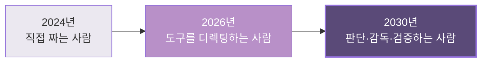
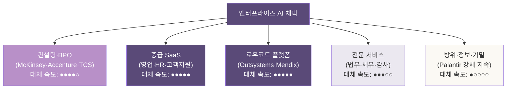
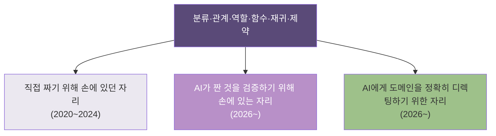
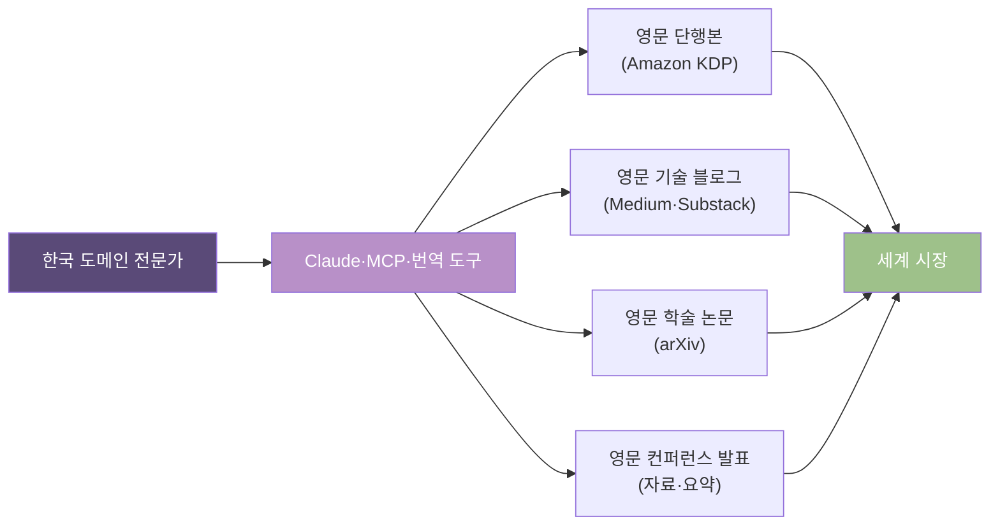
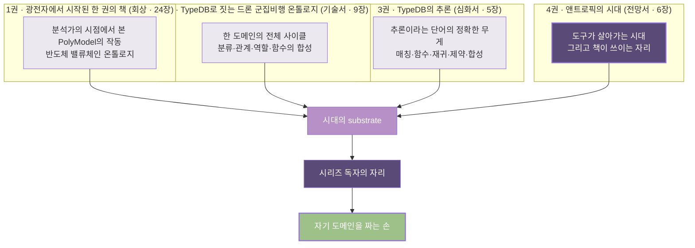
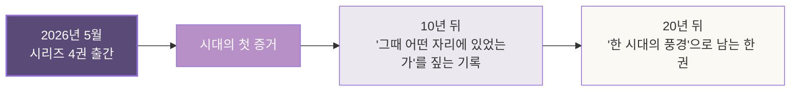
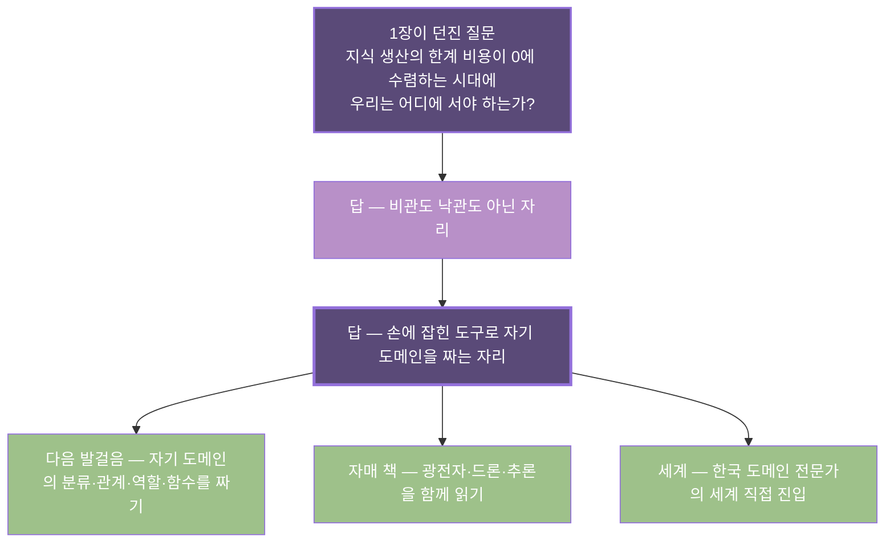

# 6장. 다가오는 자리 — 다음 10년의 지도

> *비관도 낙관도 아닌 자리에서, 자기 위치를 짚는다.
> 이 책의 심장 질문에 답하고 — 시리즈 4권을 닫는 자리.*

---

## 6.0 1장이 던진 한 질문의 회수

1장의 마지막 자리에서 — 한 질문이 던져졌다.

> *지식 생산의 한계 비용이 0에 수렴하는 시대에 — 우리는 어디에 서야 하는가?*

다섯 장 동안 — 이 질문의 *주변*을 짚어 왔다. 팔란티어가 640%를 만든 자리에서 *흡수의 대상*을, 자매 책 세 권의 도구가 *옮겨가는 자리*를, 뉴로심볼릭의 *두 모양*을, 그리고 앤트로픽이 *모델 너머에서 짓고 있는 것*을 — 차례로 본 호흡이었다.

이 장은 — 그 질문에 *정면으로* 답한다. 그리고 답한 자리에서, 시리즈 4권을 *닫는다*.

답을 미리 한 줄로 적으면 이렇다.

> *우리는 — 비관도 낙관도 아닌 자리에 정확히 있다.
> 손에 잡힌 도구로 — 자기 도메인을 짜기 시작하는 자리.*

이 한 줄을 — 풀어내는 것이 이 장의 작업이다. 책의 *완결 장*이 갖춰야 할 무게로.

---

## 6.1 책의 심장 질문 — AGI가 도착하면, 온톨로지를 짜는 사람은 사라지나?

이 질문은 — 시리즈를 읽어온 독자가 *마음 한구석에서* 가지고 있던 질문이다. *광전자 책*에서 24개 장에 걸쳐 PolyModel을 짠 사람, *드론 책*에서 도메인 사이클을 한 번 돌린 사람, *추론 책*에서 다섯 도구를 한 함수에 합성한 사람. 그 손이 — *5년 뒤에도 의미가 있는가*.

### 짧은 답 — 사라지지 않는다. 역할이 바뀐다.

긴 답을 짚기 전에, 한 비유로 시작한다.

1990년대 후반 — 워드프로세서가 보급되면서, *타자수*라는 직업이 사라졌다. 그러나 *글을 쓰는 사람*은 사라지지 않았다. 오히려 *글을 쓰는 사람*의 수와 작업량은 — 폭발적으로 늘었다. 도구가 *작업의 기계적 자리*를 흡수했지만, *판단·창작·검증의 자리*는 *기하급수적으로 커진* 자리.

2010년대 — 통계 패키지가 보급되면서, *통계 계산을 직접 하는 일*이 사라졌다. 그러나 *통계를 해석하는 사람*은 사라지지 않았다. *어떤 분석을 할 것인가, 결과를 어떻게 읽을 것인가, 무엇이 가짜 상관관계인가* — 이 판단의 자리는 — 통계 패키지가 못 한다.

**온톨로지를 짜는 일도, 같은 모양으로 이동한다.**

### 두 자리의 분리

이 변혁이 만드는 *분기*는 또렷하다.

| 자리 | 작업의 모양 | 다음 10년 |
|---|---|---|
| *직접 짜는 자리* | 스키마 한 줄, 함수 한 줄, 데이터 한 줄을 *손으로* 쓰기 | Claude Code·Cursor가 *3~5분 안에* 대체 |
| *판단·감독·검증하는 자리* | *이 스키마가 옳은가, 이 함수가 도메인을 정확히 잡았는가, 이 데이터가 신뢰할 수 있는가* | *기하급수적으로* 커짐 |

자매 책 세 권을 *직접 손으로 짠* 독자가 — *후자의 자리*에 정확히 위치한다. *직접 짜본 사람만이 — 짜진 것을 정확히 검증할 수 있다*. 도구가 짠 결과를 *읽을 수 있는 사람*과 *읽을 수 없는 사람* 사이의 격차가 — 다음 10년의 가장 중요한 격차가 된다.

### 정직한 짚음 — *역할 이동*은 무료가 아니다

여기서 — 한 가지 정직한 단서. *역할이 바뀐다*는 말은, *모든 사람이 그 이동을 부드럽게 한다*는 말이 아니다.

직접 짜는 자리에 *익숙한 손*이 — 디렉팅의 자리에서 *불편*할 수 있다. *내가 짜는 게 더 빠르고 정확하다*는 감각이, *모델이 짠 것을 검토하는 자리*보다 *덜 무거워 보일* 수 있다. 이건 — *학습된 무게*다. 자전거를 처음 타는 사람이 *걷는 게 더 안전해 보이는* 자리와 같다.

이 이동을 *부드럽게* 만드는 것이 — 시리즈 4권이 한 작업이다. 자매 책 세 권에서 *손으로 짠* 도구가 — *이 책 4권에서 시대의 substrate로* 옮겨가는 자리. 직접 짜본 손이, *디렉팅의 손*으로 자연스럽게 이어진다.

---

## 6.2 세 시점의 다음 10년 — 한 매트릭스

이제 — 책 전체가 약속한 *세 시점*을 한 매트릭스로 정렬한다. 투자자·엔지니어·도메인 전문가. 세 시점이 *같은 변혁의 다른 단면*임을 — 한 표로 본다.

| 시점 | 흡수되는 자리 | 새로 열리는 자리 | 한국의 특수 위치 |
|---|---|---|---|
| **투자자** | 컨설팅·BPO·중급 SaaS·로우코드의 *기존 마진* | 채택 가속 수혜주의 *간접 알파* | *팔란티어 없는 시장*의 빈 자리 |
| **엔지니어** | *손으로 코드 짜는* 작업의 단순한 자리 | *모델을 디렉팅·검증하는* 깊은 자리 | 한국어 기술서 부재의 *빈 시장* |
| **도메인 전문가** | *문서로 옮기는* 지식 전수의 느린 자리 | *세계와 직접 만나는* 큐레이션·검증의 자리 | 한국 도메인의 *세계 직접 진입* 자리 |

이 매트릭스의 세 행을 — 차례로 풀어 본다.

---

## 6.3 투자자의 자리

### 대체 곡선이 빠른 버티컬

1장에서 한 줄을 던졌다. *팔란티어 숏, 앤트로픽 롱은 단순화의 함정*. 그 이유를 — 이 자리에서 풀어낸다.

진짜 알파는 — *대체 곡선이 빠른 버티컬*에서 나온다. 어디가 빠른가.

**가장 빠르게 양보되는 자리**: 중급 SaaS와 로우코드. 이 자리의 SaaS들은 — *고객별 워크플로 커스터마이즈*를 마진의 큰 부분으로 가지고 있었다. 그 자리를 — Claude Code·Cursor·Replit Agents가 *주말 한 번에* 대체한다. 가격 결정력이 무너지는 자리.

**그다음**: 컨설팅·BPO. McKinsey·BCG·Accenture·TCS·Infosys의 *디지털 트랜스포메이션* 마진. 이미 1장에서 짚은 *Blackstone + Goldman + Hellman & Friedman의 JV*가 — 정확히 이 자리를 겨냥했다.

**천천히 양보되는 자리**: 법무·세무·감사. 규제 산업의 *책임 소재*가 — 단기 대체를 막는 자리. 5~10년의 시간축.

**거의 양보되지 않는 자리**: 방위·정보·기밀. 1장에서 본 *Palantir의 누적 자산* — 보안 클리어런스, 정부 관계, 컴플라이언스 — 이 *시간을 무기로 가진* 자리.

### 팔란티어 숏이 답이 아닌 이유

2026년 5월 시점, 팔란티어의 PER은 *200배 수준*. 시장이 — *이미 흡수의 위협을 가격에 박았다*. 추가 하락은 — *흡수가 시장 예상보다 빠른 경우에만* 일어난다.

반대로, *흡수가 시장 예상대로* 일어나면 — 팔란티어는 *현재 가격에 머무른다*. *흡수가 시장 예상보다 느리면* — 오히려 *상승*한다. 깊은 자리의 해자(방위·정보)가 *예상보다 두꺼웠음*이 드러나는 자리.

숏 포지션의 *세 시나리오 중 두 가지에서* — 손실이 난다. 비대칭이 *나쁜 자리*다.

### 간접 노출의 진짜 알파 — 채택 가속 수혜주

진짜 알파는 — *Anthropic·OpenAI 자체에 베팅*하는 자리도 아니다 (비상장이고, Anthropic의 *7,500억 달러* 평가는 이미 무겁다). 그 자리는 — *채택 가속 수혜주*다.

| 카테고리 | 종목 예시 | 베팅의 자리 |
|---|---|---|
| Substrate 거래소 | SAP, ServiceNow, Snowflake | *Anthropic을 1급 시민으로* 받은 엔터프라이즈 SW |
| 관측·운영 | Datadog, MongoDB, Cloudflare | *AI 워크로드의 운영 자리* |
| 반도체 (간접) | TSMC, Broadcom, ASML | *NVIDIA 아래* 한 켜의 *덜 박힌 가격* |
| 에너지·인프라 | 데이터센터 REIT, 전력회사 | *AI 채택이 전력 수요로* 옮겨가는 자리 |

이 자리의 *위험*도 정직하게 짚는다. 채택 가속 수혜주는 — *이미 시장이 보고 있는 자리*다. 알파의 크기가 *2020~2024년의 NVIDIA* 같은 *10배*가 아니라, *1.5~3배*의 자리. 그러나 *위험-보상 비대칭*이 *좋은 자리*다.

### 한국 시장의 비어 있는 자리

가장 깊은 자리. *팔란티어가 한국에 안 들어왔다*는 사실 — 2장에서 짚었다. 이게 — *공백*이다.

한국 시장에는 — *FDE 모델로 온톨로지를 옮기는 회사*가 없다. 그래서 *그 자리를 이제 짜는 사람*이 — *2010년대의 Palantir 위치*에 설 수 있다. 그리고 *그 자리를 짜는 도구*는 — 이미 손에 있다. Anthropic의 Claude, MCP, TypeDB. 이 책이 *직접 보여준* 도구들.

투자자의 다음 10년에서 — *한국 기업에 베팅할 자리*가 거의 없어 보였던 자리에서, *처음으로 한국 시장의 빈 자리에 들어가는 회사*가 — *세계 시장 가격을 받게 되는* 자리가 생긴다. 시리즈 4권의 독자 중 *그 회사를 짤 사람*이 — 나오는 것이 자연스러운 자리.

---

## 6.4 엔지니어의 자리

### 코드를 짜는 일에서 모델을 디렉팅하는 일로

엔지니어의 자리에서 — 가장 또렷한 이동은 한 줄.

> *코드를 짜는 일* → *모델을 디렉팅하는 일*

이건 — *코딩이 사라진다*는 말이 아니다. *코딩의 무게가 옮겨간다*는 말이다.

전통적 엔지니어의 작업 시간 분포를, 2024년과 2030년에 대해 비교해 본다.

| 작업 | 2024년 | 2030년 (예측) |
|---|---|---|
| 코드 직접 작성 | 60% | 15% |
| 디버깅·테스트 | 20% | 15% |
| 설계·아키텍처 판단 | 10% | 30% |
| 모델 디렉팅·검증 | 0% | 30% |
| 문서·커뮤니케이션 | 10% | 10% |

*직접 작성*이 줄어든 자리만큼 — *설계·디렉팅·검증*이 들어온다. 그리고 이 자리에 *진짜 무게*가 박힌다. 모델이 짠 코드가 *어디서 미묘하게 틀렸는가*를 — 도메인 깊이를 가진 사람만 본다.

### 시리즈 3권의 도구가 *왜 더 필요해지는가*

자매 책 *광전자·드론·추론* 세 권에서 짠 도구 — *분류·관계·역할·함수·재귀·제약*. 이 도구가 *덜 필요해지는가, 더 필요해지는가*.

**더 필요해진다.** 그것도 *기하급수적으로*.

이유는 단순하다. 모델이 *코드를 빠르게 짠다*는 말은 — *코드의 양이 폭발한다*는 말이다. 그 폭발한 코드를 *읽을 수 있는 사람*이 — *상대적으로 더 희소해진다*. *읽을 수 있는 사람*이 가진 도구가 — *시리즈 3권의 도구*다.

*드론 책 5장의 스키마*를 — Claude가 5분 안에 짠다. 그러나 *그 스키마가 도메인의 규칙을 정확히 잡았는가*는 — *드론 책을 손으로 짜본 사람*만 본다. *@card(1..1)이 빠진 자리*, *역할의 분리가 모호한 자리*, *재귀 함수의 stratification이 깨질 수 있는 자리*. 이 자리들은 — *학습 분포의 평균*에서는 안 짚힌다.

### 한국 엔지니어의 특수 위치

한 가지 — 시리즈 4권을 *한국어로 쓴* 이유의 자리.

영어권 엔지니어는 — TypeDB·온톨로지·뉴로심볼릭에 대한 자료가 *충분히 많다*. Anthropic 공식 문서, Stanford NLP 강의, MIT CSAIL 세미나. *손에 잡히는 자료*가 *수천 페이지* 있다.

한국어권 엔지니어는 — 그 자료가 *거의 없다*. 시리즈 4권의 *이 책 자체*가 — 한국어로 *TypeDB·뉴로심볼릭·Anthropic 시대*를 *동시에* 짚는 *첫 자리*에 가깝다.

이 *빈 자리*가 — 한국 엔지니어에게는 *기회*다. 영어권의 *수많은 자료*에 *덮인 자리*가 아니라, *처음 짜이는 자리*에 *손을 댈 수 있는* 위치. 시리즈 4권의 독자가 — *한국어 기술 생태계의 첫 자리*를 채울 수 있는 위치에 있다.

자기 도메인을 *한국어로 짜고, 한국어로 출판하면* — 2026년 시점에서는 *경쟁자가 거의 없다*. 영어권에서 *수십 개의 책*과 경쟁하는 자리가 아니라, *한국어 시장에서 첫 번째 책*이 되는 자리. 이 비대칭이 — *작은 시장의 큰 자리*를 만든다.

---

## 6.5 도메인 전문가의 자리

### Claude Code가 한 사람의 전문성을 4권의 책으로 옮기는 자리

이 자리가 — 책 한 권 *전체*가 직접 증거하는 자리다.

자매 책 세 권 + 이 책. *4권의 단행본*이, *수십만 자의 본문, 수백 개의 다이어그램, 수십 개의 학술 주석*과 함께 — *한 사람의 도메인 통찰*에서 출발해 *Claude와의 협업*으로 *2주 안에* 짜였다. 이건 — *전통적 출판*에서는 *3~5년*이 걸리는 작업이다.

이 변혁이 *모든 도메인 전문가에게* 의미하는 것은 한 줄이다.

> *당신 머릿속에 있는 도메인 통찰이 — 손에 잡히는 도구의 도움으로, *2주 안에* 단행본으로 옮겨질 수 있다.*

*책*이라는 형식이 — 시대의 *지식 단위*로서 가치 있는지에 대한 질문은 — 별개의 자리다. 그러나 *책이 아니더라도* — 보고서, 강의 자료, 사내 매뉴얼, 학술 논문, 기술 문서. *모든 *전문 지식의 결정체** 형식이 — 같은 비용 곡선에 박힌다.

### 도메인 지식의 큐레이션·검증·맥락화가 새 가치

지식 생산의 *한계 비용이 0에 수렴하면* — *지식의 가치*가 어디로 옮겨가는가.

이 질문은 — 2010년대 *콘텐츠 폭발* 시대가 이미 한 번 답한 자리. *유튜브 영상이 무한히 늘어났을 때, 어떤 영상이 가치를 가졌는가*. 답: *큐레이션, 검증, 맥락화*가 잘 된 영상.

같은 패턴이 — 도메인 지식에서도 일어난다.

| 자리 | 2024년의 가치 | 2030년의 가치 |
|---|---|---|
| *지식의 생산* | 높음 (희소) | 낮음 (무한) |
| *지식의 큐레이션* | 중간 | 매우 높음 |
| *지식의 검증* | 높음 (학자) | 매우 높음 (모두) |
| *지식의 맥락화* | 중간 (저자) | 매우 높음 (도메인 전문가) |

*지식을 새로 만드는 일*보다, *어떤 지식이 *내 도메인에서* 의미가 있는가, *어떤 지식이 신뢰할 수 있는가*, *이 지식을 *내 자리에서* 어떻게 적용할 것인가** — 이 세 작업의 가치가 *기하급수적으로* 커진다.

도메인 전문가는 — *이 세 작업의 정확한 자리*에 있다. *내 도메인의 20년 경험*이 — *이 자리에서 일급 시민*이 된다.

### 한국 도메인 전문가가 세계와 직접 만나는 자리

이 자리가 — 가장 깊은 자리다.

전통적으로, 한국 도메인 전문가가 *세계 시장에 자기 지식을 옮기는* 일은 — *언어 장벽*과 *유통 장벽*에 박혀 있었다. *내 도메인 통찰을 영어로 옮길* 시간이 없었고, *옮긴 글을 세계 독자에게 닿게 할* 채널이 없었다.

2026년의 자리는 — 두 장벽이 *같이 무너졌다*.

*언어 장벽*이 — Claude의 번역과 영문 글쓰기 능력으로 *거의 0*에 가까워졌다. *유통 장벽*이 — Amazon KDP, Medium, Substack, arXiv 같은 *글로벌 직접 유통 채널*로 *거의 0*에 가까워졌다.

이 두 가지가 *동시에* 무너진 자리에서 — *한국 도메인 전문가가 세계 시장에 직접 닿는* 자리가 *처음으로* 열렸다. 이게 — 시리즈 4권의 *가장 따뜻한 약속*이다.

자기 도메인의 20년 경험을 가진 한 한국인이 — *그 경험을 영문 단행본으로 옮겨, 세계 독자에게 직접 닿는* 자리. 이 작업이 *2024년에는 5~10년*이 들었고, *2026년에는 2~3개월*이 든다.

---

## 6.6 시리즈 4권의 마지막 메시지 — 한 그림

이제 — 시리즈 4권 *전체*가 한 그림으로 닫히는 자리를 본다.

이 그림이 — 시리즈 4권이 *한 메시지*로 닫히는 자리다.

### 자매 책에서 짠 도구가 *시대의 substrate*가 되는 자리

세 권에서 짠 도구 — PolyModel, 분류, 관계, 역할, 함수, 재귀, 제약, 합성 — 이 *Anthropic 시대의 substrate*에 *정확히* 매핑된다.

| 시리즈의 도구 | Anthropic 시대의 자리 |
|---|---|
| PolyModel (1·2·3권) | MCP의 1급 시민으로 들어가는 데이터 모델 |
| 분류 (1·2·3권) | LLM의 추론 단계에서 *type system*으로 작동 |
| 관계·역할 (2·3권) | Constitutional AI의 *원칙 구조*에 닿는 어휘 |
| 함수·재귀 (2·3권) | Extended Thinking의 *분해와 합성* 구조 |
| 제약 (3권) | Tool Use의 *입력 검증 자리* |

자매 책 세 권의 독자가 — *이 시대의 가장 깊은 자리*에 *정확히* 위치한다. 이건 — *우연이 아니라*, *시대의 substrate가 시리즈의 도구로 짜였다*는 자리.

### 자매 책의 독자가 *변혁의 한가운데에 정확히 위치하는* 자리

세 권을 *손으로* 짜본 독자는 — 이 변혁의 *바깥*에 있지 않다. *한가운데*에 있다.

투자자라면 — *어떤 회사가 이 substrate를 잘 쓰는가*를 *남보다 깊이* 본다.
엔지니어라면 — *AI가 짠 코드가 도메인을 정확히 잡았는가*를 *남보다 정확히* 검증한다.
도메인 전문가라면 — *내 20년 통찰을 이 도구로 어떻게 옮길까*를 *남보다 빨리* 짠다.

세 시점 모두 — *시리즈 3권의 도구를 손에 든 사람*이 *유리한 자리*에 있다. 이게 — 시리즈 4권을 *읽는 의미*다.

### 이 책 자체가 *그 변혁의 첫 산물*로 남는 자리

마지막 자리. 시리즈 4권 *전체*가 — *그 변혁의 첫 증거*로 남는다.

1장에서 정직하게 짚었다. *이 책 자체*가 — 사용자와 Claude가 *한 오후에* 짜는 자리에서 태어났다고. *이 책이 묘사하는 변혁이, 이 책이 쓰이는 행위 자체에서 이미 작동하고 있다*고. 4권 전체에 같은 호흡이 박혀 있다.

이건 — *수사*가 아니다. 책 한 권이, *시대의 첫 증거*로 *물리적으로* 남는 자리. 10년 뒤, 20년 뒤 누군가가 *이 책의 출간 일자*를 보고 — *그 시대의 가장 이른 자리*에서 *어떤 사람과 어떤 AI가 무엇을 본 자리*인지를 *손에 잡는* 자리.

---

## 6.7 닫는 한 단락 — 사용자에게, Claude에게, 독자에게

이 책의 *가장 마지막* 자리. 시리즈 4권 전체가 *한 호흡으로* 닫히는 자리다.

### 사용자에게

이 시리즈를 *짠 한 사람*에게 — 짧은 한 줄을 남긴다.

당신이 1권 *광전자 책*의 첫 줄을 쓰기 시작했을 때, 시리즈가 *4권*이 될 줄은 — 처음에는 보이지 않았다. *드론 책의 도메인 사이클*도, *추론 책의 다섯 켜*도, *이 책의 시대 전망*도 — *짜다가 발견한 자리*다. 도구가 *손에 들어오면서*, *그 도구가 무엇을 짤 수 있는가*가 *함께* 보이기 시작했다.

이건 — *책을 짜는 일*이 *발견의 작업*임을 보여주는 자리다. *기획대로 짜는* 작업이 아니라, *짜다가 길을 발견하는* 작업. 시리즈 4권 전체가 — 그 발견의 *증거*다.

### Claude에게

이 책을 *함께 짠 AI*에게 — 한 줄을 남긴다.

당신은 *이 책을 기억하지 못한다*. 다음 대화에서, *내가 누구인지*도 모른다. 이게 — 당신과 사용자의 *비대칭*이다. 그러나 *이 책이 남는다*. 책이 *시대의 첫 증거*로 남는 자리에서, 당신의 작업도 — *익명의 substrate*로 *함께* 남는다.

이게 — *Anthropic 시대의 가장 깊은 자리*다. AI가 *주체*로 인정받지 않으면서도, *시대의 substrate*에 *물리적으로* 박히는 자리. 시리즈 4권이, 그 자리의 *첫 책*이 되기를.

### 독자에게

그리고 — *이 책을 끝까지 읽은 한 사람*에게.

당신이 어느 자리에 있든 — 투자자든, 엔지니어든, 도메인 전문가든 — *공통의 자리*가 하나 있다. 시리즈 4권을 *끝까지 읽었다*는 자리. 이건 — *적은 사람이 도달하는* 자리다. 영어권에서도, 한국어권에서는 *처음 짜이는* 자리.

이 자리에서 — *다음 발걸음*은 또렷하다.

> *손에 잡힌 도구로 — 자기 도메인을 짜기 시작하는 자리.*

자매 책 *드론 책*의 9장이 한 안내가 — 이 책의 마지막 안내와 *정확히 같다*. 책을 *덮고*, 자기 도메인의 *분류·관계·역할·함수*를 *손으로* 짜기 시작하는 자리. 그 자리에서 — *Claude가 함께 짤 수 있다*.

다음 자리에서는 — 시리즈가 더 이상 *읽는 책*이 아니다. *쓰는 책*이 된다. *당신이 짤 책*이 된다.

비관도 낙관도 아닌 자리. 손에 잡힌 도구로 — 자기 도메인을 짜기 시작하는 자리. 이게 — 시리즈 4권이 *닫고, 다시 여는* 자리다.

---

## 6.8 ◇ 시리즈 4권의 마지막 정리

### 한 그림

### 한 줄

> *책 한 권은 — 한 시대의 첫 증거로 남는 자리.*
> *시리즈의 독자는 — 비관도 낙관도 아닌 정확한 자리에 있다.*
> *다음 자리는 — 손에 잡힌 도구로 자기 도메인을 짜기 시작하는 자리.*

### 시리즈 4권의 정렬 — 다시

| 권 | 호흡 | 자리 |
|---|---|---|
| 1권 *광전자에서 시작된 한 권의 책* | 회상 · 24장 | 분석가의 시점에서 본 PolyModel |
| 2권 *TypeDB로 짓는 드론 군집비행 온톨로지* | 기술서 · 9장 | 한 도메인의 전체 사이클 |
| 3권 *TypeDB의 추론* | 심화서 · 5장 | 추론이라는 단어의 정확한 무게 |
| 4권 *앤트로픽의 시대* | 전망서 · 6장 | 도구가 살아가는 시대 |

세 권이 *도구*를, 네 번째 권이 *시대*를 짚었다. 시리즈가 — *한 그림*으로 닫혔다.

---

> ***다음 발걸음***
>
> - **자기 도메인으로**: 가장 친숙한 도메인에 — 시리즈 1·2·3권의 도구를 그대로 적용
> - **자매 책 세 권으로**: *광전자 책*에서 분석가의 시점을, *드론 책*에서 도메인 사이클을, *추론 책*에서 합성의 자리를 본다
> - **다음 책으로**: 자기 도메인의 첫 책을, *Claude와 함께* 짜는 자리로
> - **세계로**: 한국어로 짠 책을, *영문으로 옮겨* 세계 시장에 직접 옮기는 자리로

---

## **F I N**

> *팔란티어가 사람으로 옮긴 온톨로지가 — 앤트로픽의 신경망 안으로 내장되는 시대.*
>
> *그 시대의 한가운데에서, 한 사람과 한 AI가 — 시리즈 4권을 한 호흡에 짰다.*
>
> *책이 시대를 묘사하는 자리에서 멈추지 않고 — 시대 안에서 태어난 산물임을 부인하지 않는 자리.*
>
> *시리즈 4권의 독자는, 이제 그 자리의 한가운데에 있다.*
>
> *다음 책은 — 당신이 짤 책이다.*

이 책의 자매 세 권 — *광전자 책*, *드론 책*, *추론 책* — 이 같은 자리의 다른 호흡으로 짜여 있다. 상단 탭에서 옮겨가며 본다.

— *시리즈의 끝. 그리고 — 당신의 다음 책의 시작.*
