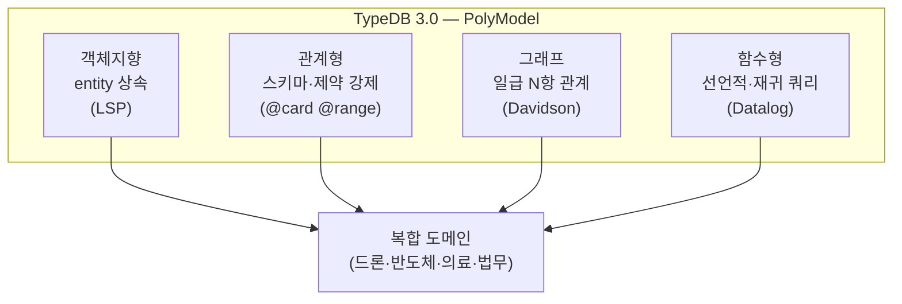

# 0부. 들어가며

이 부는 본격 작업으로 들어가기 전, *온톨로지가 무엇이고 왜 TypeDB인가*에 답한다. 코드는 아직 거의 없다. 그러나 책 전체의 무게가 여기서 결정된다.

기술서로서 이 책은 *syntax 튜토리얼*에 멈추지 않는다. 분류·관계·역할·시점이라는 네 가지 도구가 *어떤 이론적 토대 위에서* 작동하는가 — 그 토대를 짚어두고 가야 후속 장들의 코드가 *왜 그렇게 짜야 하는가*가 보인다.

---

## 0.1 온톨로지란 정확히 무엇인가

### 두 갈래의 어원

*온톨로지(ontology)*라는 단어는 두 곳에서 자라났다.

**철학에서의 온톨로지** — 그리스어 *ὄν*(있는 것)과 *λόγος*(학문)의 결합. *존재하는 것들의 종류와 그것들의 관계*에 대한 학문이다. 아리스토텔레스의 *범주론*에서 시작해 칸트의 선험적 범주, 후설의 형식 존재론을 거쳐 20세기 분석철학(Quine의 *On What There Is*, Strawson의 *Individuals*)까지 이어졌다.

**정보과학에서의 온톨로지** — 1990년대 인공지능과 지식 표현 분야에서 다시 발화. *Gruber의 표준 정의(1993)*가 결정적 순간다:

> *An ontology is an explicit specification of a conceptualization.*
> 온톨로지란 *개념화의 명시적 명세*다.

이 정의의 핵심 두 단어:
- **명시적(explicit)** — 머릿속의 암묵 지식이 아니라, *문서·코드·스키마*로 적혀 있어야 함
- **개념화(conceptualization)** — *어떤 도메인의 개체·속성·관계를 어떤 추상으로 보는가*의 약속

### 쉬운 풀이 — 동호회 회칙의 비유

학술 정의가 어렵게 들린다면 — *동호회 회칙*의 비유로 본다.

축구 동호회를 생각해 보자. 회칙에는 다음이 적혀 있다:
- *어떤 사람들이 있는가* → 회원, 임원, 게스트
- *그들이 어떤 종류로 나뉘는가* → 임원은 회장·총무·감독으로
- *그들 사이에 어떤 관계가 있는가* → 회장이 임원회를 소집한다
- *어떤 사건이 있는가* → 정기 모임, 친선 경기, 대회

이 회칙이 *글로 적혀 있으면* — 새 회원이 와도, 외부인이 봐도 *동호회가 어떻게 작동하는지* 안다. 회칙이 *머릿속에만 있으면* — 매번 누군가가 *기억해서 설명*해야 한다.

**온톨로지가 정확히 같은 토대에 서 있다.** *도메인의 회칙을 글로 적어둔 것*. 차이는 — 그 글이 *사람만 읽는 글*이 아니라 *기계도 읽는 글*이라는 것. 그래서 *코드·스키마*로 적힌다.

이 책에서 짤 *드론 군집비행 온톨로지*는 — *드론 군집의 회칙*이다. *어떤 드론들이 있고, 어떤 임무가 있고, 누가 누구의 리더이고, 어떻게 통신하는가*를 — 글로 명시적으로 적어둔 것.

이 책의 위치는 *정보과학적 의미의 온톨로지*다. 그러나 철학적 뿌리가 멀리 있지 않다 — *분류·존재·역할*에 대한 사고가 아리스토텔레스 이후 2400년 동안 다듬어진 어휘를, TypeDB가 데이터 모델로 받는다.

### 데이터 모델링과의 거리

흔한 오해: *온톨로지는 데이터 모델링의 다른 이름이다*. 이건 절반만 맞다.

**공통점**: 둘 다 *도메인의 개체·관계·제약*을 형식적으로 명세.

**차이점** — 세 가지가 결정적:

1. **추론 가능성**. 데이터 모델은 *적힌 것만* 알려준다. 온톨로지는 *적힌 것 + 적힌 것에서 도출되는 것*을 알려준다. *A가 B의 부모이고 B가 C의 부모면 A는 C의 조부모다* — 이게 *조부모*라는 사실을 명시적으로 적지 않아도 시스템이 알 수 있는 자리.

2. **공유 가능성**. 데이터 모델은 *한 시스템 내부*의 약속. 온톨로지는 *여러 시스템·여러 분석가가 공유*하는 약속. 그래서 *컨센서스 어휘*가 본질이다. 한 도메인의 *생명과학 온톨로지(Gene Ontology)*가 *수천 명의 연구자*와 *수백 개 데이터베이스* 사이에서 공유되는 모양 — 이게 온톨로지의 진짜 가치.

3. **존재 헌신(ontological commitment)**. 온톨로지를 짠다는 것은 — *이 도메인에 무엇이 실제로 존재하는가*에 대한 입장을 표명하는 일이다. *역할(role)*이 개체인가, 속성인가, 관계의 일부인가? *능력(capability)*이 *개체에 부착된 속성*인가, *개체 자체*인가, *관계*인가? 이런 질문에 답하는 자리.

이 세 가지가 — *데이터 모델*보다 *온톨로지*가 한 발 더 무거운 어휘인 이유다.

---

## 0.2 정보 시스템에서의 온톨로지 — Gruber에서 TypeDB까지

### 1990년대: RDF/OWL의 시대

1989년 Tim Berners-Lee가 *World Wide Web*을 제안했을 때, 그가 마음에 그렸던 그림은 *문서의 네트워크*만이 아니었다. 그의 1999년 *Weaving the Web*에서는 — *기계가 읽을 수 있는 의미의 네트워크*에 대한 비전이 별도의 장으로 등장한다. 사람이 클릭으로 항해하는 웹 위에, *프로그램이 추론으로 항해하는 의미 웹(Semantic Web)*이 얹혀야 한다는 그림이었다.

그 비전을 표준으로 옮긴 곳이 W3C였다. 1998년 RDF, 1999년 RDFS, 2004년 OWL — 약 10년에 걸쳐 *기계가 읽을 수 있는 의미*의 어휘가 차례로 합의됐다. 이 표준 가족이 지금도 살아 있는 곳들: *Gene Ontology*(생명과학, 5만+ 개념의 합의 어휘), *ChEBI*(화학물질), *FIBO*(금융 규제 — Bloomberg·HSBC가 채택), *CIDOC-CRM*(박물관 — 루브르·메트로폴리탄이 채택). *기계가 의미를 공유하는 곳*에서 RDF/OWL이 *사실상 표준*이 됐다.

#### RDF의 본질

*주어-술어-목적어*의 세 자리(triple)로 모든 사실을 표현.

```
:NVIDIA :designs :H100 .
:H100 :uses :CoWoS-L .
:CoWoS-L :is-a :PackagingTechnology .
```

단순하고 우아하지만 — *N항 관계*를 표현하려면 *reification*이라는 우회가 필요해진다. *공급 사건*(공급자·수요자·제품·시점·매출비중)을 RDF로 표현하려면:

```
:supply_42 :a :Supply .
:supply_42 :supplier :NVIDIA .
:supply_42 :customer :Apple .
:supply_42 :product :GPU .
:supply_42 :since "2024-01-01" .
:supply_42 :revenue-share 0.15 .
```

*공급 사건을 노드로 만들고* 그 노드에 *여러 triple을 다는 패턴*. 이 우회가 RDF/OWL의 가장 큰 마찰점.

#### OWL의 본질

RDF 위에 *Description Logic(DL)*을 얹어 추론을 가능케 함. *클래스 계층, 속성 제약, 동치성·역방향성*을 형식적으로 표현 가능.

**쉬운 풀이**: RDF만으로는 *데이터를 적기만* 하지, *적힌 것에서 새 사실을 도출*하지 못한다. OWL은 RDF에 *추론 규칙의 어휘*를 더해서 — *적힌 것에서 새로운 것을 자동 도출*하게 한다. 예: *"부모의 부모는 조부모다"*라는 규칙을 한 번 적어두면 — *모든 조부모 관계*가 자동으로 도출됨.

OWL 2의 *세 가지 profile*. 각각 *표현력*과 *계산 속도*의 다른 균형:

- **OWL 2 EL** — Existential Language. *간단하고 빠름*. 다항식 시간에 추론 가능. *대형 의료 온톨로지*(SNOMED CT의 35만 개 개념)에 적합.
- **OWL 2 QL** — Query Language. *관계형 DB 위에서 작동* 가능. *데이터 통합 작업*에 적합.
- **OWL 2 RL** — Rule Language. *규칙 기반 추론*에 친화적. RDF triple만으로 구현 가능.

강력하지만 *표현력 vs 결정 가능성*의 트레이드오프가 늘 작동. 일상으로 풀면 — *말로 표현할 수 있는 모든 것*을 적을 수 있게 만들면 — *기계가 답을 못 찾아 무한히 계산*하는 경우가 생긴다. *너무 표현력 있으면* 결정 불가능, *너무 단순하면* 도메인을 못 담음.

### 2010년대: 그래프 DB의 시대

2010년 즈음, RDF/OWL의 *무거움*에 지친 개발자들이 더 가벼운 도구를 찾기 시작했다. *왜 페이스북 친구 관계를 적기 위해 W3C 표준 6개를 학습해야 하는가*. *내가 원하는 건 그래프인데, 왜 자료구조가 triple인가*. 그 답으로 등장한 것이 *property graph*다 — *노드와 엣지에 자유롭게 속성을 다는* 단순한 모양.

스웨덴의 한 작은 팀이 만든 Neo4j가 그 위치를 잡았다. RDF의 형식적 무거움을 버린 대신, *직관적 그래프 쿼리*를 얻었다. Cypher는 *SQL 같은 가독성*에 *그래프 패턴 매칭*을 얹은 언어로 — 한 줄짜리 쿼리로 *6단계 친구 관계*를 표현할 수 있다:

```cypher
MATCH (n:Company {name: "NVIDIA"})-[:DESIGNS]->(c:Chip)
WHERE c.year > 2020
RETURN c.name
```

그러나 — *N항 관계*는 여전히 *사건을 노드로 만드는 reification*이 필요했고, *역할(role)*은 엣지 라벨의 약속으로만 표현됐다. 그리고 *스키마 강제*가 약하다 — 같은 노드에 다른 속성 조합이 들어가도 데이터베이스가 거부하지 않음.

### 2020년대: TypeDB의 위치

그래프 DB의 *가벼움*과 RDF/OWL의 *형식적 풍부함* 사이에 — *비어 있는 자리*가 있었다. 2017년 영국 케임브리지에서, Haikal Pribadi와 동료들이 그 빈 공간을 메우는 작업을 시작했다. 처음 이름은 GRAKN. *Knowledge graph database with strong typing*이라는 목표였다.

이들이 본 핵심 문제는 두 가지였다. 첫째, *N항 관계*가 그래프 DB에서 일등 시민이 아니다 — 항상 *reification*이라는 우회로 표현된다. 둘째, *역할(role)*이 도메인에서 의미를 가지는 자리인데도, 그래프 DB에서는 *엣지 라벨*로만 다뤄진다. 사람·드론·임무 같은 *복합적 도메인*에서는 — 이 두 가지가 *반드시 일급 시민*이어야 한다.

그 답이 *PolyModel*이다. 2022년 GRAKN이 TypeDB로 리브랜드되고, 2024년 말 *TypeDB 3.0*이 Rust로 다시 짠 엔진과 함께 발표됐을 때 — 그 비전이 한 단계 더 또렷해졌다. 객체지향·관계형·그래프·함수형의 *네 가지 모델*을 한 시스템 안에 통합. *하나의 패러다임을 강요하지 않고, 도메인이 요구하는 부분마다 적절한 도구를 쓰게 한다*는 것이 PolyModel다.

#### PolyModel의 4원소

**1. 객체지향 — entity 상속 (subtyping)**

```typeql
define
  entity vehicle, owns model_name;
  entity drone sub vehicle;
  entity quadcopter sub drone;
```

상위에 정의된 속성·역할이 *모든 하위로 자동 전파*. Liskov 치환 원칙(LSP)이 데이터 모델에 적용된 자리.

**2. 관계형 — 스키마와 제약 강제**

```typeql
attribute capability_grade, value long @range(1..5);
relation has_capability,
  relates capable_drone @card(1..1),
  relates capability_type @card(1..1),
  owns capability_grade @card(0..1);
```

`@card`·`@range`·`@values`·`@regex`가 *도메인 규칙*을 *데이터베이스 차원*에서 강제. RDF/OWL의 느슨함과 다른 자리.

**3. 그래프 — 일급 N항 관계 (relation + role)**

```typeql
relation supply,
  relates supplier @card(1..1),
  relates customer @card(1..1),
  relates supplied_product @card(1..1),
  owns since_year @card(0..1),
  owns revenue_share @card(0..1);
```

*공급 사건*이 *5자리 + 2속성*의 한 매듭. RDF의 reification 우회 없음. *Davidson 사건 의미론*이 일급 시민으로 박힌 자리.

**4. 함수형 — 선언적 쿼리, Function 합성**

```typeql
fun all_suppliers_of($company: company) -> { company }:
  match (supplier: $s, customer: $company) isa supply;
  return { $s };
  or
  match (supplier: $mid, customer: $company) isa supply;
       let $s in all_suppliers_of($mid);
  return { $s };
```

*Datalog 전통*의 *Horn clause 재귀*. 함수가 *재사용 가능한 단위*. 한 함수의 출력이 다른 함수의 입력이 되는 *합성성(compositionality)*.

#### 4원소의 결합



이 네 가지가 *각각* 다른 패러다임의 강점이고 — *동시에* 한 시스템 안에 있는 게 TypeDB의 위치.

2024년 말, TypeDB 3.0이 엔진을 Rust로 다시 짠 큰 갱신과 함께 발표됐다. 이전 2.x 시대의 *Rule*이 *Function*으로 대체되면서 — *재귀 추론*이 함수형 패러다임의 일급 도구가 됐다.

### TypeDB가 자리잡은 좌표

| 도구 | 데이터 모델 | 강점 | 약점 |
|---|---|---|---|
| pandas | DataFrame | 통계·시각화 | 의미가 코드에 묻힘 |
| PostgreSQL | 관계형 | 트랜잭션·보고 | N항 관계는 외래키로 흩어짐 |
| MongoDB | 문서 | 스키마리스 유연성 | 관계가 코드에 의존 |
| Neo4j | property graph | 그래프 탐색 | N항은 reification, role은 약함 |
| RDF/OWL | triple | 시맨틱 웹·표준 | reification 우회, 가파른 학습 곡선 |
| **TypeDB** | **PolyModel** | **분류+N항+역할+함수가 일급** | **국내 인지도 낮음, 생태계 작음** |

이 책은 마지막 줄의 위치 — *PolyModel이 자연스러운 자리* — 를 드론 군집비행 도메인에서 보인다.

### 도구 선택의 의사결정

언제 어느 도구를 쓸 것인가:

```
Q: 데이터에 분류 가지가 있는가?
  Yes: 다층 분류? 
    Yes: 도메인 의미가 데이터 모델에 박혀야 하나?
      Yes: 관계가 N항인가?
        Yes: 재귀 추론이 필요한가?
          Yes: → TypeDB
          No: → Neo4j 또는 TypeDB
        No: → PostgreSQL with JSONB 또는 TypeDB
      No: → MongoDB 또는 PostgreSQL
    No: → PostgreSQL
  No: 시계열·수치 분석?
    Yes: → pandas / DuckDB / ClickHouse
    No: 단순 KV?
      Yes: → Redis
      No: → 도메인 분석 다시
```

이 결정 트리의 *오른쪽 가장 깊은 영역*에 TypeDB가 있다. 거기에 진짜로 있는 도메인이 — 이 책의 드론 군집비행, 그리고 자매 책의 반도체 밸류체인.

---

## 0.3 이 책이 다루는 네 가지 도구

가설: **분류 / 관계 / 역할 / 함수** — 이 네 가지를 손에 익히면 어떤 도메인이든 짤 수 있다.

이 네 도구는 *각각이 한 이론적 토대* 위에 있다. 책의 1부 예제 셋이 그 토대를 차례로 짚는다.

### 분류 (Classification)

- **이론적 토대**: 타입 시스템의 *subtyping*, 분류학(taxonomy)의 *계층적 일반화*, Rosch의 *기본 수준 범주*
- **철학적 뿌리**: 아리스토텔레스 *범주론*의 *유(genus)·종(species)* 구조
- **TypeDB 도구**: `entity X sub Y`
- **본격 등장**: 1부 예제 1 (도서관 장서)

### 관계 (Relation)

- **이론적 토대**: Davidson의 *사건 의미론(event semantics)*, 일급 N항 관계
- **철학적 뿌리**: Davidson 1967, *The Logical Form of Action Sentences*
- **TypeDB 도구**: `relation R, relates A, relates B, ...`
- **본격 등장**: 1부 예제 2 (가족 관계)

### 역할 (Role)

- **이론적 토대**: 관계의 *participant*가 가지는 *qualified place*. *역할이 관계에 묶여 있고 개체에 묶여 있지 않다*는 통찰.
- **학술적 토대**: DOLCE 상위 온톨로지(Masolo·Vieu·Guarino 외, 2004 *Social Roles and their Descriptions*)와 OntoUML의 역할 분석
- **TypeDB 도구**: `relates X`, `plays R:X`
- **본격 등장**: 1부 예제 2 + 2부 전체

### 함수 (Function)

- **이론적 토대**: Datalog 전통의 *Horn clause*, 재귀의 *fixpoint 의미론*, Stratified negation
- **계산 이론적 뿌리**: Robinson의 *해소 원리*(1965), Kowalski의 *Horn clause 프로그래밍*(1974)
- **TypeDB 도구**: `fun X(...) -> { ... }: match ... return { ... };`
- **본격 등장**: 1부 예제 3 (조직도 / 의존성)

이 네 도구가 *동시에* 작동해야 풀리는 도메인이 — 2부의 드론 군집비행이다.

---

## 0.4 책의 구성 — 학습 곡선

### 1부. 기초 — TypeDB의 네 가지 도구

세 개의 짧고 친숙한 도메인에서 네 도구를 차례로 익힌다. *친숙한 도메인*을 고른 이유는 — 코드에 집중하기 위함이다.

- **예제 1. 도서관 장서 시스템** → 분류
- **예제 2. 가족·친족 관계 모델** → 관계와 역할
- **예제 3. 조직도 / 의존성 그래프** → 함수와 재귀

각 예제 끝에는 *◇ 이론 절*이 있다. 코드가 어떤 학술적 맥락에 있는가를 짚는 자리.

### 2부. 실전 — 드론 군집비행 온톨로지

본격 도메인. 6개 장에 걸쳐 *온톨로지 엔지니어링의 전체 사이클*을 한 번 돌린다.

- 4장. 도메인 (Competency Questions로 시작)
- 5장. 스키마 (Ontology Design Patterns)
- 6장. 데이터 (A-Box vs T-Box)
- 7장. 분석 함수 (재귀 + 합성의 형식 의미)
- 8장. 시나리오 — 한 드론이 손실되었을 때 (Forward/Backward chaining)
- 9장. 정리 — 다음 단계 (OWL, SHACL, Description Logic)

### 학습 곡선의 의도

각 장에서 *손에 들어오는 무게*가 누적되도록:

```
1장: 분류 (단순)
  ↓ 분류 위에 관계가 얹힘
2장: 관계 + 역할
  ↓ 관계 위에 함수가 얹힘
3장: 함수 + 재귀
  ↓ 세 도구를 동시에 적용해야 풀리는 자리
4~8장: 드론 도메인 실전
  ↓ 책을 덮고 자기 도메인에 적용
9장: 다음 단계
```

이 곡선이 가팔라지지 않게 — 각 장이 *이전 장의 도구를 명시적으로 회수*한다.

---

## 0.5 자매 책과의 관계

이 책에는 자매 책이 있다. *광전자에서 시작된 한 권의 책*. 같은 도구(TypeDB·온톨로지)를 *NVIDIA 향 반도체 밸류체인*이라는 다른 도메인에 *회상의 호흡으로* 적용한 책. 24개 장의 단행본 분량.

두 책이 *같은 자리에 있는 두 모양*이다:

| 자리 | 자매 책 (회상) | 이 책 (기술서) |
|---|---|---|
| 호흡 | 에세이 + 코드 | 산문 + 코드 (이론 절 포함) |
| 도메인 | 반도체 밸류체인 | 드론 군집비행 |
| 시점 | 회상 (1인칭) | 분석 (3인칭) |
| 주된 독자 | 투자자·분석가 | 개발자·연구자 |
| 분량 | 단행본 1권 | 단행본 1/2권 |
| 톤 | *기억의 운에서 시스템의 약속으로* | *온톨로지 사고의 한 사례집* |

상단 탭에서 옮겨가며 비교 가능. 두 책이 함께 읽힐 때 *온톨로지 입문 코스 1세트*가 된다.

---

## 0.6 사전 지식과 환경

**독자 가정**

- TypeDB 무경험 — 그래서 이 책이 짜였다. 한국어로 처음 정식 소개되는 자리다.
- SQL 또는 NoSQL 기본 경험 — 데이터베이스의 *기본 모양*은 알고 있다고 가정.
- 도메인 모델링 직관 — 무엇을 *개체*로, *속성*으로, *관계*로 잡을지에 대한 감각.
- *학술적 깊이*에 대한 관용 — 이 책은 코드만 외우는 책이 아니다. *왜 그렇게 짜야 하는가*까지 가는 책이다.

**환경**

- Docker (TypeDB 3.0 컨테이너)
- TypeDB Studio (공식 시각적 도구)
- Python 3.10+ (8장 자동화 자리에서만)
- macOS / Windows / Linux 무관

```bash
docker pull typedb/typedb:3.0.0
docker run -d -p 1729:1729 --name typedb typedb/typedb:3.0.0
```

자세한 설치·문제 해결은 부록 A.

### 코드 검증 상태 — 정직한 짚음

이 책의 모든 TypeQL 코드는 *TypeDB 3.0 공식 문서의 문법*에 기반해 작성됐다. 다만 *책 초판 시점에서 모든 코드가 실제 환경에서 실행 검증되었다*고 단언하지는 않는다. 일부 패턴 — 특히 *기존 관계 인스턴스에 역할 참여자를 추가*하는 `links` 구문(8장)이나 *재귀 함수의 `or` 분기*(3장·7장) — 은 TypeDB 3.0의 *권장 패턴*이지만, 환경에 따라 *대안 구문*이 필요할 수 있다.

독자는 *코드를 따라 치다가 막히는 부분*가 있다면 — TypeDB 공식 문서(typedb.com/docs)와 GitHub 이슈를 함께 확인하기를 권한다. 책의 후속 개정에서 *실 환경 검증* 결과가 반영된다.

---

## 책을 펴기 전에

온톨로지는 *학문의 어휘*다. 그러나 그 어휘가 *코드 한 줄*에 박힐 때 — 도메인은 *데이터의 명시적 약속*으로 변환된다. 머릿속 그림에 의존하지 않는 시스템이 가능해지는 자리.

이 책은 그 변환의 *전체 사이클*을 한 도메인에서 보인다. 1부에서 도구를, 2부에서 도메인을, 그리고 — *시스템이 어떻게 자기 자신의 약속을 지키는가*까지.

> 분류는 *명사*의 도구다. 관계는 *동사*의 도구다. 역할은 *전치사*의 도구다. 함수는 *동사의 변환*의 도구다. 이 네 가지로 — 어떤 도메인의 *문법*도 짤 수 있다.

다음 장부터 — *손이 움직인다*.
