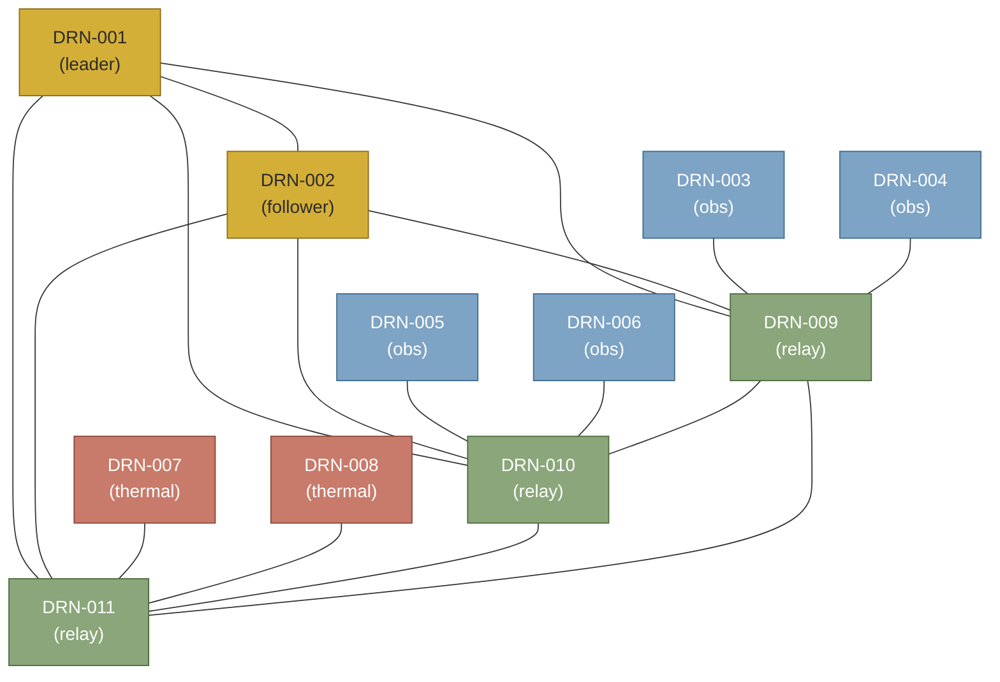

# 제6장. 데이터 채우기

## 들어가며

*스키마가 짜이고 나면 — 조용한 자리가 한 번 온다.* 데이터베이스에 *아직 아무것도 없다*. 약속만 적혔지, 그 약속이 묶을 *실제 사실들*은 비어 있다.

이 자리에서 *손이 멈추는 사람*이 많다. *어떤 데이터를 채워야 시스템을 시험할 수 있는가*. 너무 적으면 추론이 trivial해진다. 너무 많으면 데이터 채우는 데 시간이 다 간다. *작지만 의미 있는 단위* — 이 자리를 잡는 것이 데이터 채우기의 진짜 어려움이다.

이 장이 그 자리에 정확히 12대의 드론을 채운다. 군집의 *최소 의미 단위*. 리더 2 + 관측 4 + 열화상 2 + 중계 3 + 예비 1. 5장의 스키마가 *처음으로 데이터를 받는 자리*다.

5장의 스키마 위에 — 이 장에서 *실제 데이터*가 들어간다. 12대 드론, 5가지 능력, 1개 산악 수색 임무, 1개 메시 네트워크. 이 데이터가 7장의 *분석 함수* 토대다.

이 장의 이론적 자리: *Description Logic*의 **A-Box vs T-Box** 구분, 그리고 *데이터 출처(provenance)* 추적.

---

## 6.1 시연 데이터의 약속

먼저 짚어둔다. **이 장의 12대 드론과 모든 수치는 책의 시연을 위한 가상 구성이다.** 실제 군집비행 시스템의 데이터는:
- 더 큰 규모 (수십~수백 대)
- 더 다양한 제조사·모델
- *실시간 스트림*으로 입력 (Kafka·MQTT 등)
- *센서 데이터*가 함께 (위치·속도·배터리·풍속 등)

책의 모형은 *분석 함수의 작동을 보이기 위한 최소 구성*이다. 실제 적용 시에는 데이터 인입 파이프라인을 별도 설계해야 한다.

---

## 6.2 ◇ 이론 절 — A-Box와 T-Box

본격 데이터 입력 전에 — *데이터와 스키마의 자리*를 짚는다.

### Description Logic의 두 자리

Description Logic(DL) — RDF/OWL의 형식 토대 — 에서 지식은 두 자리로 나뉜다:

**쉬운 풀이 — 사전과 명단**:

도서관에 두 종류의 책이 있다고 생각해 보자.
- *사전(辭典)* — *단어가 무엇을 의미하는지*가 적혀 있음. *학생: 학교에서 배우는 사람*. 변하지 않는 *정의*.
- *학생 명단* — *김철수는 1학년이다, 이영희는 2학년이다*. 각 *구체적 사실*. 시간에 따라 변함.

*T-Box는 사전*, *A-Box는 명단*.

**T-Box (Terminological Box)**. 개념·관계의 *정의*. 한국어로 *용어 상자* — 또는 *사전*.
- *드론은 비행체의 하위다*
- *모든 link는 두 드론을 묶는다*
- *능력 등급은 1에서 5 사이의 정수다*

→ 이게 5장의 *스키마*다. *드론이라는 단어가 무엇을 의미하는가*의 정의.

**A-Box (Assertional Box)**. *개별 사실의 명세*. 한국어로 *주장 상자* — 또는 *명단*.
- *DRN-001은 quadcopter다*
- *DRN-001은 formation_lead 능력을 등급 5로 가진다*
- *DRN-001은 2026-04-01 16:00부터 mission MSN-001의 leader다*

→ 이게 6장의 *데이터*다. *구체적인 드론·임무·할당의 명단*.

### 왜 이 구분이 중요한가

세 가지 자리에서 결정적:

1. **추론의 모양**. T-Box 기반 추론(*classification*: 모든 사실에 적용)과 A-Box 기반 추론(*query answering*: 특정 사실에 적용)은 알고리즘이 다르다. TypeDB의 함수는 주로 *A-Box 위의 query answering*.

2. **변경의 빈도**. T-Box는 *드물게 변함* (스키마 진화). A-Box는 *매 순간 변함* (데이터 입출). 운영 시스템은 이 둘을 *다른 리듬*으로 관리.

3. **권한과 거버넌스**. T-Box 수정은 *온톨로지 엔지니어*의 영역. A-Box 수정은 *데이터 입력 시스템*의 영역. 책임의 자리가 다르다.

### TypeDB의 처리

TypeDB는 두 자리를 *명시적으로 분리*한다:
- `transaction schema` — T-Box 작업 (스키마 변경)
- `transaction write` — A-Box 작업 (데이터 입출)
- `transaction read` — 둘 다 조회

이 분리가 *RDF/OWL*의 *triple 단일 모델*보다 — *데이터베이스 운영의 직관*에 가깝다.

---

## 6.3 가상 시나리오 — 산악 수색 임무

**시나리오 설정**:
- 장소: 강원도 산악 지역
- 일시: 2026년 4월 1일 오후 4시 ~ 일몰 (약 3시간)
- 임무: 조난자 1명 수색
- 자원: 12대 드론 군집

**드론 구성 (12대)**:
- *리더 후보* 2대 (DRN-001, DRN-002)
- *광학 관측* 4대 (DRN-003 ~ 006)
- *열화상 관측* 2대 (DRN-007, DRN-008)
- *통신 중계* 3대 (DRN-009 ~ 011)
- *예비* 1대 (DRN-012)

---

## 6.4 드론·능력 데이터

```typeql
transaction write drone_swarm
```

```typeql
insert
  # === 리더 후보 2대 (DJI 가상 모델) ===
  $d01 isa quadcopter,
    has serial_id "DRN-001",
    has model_name "Matrice-300-RTK",
    has manufacturer "DJI",
    has max_flight_time_min 55;
  $d02 isa quadcopter,
    has serial_id "DRN-002",
    has model_name "Matrice-300-RTK",
    has manufacturer "DJI",
    has max_flight_time_min 55;
  
  # === 광학 관측 4대 ===
  $d03 isa quadcopter,
    has serial_id "DRN-003",
    has model_name "Skydio-X10",
    has manufacturer "Skydio",
    has max_flight_time_min 40;
  $d04 isa quadcopter,
    has serial_id "DRN-004",
    has model_name "Skydio-X10",
    has manufacturer "Skydio",
    has max_flight_time_min 40;
  $d05 isa quadcopter,
    has serial_id "DRN-005",
    has model_name "Skydio-X10",
    has manufacturer "Skydio",
    has max_flight_time_min 40;
  $d06 isa quadcopter,
    has serial_id "DRN-006",
    has model_name "Skydio-X10",
    has manufacturer "Skydio",
    has max_flight_time_min 40;
  
  # === 열화상 2대 (하이브리드 가상 모델) ===
  $d07 isa hybrid,
    has serial_id "DRN-007",
    has model_name "Hybrid-Thermal-V2",
    has manufacturer "Test-Manufacturer",
    has max_flight_time_min 90;
  $d08 isa hybrid,
    has serial_id "DRN-008",
    has model_name "Hybrid-Thermal-V2",
    has manufacturer "Test-Manufacturer",
    has max_flight_time_min 90;
  
  # === 통신 중계 3대 (KARI 가상 모델) ===
  $d09 isa fixed_wing,
    has serial_id "DRN-009",
    has model_name "K-Relay-100",
    has manufacturer "KARI-Test",
    has max_flight_time_min 180;
  $d10 isa fixed_wing,
    has serial_id "DRN-010",
    has model_name "K-Relay-100",
    has manufacturer "KARI-Test",
    has max_flight_time_min 180;
  $d11 isa fixed_wing,
    has serial_id "DRN-011",
    has model_name "K-Relay-100",
    has manufacturer "KARI-Test",
    has max_flight_time_min 180;
  
  # === 예비 1대 ===
  $d12 isa quadcopter,
    has serial_id "DRN-012",
    has model_name "Universal-Standby",
    has manufacturer "Test-Manufacturer",
    has max_flight_time_min 60;
  
  # === 능력 인스턴스 (5가지) ===
  $cap_night isa night_optical, has capability_name "night_optical";
  $cap_thermal isa thermal_imaging, has capability_name "thermal_imaging";
  $cap_relay isa mesh_relay, has capability_name "mesh_relay";
  $cap_lead isa formation_lead, has capability_name "formation_lead";
  $cap_obstacle isa obstacle_avoidance, has capability_name "obstacle_avoidance";
  
  # === 능력 매핑 (전체 21개 매듭) ===
  
  # 리더 후보 2대: formation_lead 5등급 + obstacle_avoidance 4등급
  (capable_drone: $d01, capability_type: $cap_lead) isa has_capability,
    has capability_grade 5;
  (capable_drone: $d01, capability_type: $cap_obstacle) isa has_capability,
    has capability_grade 4;
  (capable_drone: $d02, capability_type: $cap_lead) isa has_capability,
    has capability_grade 5;
  (capable_drone: $d02, capability_type: $cap_obstacle) isa has_capability,
    has capability_grade 4;
  
  # 광학 관측 4대: night_optical 4등급 + obstacle_avoidance 3등급
  (capable_drone: $d03, capability_type: $cap_night) isa has_capability,
    has capability_grade 4;
  (capable_drone: $d03, capability_type: $cap_obstacle) isa has_capability,
    has capability_grade 3;
  (capable_drone: $d04, capability_type: $cap_night) isa has_capability,
    has capability_grade 4;
  (capable_drone: $d04, capability_type: $cap_obstacle) isa has_capability,
    has capability_grade 3;
  (capable_drone: $d05, capability_type: $cap_night) isa has_capability,
    has capability_grade 4;
  (capable_drone: $d05, capability_type: $cap_obstacle) isa has_capability,
    has capability_grade 3;
  (capable_drone: $d06, capability_type: $cap_night) isa has_capability,
    has capability_grade 4;
  (capable_drone: $d06, capability_type: $cap_obstacle) isa has_capability,
    has capability_grade 3;
  
  # 열화상 2대: thermal_imaging 5등급 + obstacle_avoidance 4등급
  (capable_drone: $d07, capability_type: $cap_thermal) isa has_capability,
    has capability_grade 5;
  (capable_drone: $d07, capability_type: $cap_obstacle) isa has_capability,
    has capability_grade 4;
  (capable_drone: $d08, capability_type: $cap_thermal) isa has_capability,
    has capability_grade 5;
  (capable_drone: $d08, capability_type: $cap_obstacle) isa has_capability,
    has capability_grade 4;
  
  # 통신 중계 3대: mesh_relay 5등급
  (capable_drone: $d09, capability_type: $cap_relay) isa has_capability,
    has capability_grade 5;
  (capable_drone: $d10, capability_type: $cap_relay) isa has_capability,
    has capability_grade 5;
  (capable_drone: $d11, capability_type: $cap_relay) isa has_capability,
    has capability_grade 5;
  
  # 예비 1대: 다목적 (각 능력 3등급)
  (capable_drone: $d12, capability_type: $cap_night) isa has_capability,
    has capability_grade 3;
  (capable_drone: $d12, capability_type: $cap_relay) isa has_capability,
    has capability_grade 3;

commit;
```

총 21개 `has_capability` 매듭. 군집의 *능력 매트릭스*가 데이터에 박힘.

---

## 6.5 임무·역할·시점 데이터

```typeql
insert
  # === 임무 인스턴스 ===
  $m1 isa search_and_rescue,
    has mission_id "MSN-2026-04-01-001",
    has started_at 2026-04-01T16:00:00;
  
  # === 역할 정의 5종 ===
  $role_leader isa role_def, has role_type "leader";
  $role_observer isa role_def, has role_type "observer";
  $role_relay isa role_def, has role_type "relay";
  $role_rescuer isa role_def, has role_type "rescuer";
  $role_follower isa role_def, has role_type "follower";
  
  # === 역할 할당 (11대 — 예비 d12 제외) ===
  
  # DRN-001: leader (현재)
  (assigned_drone: $d01, assignment_mission: $m1, played_role: $role_leader)
    isa assigned_to, has assignment_start 2026-04-01T16:00:00;
  
  # DRN-002: follower (백업 리더 후보)
  (assigned_drone: $d02, assignment_mission: $m1, played_role: $role_follower)
    isa assigned_to, has assignment_start 2026-04-01T16:00:00;
  
  # DRN-003 ~ 006: observer
  (assigned_drone: $d03, assignment_mission: $m1, played_role: $role_observer)
    isa assigned_to, has assignment_start 2026-04-01T16:00:00;
  (assigned_drone: $d04, assignment_mission: $m1, played_role: $role_observer)
    isa assigned_to, has assignment_start 2026-04-01T16:00:00;
  (assigned_drone: $d05, assignment_mission: $m1, played_role: $role_observer)
    isa assigned_to, has assignment_start 2026-04-01T16:00:00;
  (assigned_drone: $d06, assignment_mission: $m1, played_role: $role_observer)
    isa assigned_to, has assignment_start 2026-04-01T16:00:00;
  
  # DRN-007, 008: rescuer (열화상 + 구조)
  (assigned_drone: $d07, assignment_mission: $m1, played_role: $role_rescuer)
    isa assigned_to, has assignment_start 2026-04-01T16:00:00;
  (assigned_drone: $d08, assignment_mission: $m1, played_role: $role_rescuer)
    isa assigned_to, has assignment_start 2026-04-01T16:00:00;
  
  # DRN-009 ~ 011: relay
  (assigned_drone: $d09, assignment_mission: $m1, played_role: $role_relay)
    isa assigned_to, has assignment_start 2026-04-01T16:00:00;
  (assigned_drone: $d10, assignment_mission: $m1, played_role: $role_relay)
    isa assigned_to, has assignment_start 2026-04-01T16:00:00;
  (assigned_drone: $d11, assignment_mission: $m1, played_role: $role_relay)
    isa assigned_to, has assignment_start 2026-04-01T16:00:00;
  
  # DRN-012는 예비 — 역할 미할당
commit;
```

11개 assignment 매듭.

---

## 6.6 통신 링크 데이터




메시 네트워크 구조 (단순화):
- 리더 2대가 *중계 드론 3대 모두*와 연결
- 관측·열화상 드론은 *가장 가까운 중계 드론*과 연결
- 중계 드론끼리도 *백본*으로 연결

```typeql
insert
  # === 리더 페어 (1개) — 리더-팔로워 직접 통신 ===
  (link_endpoint: $d01, link_endpoint: $d02) isa communicates_with,
    has link_quality 0.97, has link_established_at 2026-04-01T16:00:00;
  
  # === 리더 ↔ 중계 (6개) ===
  (link_endpoint: $d01, link_endpoint: $d09) isa communicates_with,
    has link_quality 0.95, has link_established_at 2026-04-01T16:00:00;
  (link_endpoint: $d01, link_endpoint: $d10) isa communicates_with,
    has link_quality 0.92, has link_established_at 2026-04-01T16:00:00;
  (link_endpoint: $d01, link_endpoint: $d11) isa communicates_with,
    has link_quality 0.88, has link_established_at 2026-04-01T16:00:00;
  (link_endpoint: $d02, link_endpoint: $d09) isa communicates_with,
    has link_quality 0.91, has link_established_at 2026-04-01T16:00:00;
  (link_endpoint: $d02, link_endpoint: $d10) isa communicates_with,
    has link_quality 0.90, has link_established_at 2026-04-01T16:00:00;
  (link_endpoint: $d02, link_endpoint: $d11) isa communicates_with,
    has link_quality 0.85, has link_established_at 2026-04-01T16:00:00;
  
  # === 관측 ↔ 중계 (4개) ===
  (link_endpoint: $d03, link_endpoint: $d09) isa communicates_with,
    has link_quality 0.85, has link_established_at 2026-04-01T16:00:00;
  (link_endpoint: $d04, link_endpoint: $d09) isa communicates_with,
    has link_quality 0.82, has link_established_at 2026-04-01T16:00:00;
  (link_endpoint: $d05, link_endpoint: $d10) isa communicates_with,
    has link_quality 0.78, has link_established_at 2026-04-01T16:00:00;
  (link_endpoint: $d06, link_endpoint: $d10) isa communicates_with,
    has link_quality 0.80, has link_established_at 2026-04-01T16:00:00;
  
  # === 열화상 ↔ 중계 (2개) ===
  (link_endpoint: $d07, link_endpoint: $d11) isa communicates_with,
    has link_quality 0.88, has link_established_at 2026-04-01T16:00:00;
  (link_endpoint: $d08, link_endpoint: $d11) isa communicates_with,
    has link_quality 0.86, has link_established_at 2026-04-01T16:00:00;
  
  # === 중계 백본 (3개) ===
  (link_endpoint: $d09, link_endpoint: $d10) isa communicates_with,
    has link_quality 0.94, has link_established_at 2026-04-01T16:00:00;
  (link_endpoint: $d10, link_endpoint: $d11) isa communicates_with,
    has link_quality 0.93, has link_established_at 2026-04-01T16:00:00;
  (link_endpoint: $d09, link_endpoint: $d11) isa communicates_with,
    has link_quality 0.91, has link_established_at 2026-04-01T16:00:00;

commit;
```

총 16개 링크 (리더 페어 1 + 리더↔중계 6 + 관측↔중계 4 + 열화상↔중계 2 + 백본 3). 메시 그래프의 *백본 + 가지* 구조. *예비 드론 DRN-012는 미할당 상태 — 링크 없음*.

---

## 6.7 데이터 확인 쿼리 — 5가지 sanity check

### Check 1 — 모든 드론

```typeql
match $d isa drone, has serial_id $sid;
fetch $sid;
```

답: 12대.

### Check 2 — 드론별 능력

```typeql
match
  $d isa drone, has serial_id $sid;
  (capable_drone: $d, capability_type: $c) isa has_capability,
    has capability_grade $g;
  $c has capability_name $cname;
fetch $sid; $cname; $g;
```

답: 21개 행. 각 드론의 능력 매트릭스.

### Check 3 — 임무에 배치된 드론

```typeql
match
  $m isa mission, has mission_id "MSN-2026-04-01-001";
  (assigned_drone: $d, assignment_mission: $m, played_role: $r) isa assigned_to;
  $d has serial_id $sid;
  $r has role_type $role_type;
fetch $sid; $role_type;
```

답: 11대 (예비 1대 제외).

### Check 4 — 통신 링크 그래프

```typeql
match
  $link isa communicates_with, has link_quality $q;
  (link_endpoint: $a, link_endpoint: $b) isa communicates_with;
  $link is $link;
  $a has serial_id $aid;
  $b has serial_id $bid;
fetch $aid; $bid; $q;
```

답: 16개 행.

### Check 5 — 고립된 드론 (링크 0개) 식별

```typeql
match
  $d isa drone, has serial_id $sid;
  not { ($d) isa communicates_with; };
fetch $sid;
```

답: `DRN-012` 1행 (예비 드론, 미할당 상태이므로 정상). 활성 11대는 모두 최소 1개 링크 보유 — *데이터 무결성* 확인.

---

## 연습문제

**문제 1 (스케일).** 이 책은 12대를 다룬다. *24대로 확장*한다면 — 능력 매듭 수, 링크 수, 역할 매듭 수가 *각각 몇 개*로 늘어날 것 같은가? (단순 2배는 아닐 수도. *왜*인지 한 줄로)

**문제 2 (시간 변화).** 임무 진행 중 DRN-005의 *위치*가 1초마다 바뀐다. 이걸 데이터에 박는 *세 가지 모델링 선택*은? 각각의 trade-off는?

**문제 3 (품질 저하 시나리오).** `link_quality`가 *0.5 이하*로 떨어지는 자리를 어떻게 자동 감지하나? 6.7 Check 패턴 응용.

---

## 6.8 ◇ 이론 절 — 데이터 출처(Provenance)

### Provenance란

*Provenance*는 *데이터의 출처와 변경 이력*. 한 데이터가:
- *어디서 왔는가* (센서·시스템·사람)
- *언제 입력됐는가*
- *누구의 책임인가*
- *어떻게 변경됐는가*

미술품의 *프로비넌스*(소유 이력)와 같은 어원. 데이터에서도 *신뢰의 근거*가 된다.

### W3C PROV-O 표준

W3C는 *PROV*라는 출처 표준 가족을 짰다. PROV-O는 OWL 버전. 핵심 개체:
- **Entity** — 데이터 자체
- **Activity** — 데이터를 생성/변경한 행위
- **Agent** — 행위의 책임자 (사람·시스템·조직)

### TypeDB에서의 Provenance 패턴

이 책의 단순 모델은 *provenance*를 다루지 않지만 — 실제 운영 시스템에서는 추가 가능:

```typeql
define
  entity data_source, owns source_name @card(1..1), owns source_type @card(1..1);
  
  relation generated_by,
    relates generated_data @card(1..1),
    relates source_agent @card(1..1),
    owns generated_at @card(1..1);
  
  drone plays generated_by:generated_data;
  data_source plays generated_by:source_agent;
```

각 데이터 매듭이 *어느 출처에서 왔는가*를 추적.

### 6장의 한계와 보강 방향

이 책의 6장 데이터는 *가상 시연*이라 출처가 *책의 저자*. 실제 시스템에서는:
- 센서 데이터의 출처는 *센서 ID + 측정 시점*
- 임무 할당의 출처는 *관제사 ID + 결정 시점*
- 능력 등록의 출처는 *제조사 인증 + 인증 시점*

각각이 *별도의 provenance 매듭*으로 박혀야 *분석의 신뢰도*가 확보된다.

---

## 6.9 정리

이 장에서 손에 들어온 것:

**데이터**
- 12대 드론, 5가지 능력
- 11개 임무 할당, 19개 통신 링크
- 약 80개의 매듭 (entity + relation 인스턴스)

**이론적 자리**
- A-Box vs T-Box — 스키마와 데이터의 형식적 자리
- TypeDB의 transaction 분리 (schema/write/read)
- Provenance — 데이터 출처 추적

다음 장 — **분석 함수 네 개**. 이 데이터 위에서 시스템이 *진짜 작업*을 시작한다. 1부에서 익힌 *재귀와 합성*이 *진짜 도메인*에 적용되는 첫 자리.
