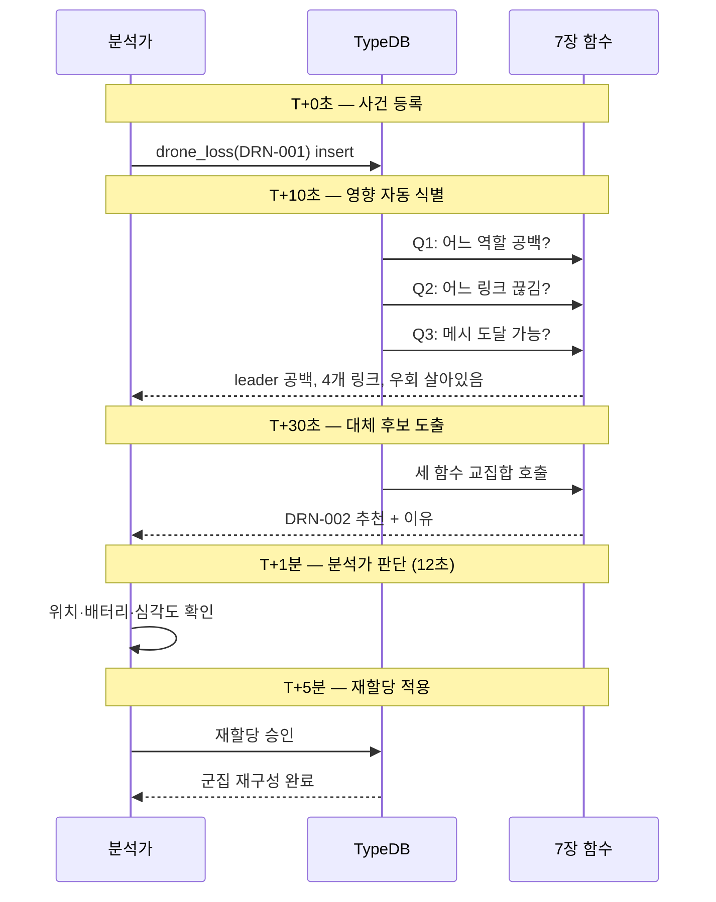
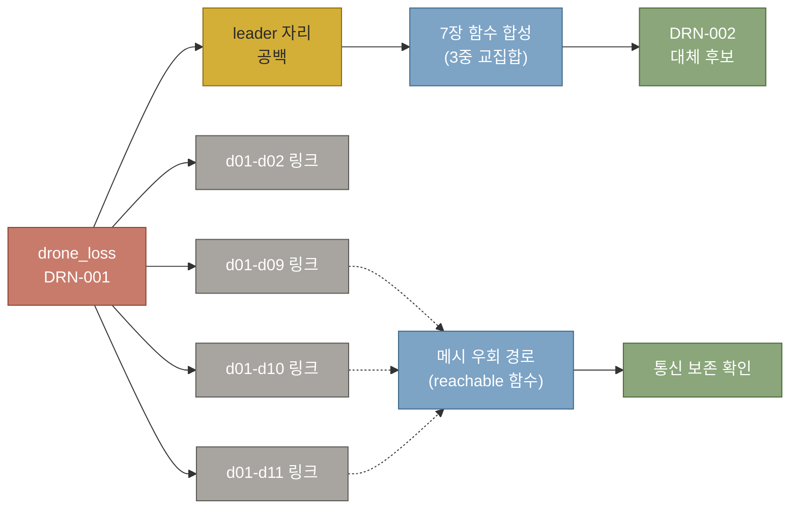
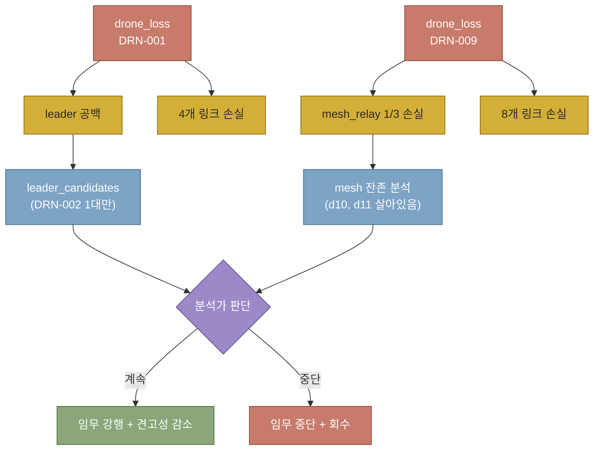
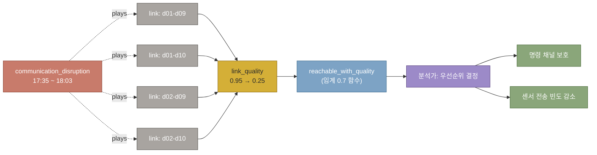
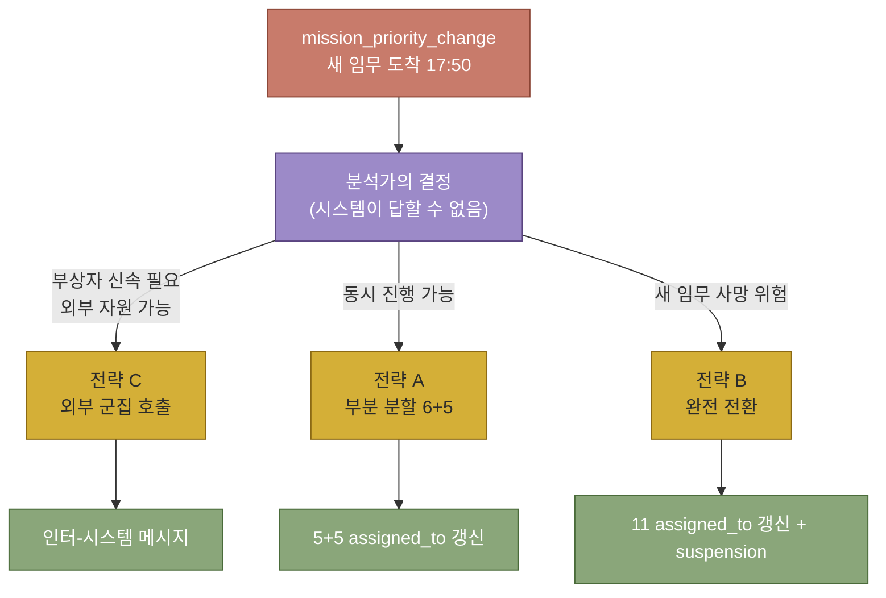

# 제8장. 시나리오 — 군집의 사건 대응

## 들어가며

여기까지 — 도메인을 직시했고(4장), 스키마를 지었고(5장), 12대 드론을 데이터로 채웠고(6장), 네 함수를 손에 들었다(7장). 이제 *그 모든 것이 한 사건 앞에서 작동하는 자리*다.

이 장이 책의 *클라이맥스*인 이유는 한 가지다. 지금까지의 모든 챕터가 — *이 한 순간을 위해서* 쌓인 것이기 때문이다. *DRN-005가 임무 중 손실됐다* 라는 한 줄의 사실 등록만으로 — 시스템이 *영향받는 임무*를 찾아내고, *깨진 통신 링크*를 식별하고, *대체 드론 후보*를 추천하고, *재할당의 이력*까지 데이터에 보존한다. 사람이 *하나씩 손으로 찾는 자리*가 — *한 줄의 쿼리*로 풀려나간다.

이것은 *기적*이 아니다. *제대로 짠 온톨로지에서 자연스럽게 나오는 결과*다. 분류 트리가 검색의 단위를 주고, N항 관계가 사건의 매듭을 잡고, 역할이 시점별 위치를 추적하고, 함수가 추론을 합성한다 — *네 도구가 동시에 일하는* 자리. 그 자리를 *눈으로 보는 것*이 이 장의 목적이다.

이 장은 *네 가지 시나리오*를 본다.
- **시나리오 A**: 리더 단일 손실 (이 장의 본진 — *책 전체의 정점*)
- **시나리오 B**: 두 드론 동시 손실 (병렬적 사건의 모양)
- **시나리오 C**: 통신 폭주 (사건의 다른 모양)
- **시나리오 D**: 임무 우선순위 변경 (사건이 아닌 *결정*)

각 시나리오의 *5단계 시간축*과 — *시스템이 답하는 자리·인간이 결정하는 자리*까지. 이것도 이 책의 중요한 정직함이다. *모든 것을 자동화하지 않는다*. 답할 수 있는 자리는 답하고, 판단해야 하는 자리는 *판단할 수 있는 사람*에게 *깨끗이 정리해서 넘긴다*. 그것이 *제대로 짠 시스템의 자리*다.

이론적 자리: *Forward chaining vs Backward chaining*, *Truth maintenance*, *사건 우선순위 결정* — 8장 후반의 ◇ 절에서 다룬다.

---

## 8.1 사건 매듭의 일반 패턴

본격 시나리오로 들어가기 전에 — 사건 자체를 *어떻게 데이터로 적는가*를 짚는다. 이 자리가 가볍게 보이지만, *온톨로지 작업에서 가장 자주 빠지는 함정*이 여기다.

흔한 첫 번째 시도: *사건을 attribute로 적는다*. "DRN-005가 손실됐다" → drone에 `lost: true` 속성. 이게 작동하는 자리가 있긴 하지만 — *언제 손실됐는지, 왜 손실됐는지, 무엇에 영향을 미쳤는지*를 같이 적어야 하는 순간, 속성 한두 개로는 부족해진다.

두 번째 시도: *사건을 entity로 둔다*. `loss_event isa event, owns time, owns cause`. 한 발 나아갔지만 — *사건이 무엇과 묶이는가*가 여전히 미해결. 별도 관계로 풀어야 한다.

*세 번째 자리*, 그리고 *진짜 모양*: **사건 자체가 N항 관계**다. *손실*이라는 사건은 — *한 드론*, *영향받은 임무들*, *깨진 링크들*, *시점*, *원인*을 *한 매듭으로 묶는* 것이다. 이것이 *Reified Event Pattern*이다. 5장에서 ODP로 짚은 그 자리.

Davidson이 1967년에 본 *사건 자체가 존재자*라는 통찰이 — *데이터 모델로 옮겨진 자리*다. 그리고 이 자리에서야 비로소 — *한 사건이 다른 사건의 자리에 들어가는* 일이 자연스러워진다. 8.2에서 *drone_loss 안에 communicates_with 관계 인스턴스가 들어간다*. 사건이 사건을 가리킨다. RDF에서는 *reification of reification*이라는 이중 우회가 필요한 부분이 — TypeDB에서 한 줄로 풀린다.

### Reified Event Pattern

5장에서 ODP로 짚은 *Reified Event Pattern*. 사건 자체를 *N항 관계*로 표현. 사건이 묶는 *주체, 영향 대상들, 시점, 원인*이 한 매듭에.

이 책에서 다룰 세 종류의 사건:

#### 8.1.1 `drone_loss` — 드론 손실

```typeql
transaction schema drone_swarm
```

```typeql
define
  relation drone_loss,
    relates lost_drone @card(1..1),
    relates affected_mission @card(0..),
    relates affected_link @card(0..),
    owns loss_time @card(1..1),
    owns loss_cause @card(0..1),
    owns severity @card(0..1);
  
  drone plays drone_loss:lost_drone;
  mission plays drone_loss:affected_mission;
  communicates_with plays drone_loss:affected_link;
  
  attribute loss_time, value datetime;
  attribute loss_cause, value string 
    @values("communication_failure", "battery_depleted", "mechanical_failure", "weather", "unknown");
  attribute severity, value string 
    @values("minor", "moderate", "severe", "critical");
```

**짚어둘 점** — `communicates_with` 관계가 *plays*로 `affected_link` 자리에 들어감. **관계 인스턴스가 다른 관계의 자리에 묶이는 모양**. RDF로는 *reification of reification*이라는 이중 우회가 필요한 부분이 — TypeDB에서는 한 줄.

#### 8.1.2 `communication_disruption` — 통신 차질

```typeql
  relation communication_disruption,
    relates affected_link_set @card(1..),
    owns disruption_start @card(1..1),
    owns disruption_cause @card(0..1),
    owns expected_duration_min @card(0..1);
  
  communicates_with plays communication_disruption:affected_link_set;
  
  attribute disruption_start, value datetime;
  attribute disruption_cause, value string
    @values("interference", "jamming", "weather", "congestion", "unknown");
  attribute expected_duration_min, value long @range(0..1440);
```

*여러 링크가 동시에 영향*받는 사건. `@card(1..)`로 *하나 이상의 링크*가 한 사건에 묶임.

#### 8.1.3 `mission_priority_change` — 임무 우선순위 변경

```typeql
  relation mission_priority_change,
    relates changed_mission @card(1..1),
    relates pre_empting_mission @card(0..1),
    owns change_time @card(1..1),
    owns new_priority @card(1..1),
    owns reason @card(0..1);
  
  mission plays mission_priority_change:changed_mission;
  mission plays mission_priority_change:pre_empting_mission;
  
  attribute change_time, value datetime;
  attribute new_priority, value long @range(1..10);
  attribute reason, value string;

commit;
```

*임무 우선순위가 바뀐다*는 자리. *기존 임무를 선점*하는 *새 임무*가 있다면 — `pre_empting_mission` 묶임.

### 세 사건 매듭의 공통 모양

- *시점*이 박힌 N항 관계
- *원인*은 옵션 (모를 수 있음)
- *영향 받는 대상*은 plays로 강제
- *심각도/우선순위*가 attribute로

이 *일반 패턴*이 — 모든 시나리오의 토대.

---

## 8.2 시나리오 A — 리더 단일 손실

이 시나리오가 *책의 결정적 순간*. 7장 함수들의 *진짜 합성*이 여기서 일어난다.

*장면*. 2026년 4월 1일 17시 23분. 임무 시작 1시간 23분 후. 산악 지역 수색 임무를 수행 중이던 DRN-001이 — 갑자기 모든 메시 노드에서 응답이 끊긴다. 통신 두절. *원인 미상*.

관제 분석가의 화면에는 한 줄의 메시지가 뜬다: *"DRN-001 link timeout, classification: lost"*. 분석가는 시스템에 *그 사실*을 한 번 등록한다 — `drone_loss` 인스턴스 한 개. *그게 전부다*.

그 한 줄의 입력이 — 다음 60초 동안 시스템 안에서 어떻게 풀려나가는가. 어떤 임무가 영향받는지, 어떤 통신 링크가 깨지는지, *리더 자리에 누구를 다시 앉혀야 하는지*. 여기서 *처음부터 본 모든 도구*가 — *동시에 작동한다*. 분류 트리가 능력의 가지를 따라 검색되고, N항 관계가 사건의 매듭을 잡고, 역할이 시점별 위치를 추적하고, 함수가 추론을 합성한다.

*이 절이 책의 정점*인 이유다.

### 8.2.1 사건 발생 — 손실 매듭 입력

```typeql
transaction write drone_swarm
```

```typeql
match
  $d01 isa drone, has serial_id "DRN-001";
  $m1 isa mission, has mission_id "MSN-2026-04-01-001";

insert
  $event isa drone_loss,
    has loss_time 2026-04-01T17:23:00,
    has loss_cause "communication_failure",
    has severity "severe";
  
  $event links (lost_drone: $d01);
  $event links (affected_mission: $m1);
commit;
```

손실 시점 — 임무 시작 1시간 23분 후.

### 8.2.2 5단계 시간축의 시스템 대응

*다음 5분 동안 관제 센터에서 일어나는 일을 — 시간순으로*.

#### T+0초. 사건이 데이터가 되는 순간

17시 23분 12초. 분석가의 두 번째 모니터에서 *DRN-001*의 텔레메트리 그래프가 — 한 줄짜리 평선으로 떨어진다. 통신 두절. 분석가는 이 자리를 한 번 본 적이 있다. 작년 가을 훈련에서. 그때는 *허위 경보*였다.

3초간 — 재연결 시도. 응답 없음. 분석가가 손가락을 한 번 옮긴다. 시스템에 *그 사실 한 줄*을 박는다:

```
drone_loss(DRN-001) at 17:23:00, cause: communication_failure, severity: severe
```

그게 전부다. 더 이상 분석가가 *손으로 해야 할 일은 없다*. 그 한 줄이 — 시스템 안에서 *연쇄 반응*을 시작한다.

#### T+10초. 시스템이 영향을 자동으로 풀어낸다

데이터베이스 안에서, 등록된 `drone_loss` 매듭이 *세 가지 추론*을 동시에 트리거한다.

- *어느 역할이 공백인가* — 8.2.3 Q1이 답한다: `leader`. 임무의 머리가 사라졌다.
- *어느 통신 링크가 끊겼는가* — 8.2.3 Q2가 답한다: DRN-002, DRN-009, DRN-010, DRN-011. *4개 링크의 한 끝*이 사라졌다.
- *남은 메시 네트워크는 여전히 연결되어 있는가* — 8.2.3 Q3이 `reachable_through_swarm`을 호출한다. 답: *그렇다. DRN-005에서 DRN-001로의 직접 경로는 끊겼지만, DRN-010을 거치는 우회 경로가 살아 있다*.

분석가의 화면 — 왼쪽에 *영향 분석* 패널이 자동으로 펼쳐진다. 빨간 글자가 두 줄, 노란 글자가 한 줄, 녹색 글자가 한 줄.

#### T+30초. 후보가 떠오른다

영향 분석이 끝났으면 — 다음은 *대체 드론의 도출*. 시스템이 *세 함수의 교집합*(8.2.4)을 호출한다.

- 7.2의 `leader_candidates(m1)` — 임무 m1의 리더 자리에 *현재 들어가지 않은* 능력 4+ 드론들
- 7.1의 `drones_with_capability(formation_lead, 5)` — formation_lead 5등급 보유 드론들
- 7.3의 `reachable_through_swarm(cand, DRN-001)` — 손실 드론을 제외하고도 통신이 살아 있는 자리들

세 집합의 교집합이 *0.4초 안에* 데이터베이스 엔진에서 계산된다. 답: **DRN-002**. 분석가의 화면 중앙에 — *하나의 후보*가 떠오른다. *추천 이유*까지 자동 표시 — "formation_lead 5등급 보유, 현재 follower 자리, DRN-009와 직접 통신 살아 있음".

#### T+1분. 사람이 결정하는 자리

여기까지 — *시스템이 답하는 자리*다. 지금부터는 *분석가*. 화면의 후보가 자동으로 *재할당되지는 않는다*. 12초 동안, 분석가는 다음 것들을 *눈으로 확인*한다:

- DRN-002의 *현재 위치* (지도 화면)
- DRN-002의 *남은 배터리* (현재 47%, 임무 종료까지 충분)
- 임무 영향의 *심각도* (현재 산악 지역 두 명의 조난자 — 지연이 곤란)

확인이 끝났다. 분석가가 *Approve* 버튼을 누른다.

#### T+5분. 군집이 새 모양으로 재구성된다

승인이 입력되면 — 8.2.5의 *임무 재할당 트랜잭션*이 실행된다. *기존 매듭은 삭제되지 않는다*. DRN-002의 follower 자리에 `assignment_end: 17:25:00`이 박힌다. *동시에* — 같은 DRN-002의 leader 자리에 `assignment_start: 17:25:00`이 박힌다. 이력은 보존되고, 현재 상태는 갱신된다.

이 갱신이 — *시스템의 다른 곳들*로 자동으로 전파된다. 편대 비행 알고리즘이 새 리더를 인식한다. 남은 11대(예비 1대 제외 시 10대)가 *DRN-002 중심*의 새 메시 위상에서 통신을 재구성한다. 17시 28분 02초. 군집이 *다시 일을 시작한다*.

5분 28초. 한 드론이 손실되고 — 군집이 *복구되기까지*의 시간. 사람이 *손으로* 같은 일을 한다면 — 베테랑 분석가도 *15분 이상* 걸린다. 능력 트리에서 검색하고, 통신 표를 보고, 후보를 비교하고. 그 *시간 단축의 자리*가 — 이 책이 짠 시스템의 *진짜 가치*다.



#### 시간축 요약표

| 시점 | 단계 | 시스템 작업 | 인간 작업 |
|---|---|---|---|
| **T+0초** | 사건 감지 | drone_loss 매듭 입력 (자동 또는 수동) | 한 줄 입력 |
| **T+10초** | 영향 식별 | 8.2.3의 4가지 질문 자동 호출 | 알림 수신 |
| **T+30초** | 후보 도출 | 7장 함수 합성으로 대체 후보 자동 | — |
| **T+1분** | 분석가 판단 | 후보 명단 + 추천 이유 제시 | *재할당 결정* |
| **T+5분** | 재할당 완료 | 데이터 갱신, 새 상태 propagation | 확인·승인 |

이 시간축이 *실시간 시스템*에서는 더 짧다 (T+1초 이하). 책의 단순화에서는 *분석가의 판단 자리*가 살짝 늘려서 잡혔다. 그 *판단 자리*는 — *기계가 답할 수 없는 자리*이기 때문에 — *절대 줄어들면 안 되는 자리*이기도 하다.

### 8.2.3 영향 자동 도출 — 네 질문

#### Q1. 어느 역할이 공백이 되는가

```typeql
transaction read drone_swarm
```

```typeql
match
  $d01 isa drone, has serial_id "DRN-001";
  $role isa role_def;
  (assigned_drone: $d01, played_role: $role) isa assigned_to;
  $role has role_type $role_type;
fetch $role_type;
```

답: `leader`. *임무의 리더 자리가 공백*.

#### Q2. 어느 통신 링크가 끊기는가

```typeql
match
  $d01 isa drone, has serial_id "DRN-001";
  ($d01, $other) isa communicates_with;
  $other has serial_id $sid;
fetch $sid;
```

답: DRN-002, DRN-009, DRN-010, DRN-011 — 리더가 *4개 링크의 한 끝*이었음.

#### Q3. 통신 경로가 여전히 도달 가능한가 (7.3 호출)

```typeql
match
  $d05 isa drone, has serial_id "DRN-005";
  $d09 isa drone, has serial_id "DRN-009";
  $d01 isa drone, has serial_id "DRN-001";
  
  let $r in reachable_through_swarm($d05, $d01);
  $r has serial_id "DRN-009";
fetch $r;
```

답이 있으면 — *DRN-005 → DRN-010 → DRN-009* 같은 우회 경로 존재.

#### Q4. 능력의 부분 손실은 (7.1 호출)

DRN-001이 가졌던 *formation_lead 5등급*과 *obstacle_avoidance 4등급*이 — 군집 전체에서 어느 정도 보존되는가:

```typeql
match
  $cap_lead isa formation_lead;
  let $d_remaining in drones_with_capability($cap_lead, 5);
  $d01 isa drone, has serial_id "DRN-001";
  not { $d_remaining is $d01; };
  $d_remaining has serial_id $sid;
fetch $sid;
```

답: DRN-002 (남은 formation_lead 5등급 보유자). *군집의 최고 등급 리더 능력은 유지됨*.

### 8.2.4 대체 드론 도출 — 세 함수의 합성

7장 함수들의 *교집합*으로 최종 답.

```typeql
match
  $m1 isa mission, has mission_id "MSN-2026-04-01-001";
  $d01 isa drone, has serial_id "DRN-001";
  
  # 7.2의 리더 후보
  let $cand in leader_candidates($m1);
  
  # 7.1의 능력 매칭 — formation_lead 5등급
  $cap_lead isa formation_lead;
  let $capable in drones_with_capability($cap_lead, 5);
  $cand is $capable;
  
  # 7.3의 통신 가능성 — DRN-009와의 통신 보장
  $d09 isa drone, has serial_id "DRN-009";
  let $reach in reachable_through_swarm($cand, $d01);
  $reach is $d09;
  
  $cand has serial_id $sid;
fetch $sid;
```



**세 함수의 교집합**:
- 리더 후보 (능력 4+ 비-리더 역할) ∩
- formation_lead 5등급 보유자 ∩
- 손실 드론 제외하고도 DRN-009와 통신 가능

답: **DRN-002**.

7.5절 *교집합 패턴*의 정확한 적용. 분석가가 12대 드론·능력·통신을 *머릿속에 들고 있지 않아도* — 시스템이 즉시 후보를 짚어준다.

### 8.2.5 임무 재할당

```typeql
transaction write drone_swarm
```

```typeql
match
  $d02 isa drone, has serial_id "DRN-002";
  $m1 isa mission, has mission_id "MSN-2026-04-01-001";
  $role_leader isa role_def, has role_type "leader";
  
  $old (assigned_drone: $d02, assignment_mission: $m1) isa assigned_to;

insert
  $old has assignment_end 2026-04-01T17:25:00;
  
  (assigned_drone: $d02, assignment_mission: $m1, played_role: $role_leader)
    isa assigned_to,
    has assignment_start 2026-04-01T17:25:00;
commit;
```

**짚어둘 점**:
- *기존 매듭을 삭제하지 않고 종료 시점만 박는다*
- *역할 변경의 이력*이 데이터에 보존됨
- 추후 *어느 드론이 언제부터 언제까지 어느 역할*이었는지를 *시간축으로 재구성* 가능

---

## 8.3 시나리오 B — 두 드론 동시 손실

*장면*. 같은 임무, 17시 23분. 정확히 같은 순간 — DRN-001(리더)과 DRN-009(중계)의 신호가 *동시에* 끊긴다. *동시*. 분석가의 화면에 두 줄이 동시에 떴다는 것은 — *우연이 아니다*. 산악 지역의 *강풍에 의한 충돌*이거나 *적대적 jamming*이거나, 둘 중 하나.

시나리오 A보다 무거운 자리다. 시나리오 A에서는 *후보 1대*가 있었다. 여기서는 — *후보 1대 + 중계 1대 손실*이다. 메시 네트워크가 *둘로 갈라질 위험*이 처음으로 등장한다.

분석가가 이 순간 마음에 들고 있는 질문 세 개:
1. *임무를 계속할 수 있는가* — 능력 합산이 충족되는가
2. *메시 네트워크가 분할되었는가* — 군집이 *두 부분*으로 갈라졌는가
3. *추가 손실이 일어나면* — 그래도 *복구 가능한가*

세 질문 모두 — *시스템이 도울 수 있는 자리*다.

### 8.3.1 사건 매듭 입력

```typeql
transaction write drone_swarm
```

```typeql
match
  $d01 isa drone, has serial_id "DRN-001";
  $d09 isa drone, has serial_id "DRN-009";
  $m1 isa mission, has mission_id "MSN-2026-04-01-001";

insert
  $loss1 isa drone_loss,
    has loss_time 2026-04-01T17:23:00,
    has loss_cause "communication_failure",
    has severity "severe";
  $loss1 links (lost_drone: $d01);
  $loss1 links (affected_mission: $m1);
  
  $loss2 isa drone_loss,
    has loss_time 2026-04-01T17:23:00,  # 동시
    has loss_cause "mechanical_failure",
    has severity "severe";
  $loss2 links (lost_drone: $d09);
  $loss2 links (affected_mission: $m1);
commit;
```

두 손실 사건. *동시*에 두 매듭이 생긴 상태.

### 8.3.2 복합 영향 도출

두 손실의 *합산 영향*. 단순 합이 아니라 — *상호작용*까지.

#### 능력 합산 손실

```typeql
match
  $d01 isa drone, has serial_id "DRN-001";
  $d09 isa drone, has serial_id "DRN-009";
  
  $cap isa capability, has capability_name $cname;
  
  # 손실 두 드론의 능력
  ((capable_drone: $d01, capability_type: $cap) isa has_capability, has capability_grade $g1)
    or
  ((capable_drone: $d09, capability_type: $cap) isa has_capability, has capability_grade $g2);
fetch $cname;
```

답: formation_lead, obstacle_avoidance, mesh_relay. *세 능력이 부분적으로 손실*.

#### 잔존 능력 합산

```typeql
match
  $cap_mesh isa mesh_relay;
  let $d_remaining in drones_with_capability($cap_mesh, 5);
  $d01 isa drone, has serial_id "DRN-001";
  $d09 isa drone, has serial_id "DRN-009";
  not { $d_remaining is $d01; };
  not { $d_remaining is $d09; };
  $d_remaining has serial_id $sid;
fetch $sid;
```

답: DRN-010, DRN-011 — *mesh_relay 5등급 잔존자*. 두 대가 남았으니 *완전 단절은 아님*.

#### 통신 토폴로지 재평가

이 자리가 결정적. DRN-009 손실 후 *메시 네트워크가 둘로 갈라지는가*:

```typeql
match
  $d05 isa drone, has serial_id "DRN-005";  # 관측 드론
  $d10 isa drone, has serial_id "DRN-010";  # 중계 드론
  $d01 isa drone, has serial_id "DRN-001";
  $d09 isa drone, has serial_id "DRN-009";
  
  # DRN-001 + DRN-009 모두 제외하고 도달 가능?
  let $r in reachable_through_swarm($d05, $d01);
  let $r2 in reachable_through_swarm($d05, $d09);
  $r is $r2;
  $r is $d10;
fetch $r;
```

답이 있으면 — *우회 경로 잔존*. 6장 데이터에서 DRN-005가 DRN-010과 직접 링크되어 있으므로 — 답은 *DRN-010*.

### 8.3.3 임무 가능성 재평가

두 드론 손실 후 — *임무가 여전히 수행 가능한가*. 분석가의 *판단 입력 자리*:

- 리더 후보: DRN-002 (시나리오 A와 동일)
- 중계 잔존: DRN-010, DRN-011 (2/3 잔존, 60% 용량)
- 관측 손실 없음 (DRN-003~006 모두 잔존)
- 열화상 손실 없음 (DRN-007, 008 잔존)

**결론**: 임무 *계속 가능*. 단 — *통신 견고성이 줄어듦*. 추가 손실 시 *임무 중단 위험*. 분석가는 *추가 백업*을 검토하거나 *임무 우선순위 하향*을 결정.



### 8.3.4 ◇ 설계 결정 — 연쇄 손실의 자리

*동시 손실*이 *단일 손실 두 번*과 다른 자리:

**다른 점 1 — 사건 간 상호작용**
단일 손실에서는 *한 사건의 영향*만 도출. 동시 손실에서는 *두 사건의 영향이 서로를 강화*. DRN-001 손실로 *임무 명령 채널*이 끊겼는데, DRN-009 손실로 *우회 중계 1대 감소*. 두 영향이 *곱셈처럼 작동*한다.

**다른 점 2 — 후보 풀의 축소**
시나리오 A에서는 *후보 1대*가 있었다. 시나리오 B에서도 *리더 후보는 여전히 DRN-002 1대*. 그러나 — *DRN-002까지 손실되는 시점*을 분석가가 *반드시 의식*해야 함. 즉 *시나리오 A의 답이 시나리오 B에서도 충분한가*가 별도 검토.

**다른 점 3 — 메시 네트워크 분할 위험**
DRN-009 손실 후 — 만약 *DRN-010이나 DRN-011 중 하나가 추가 손실*되면 — 군집이 *완전히 둘로 갈라짐*. 분석가는 *분할 임계점*을 알고 있어야 한다.

이 세 가지가 — *N항 관계*와 *재귀 함수*가 *동시에 작동해야* 답을 도출할 수 있는 자리다. 단순 그래프 DB로는 *동시 사건의 상호작용*을 매번 수동으로 풀어야 한다.

---

## 8.4 시나리오 C — 통신 폭주

*장면*. 17시 35분. 산악 지역 상공에서 *예기치 않은 무선 간섭*이 시작된다. 군용 항공기의 통과로 추정되는 *고출력 전자 방출*. 4개 링크의 *link_quality*가 동시에 *0.85에서 0.25 아래*로 떨어진다. 드론은 손실되지 않았다 — *드론은 모두 살아 있다*. 그러나 *네트워크의 신뢰성*이 *임무 수행 임계점 아래*로 떨어졌다.

이것이 시나리오 A·B와 *근본적으로 다른 모양*이다. A·B에서는 *드론 객체*가 사라졌다. 여기서는 *링크 객체*가 영향받는다. 그리고 — *영향이 일시적*이다 (간섭원이 지나가면 회복). *공포 시간*은 15분으로 추정.

분석가의 화면에 뜨는 한 줄: *"Mass interference detected, 4 links degraded, est. duration 15min"*. 시간이 *촉박*하다 — 임무 중간이라 *15분 동안의 운용 모드*를 *즉시 결정*해야 한다.

이 시나리오가 — *링크를 일급 시민으로 취급한 5장의 설계*가 *진짜로 빛을 발하는 자리*다. 사건이 link 객체에 *plays*로 묶인다.

### 8.4.1 사건 매듭 입력

```typeql
match
  # 영향 받는 링크 4개 (DRN-001과 중계 드론들 사이)
  $link1 (link_endpoint: $d01, link_endpoint: $d09) isa communicates_with;
  $link2 (link_endpoint: $d01, link_endpoint: $d10) isa communicates_with;
  $link3 (link_endpoint: $d02, link_endpoint: $d09) isa communicates_with;
  $link4 (link_endpoint: $d02, link_endpoint: $d10) isa communicates_with;
  $d01 isa drone, has serial_id "DRN-001";
  $d02 isa drone, has serial_id "DRN-002";
  $d09 isa drone, has serial_id "DRN-009";
  $d10 isa drone, has serial_id "DRN-010";

insert
  $event isa communication_disruption,
    has disruption_start 2026-04-01T17:35:00,
    has disruption_cause "interference",
    has expected_duration_min 15;
  
  $event links (affected_link_set: $link1);
  $event links (affected_link_set: $link2);
  $event links (affected_link_set: $link3);
  $event links (affected_link_set: $link4);
commit;
```

4개 링크가 *동시에* 영향. 단순 손실이 아니라 *품질 저하*.

### 8.4.2 link_quality 동시 갱신

전체 영향 받는 링크의 *quality를 0.3 이하로* (간섭 가정):

```typeql
match
  $event isa communication_disruption, has disruption_start 2026-04-01T17:35:00;
  $event links (affected_link_set: $link);
  $link has link_quality $old_q;

insert
  $link has link_quality 0.25;  # 새 품질로 갱신
  # delete $old_q는 별도 트랜잭션에서
```

### 8.4.3 고품질 경로만으로 도달 가능한가

7.3 변형 — *link_quality 0.7 이상*만 사용:

```typeql
match
  $d05 isa drone, has serial_id "DRN-005";
  let $r in reachable_with_quality($d05, $d05, 0.7);  # excluded는 자기 자신
  $r has serial_id $sid;
fetch $sid;
```

답: DRN-005에서 *고품질 경로로 도달 가능한 드론들*. 통신 폭주 자리에서 이 답이 — 6장의 *모든 드론*에서 *일부 드론*으로 줄어든 모양.

### 8.4.4 우선순위 트래픽 식별

분석가의 결정: 어느 통신이 *최우선*인가.
- 리더↔중계: 임무 명령 — *최우선*
- 관측↔중계: 센서 데이터 — *중요*
- 중계↔중계: 백본 — *중요*

저품질 시기에는 — *센서 데이터 전송 빈도 감소*, *명령은 최우선 채널 사용* 같은 운용 결정.

여기서 *시스템이 도울 수 있는 것*: *우선순위별 도달 가능 경로* 분석. 시스템이 답하지 않는 자리: *어느 우선순위가 임무에 결정적*인지의 판단 — 분석가의 자리.

### 8.4.5 15분 후 — 회복 처리

간섭원 통과. 18시 03분. 분석가는 *영향 사건의 종료*를 시스템에 등록한다:

```typeql
match
  $event isa communication_disruption,
    has disruption_start 2026-04-01T17:35:00;
  $event links (affected_link_set: $link);
  $link has link_quality $degraded;

insert
  $link has link_quality 0.85;  # 회복된 품질
```

*간섭 사건 자체는 데이터에 보존*. 추후 *같은 자리에서 또 일어났을 때*의 분석에 사용. 데이터의 *시간축*이 사건의 *발생-회복*을 둘 다 박는다.



### 8.4.6 ◇ 설계 결정 — 왜 communicates_with가 plays를 할 수 있는가

이 시나리오가 — *5장의 *깊은 설계*를 한 번 더 짚는 자리다. 다시 보자:

```typeql
relation communication_disruption,
  relates affected_link_set @card(1..);

communicates_with plays communication_disruption:affected_link_set;
```

이 한 줄. *관계가 다른 관계의 자리에 들어간다*. RDF에서는 — *각 link를 reification으로 노드화*하고, 다시 *그 노드를 disruption 노드와 연결*하는 *이중 우회*가 필요한 자리. TypeDB에서는 *한 줄의 plays 선언*.

**왜 이 모양이 중요한가**:
- *링크 자체가 영향의 단위*인 도메인에서 — 이 모양 없이는 *링크 사건*을 *데이터에 깨끗이 적을 수 없다*
- *링크 사건의 묶음*을 *하나의 매듭*으로 다루기 — 즉 *4개 링크가 같은 원인으로 동시 영향*이라는 *사실의 단위*를 보존
- *시간축의 박힘* — disruption_start·expected_duration이 *사건 자체*에 박힘. 각 링크마다 따로 적지 않음.

*Davidson이 1967년에 본 통찰*이 — *링크의 사건*에까지 자연스럽게 적용되는 자리다. 사건은 *그 자체로 존재자*이며, 사건의 *다른 사건과의 관계*도 일급으로 표현 가능.

이 시나리오 없이는 — *5장의 깊은 설계*가 *과잉 설계처럼* 보일 수 있다. 시나리오 C가 — *그 설계의 필요성*을 *증명*한다.

---

## 8.5 시나리오 D — 임무 우선순위 변경

*장면*. 17시 50분. 현재 임무가 *60% 진행* 상태에서 — 갑자기 관제 센터에 *두 번째 조난 신고*가 들어온다. *DRN-001이 막 재할당된 새 리더 체제*가 *처음으로 안정화된 직후*. 새 신고의 위치는 같은 산악 지역의 *5km 떨어진 자리*. 부상자 중 한 명이 *심각한 외상*을 호소.

이번 사건은 — 시나리오 A·B·C와 *완전히 다른 자리*다. 드론도, 링크도 손실되지 않았다. 모든 시스템이 *정상 작동*. 그런데 — *결정의 무게가 가장 크다*. *어느 임무에 더 많은 자원을 보낼 것인가*는 — *기계가 답할 수 없는 자리*다. 

분석가의 화면에 두 임무가 *나란히* 표시된다:
- *임무 1* (MSN-2026-04-01-001) — 산악 수색, 2명 조난자, 60% 진행
- *임무 2* (MSN-2026-04-01-002) — 신규, 1명 심각한 외상, 0% 진행, 우선순위 *Critical*

12대의 드론(이중 1대 손실 후 11대). 두 임무가 모두 *야간 광학*과 *열화상*과 *통신 메시*를 요구. 자원은 *유한*하다.

이 시나리오에서 — *시스템이 도울 수 있는 자리*가 정확히 무엇이고, *분석가만이 할 수 있는 자리*가 무엇인가가 *가장 또렷이 갈리는 자리*다.

### 8.5.1 사건 매듭 입력

```typeql
match
  $m1 isa mission, has mission_id "MSN-2026-04-01-001";  # 기존 산악 수색

insert
  # 새 긴급 임무 — 인근 지역의 추가 조난 신고
  $m2 isa search_and_rescue,
    has mission_id "MSN-2026-04-01-002",
    has started_at 2026-04-01T17:50:00;
  
  $event isa mission_priority_change,
    has change_time 2026-04-01T17:50:00,
    has new_priority 1,  # 최우선
    has reason "Critical injury reported";
  $event links (changed_mission: $m1);  # 기존 임무가 영향 받음
  $event links (pre_empting_mission: $m2);  # 새 임무가 선점
commit;
```

새 임무 등록 + 우선순위 변경 사건.

### 8.5.2 자원 분할 결정

분석가의 결정 자리. 시스템이 도울 수 있는 분석:

#### 분석 1 — 두 임무의 능력 요구 vs 군집 능력

```typeql
match
  $cap isa capability, has capability_name $cname;
  let $d in drones_with_capability($cap, 3);
fetch $cname; count($d);
```

군집의 *능력 매트릭스 현황*. 두 임무가 모두 *night_optical*과 *thermal_imaging*을 요구한다면 — *능력별 분할 비율* 산출.

#### 분석 2 — 두 임무의 위치 거리

(이 책의 단순화에서 위치 데이터는 없음. 실전에서는 *현재 위치*와 *임무 위치*의 거리 계산)

#### 분석 3 — 통신 메시 분할 가능성

```typeql
match
  $d_relay isa drone;
  $cap_relay isa mesh_relay;
  (capable_drone: $d_relay, capability_type: $cap_relay) isa has_capability;
  $d_relay has serial_id $sid;
fetch $sid;
```

답: DRN-009, 010, 011 — 3대의 중계. *두 임무에 1대 + 2대*로 분할 가능. 또는 *1대 + 1대 + 1대 분할*도.

### 8.5.3 분할 시나리오

분석가가 결정: *기존 임무에 6대 유지, 새 임무에 5대 할당, 예비 1대는 통합 백업*.

```typeql
match
  $d07 isa drone, has serial_id "DRN-007";  # 열화상 - 새 임무 이전
  $d08 isa drone, has serial_id "DRN-008";  # 열화상 - 새 임무 이전
  # ... 추가 드론들
  $m1 isa mission, has mission_id "MSN-2026-04-01-001";
  $m2 isa mission, has mission_id "MSN-2026-04-01-002";
  $role_rescuer isa role_def, has role_type "rescuer";
  
  # 기존 임무에서 종료
  $old_a (assigned_drone: $d07, assignment_mission: $m1) isa assigned_to;
  $old_b (assigned_drone: $d08, assignment_mission: $m1) isa assigned_to;

insert
  $old_a has assignment_end 2026-04-01T17:52:00;
  $old_b has assignment_end 2026-04-01T17:52:00;
  
  # 새 임무에 할당
  (assigned_drone: $d07, assignment_mission: $m2, played_role: $role_rescuer)
    isa assigned_to, has assignment_start 2026-04-01T17:52:00;
  (assigned_drone: $d08, assignment_mission: $m2, played_role: $role_rescuer)
    isa assigned_to, has assignment_start 2026-04-01T17:52:00;
commit;
```

기존 임무의 *부분 자원 회수* + 새 임무로 *전환*. 데이터의 *시간축*이 모든 변경을 보존.

### 8.5.4 세 가지 분할 전략 — 분석가의 결정 트리

같은 사건 앞에서, *서로 다른 분석가가 다른 결정*을 내릴 수 있다. 셋 모두 *합리적*이다:

**전략 A — 부분 분할** (선택됨)
- 기존 임무 6대, 새 임무 5대, 예비 1대
- *두 임무 동시 진행*. 각 임무의 능력은 *60~70% 수준*
- 새 임무의 부상자가 *심각한데 신속함이 가능*

**전략 B — 완전 전환**
- 기존 임무를 *일시 중단* (11대 모두 새 임무로)
- 새 임무 완료 후 *기존 임무 재개*
- *새 임무의 사망 위험이 임박*한 경우의 선택

**전략 C — 기존 유지 + 추가 자원 요청**
- *외부 군집*(다른 관제 센터의 드론) 호출
- 기존 임무 11대 유지, 새 임무는 외부 자원으로
- *조직간 협조 가능*한 경우의 선택

각 전략의 *데이터 모델 표현*이 모두 다르다:

| 전략 | 데이터 변화 | 사건 매듭 |
|---|---|---|
| A 부분 분할 | 5개 assigned_to에 end 박고, 5개 new insert | mission_priority_change 1개 |
| B 완전 전환 | 11개 assigned_to에 end, 11개 new insert | mission_priority_change + suspension 별도 |
| C 외부 자원 | 외부 군집의 assigned_to insert | 인터-시스템 메시지 (책 범위 밖) |



### 8.5.5 ◇ 설계 결정 — 사건이 아닌 *결정*의 자리

시나리오 A·B·C는 *사건*이었다. *외부에서 시스템에 가해진* 무엇. 시나리오 D는 *결정*이다. *시스템 안의 운영자가 내리는* 무엇.

그런데 — *데이터 모델은 같은 모양*이다. *mission_priority_change*도 N항 관계로 표현. *시점*이 박힌다. *원인*과 *결과 임무*가 묶인다.

**이게 의미하는 것**: 온톨로지의 *사건* 개념이 *물리적 사건*에만 적용되지 않는다. *인지적·운영적 결정*도 *사건*으로 다룬다. 의사가 *환자를 처방한다*는 결정, 법관이 *판결한다*는 결정, 분석가가 *임무 분할한다*는 결정 — 모두 *데이터에 박힌 사건*.

**왜 이게 중요한가**: 이렇게 *결정을 데이터화*하면 — 나중에 *왜 그렇게 결정했는지의 회고*가 가능해진다. *유사한 자리에서 과거에 어떤 결정이 내려졌는지*가 쿼리 가능. *의사결정 지원 시스템*의 기초.

이 책의 단순화에서는 *change_time + new_priority + reason*만 박았다. 실전에서는 — *어느 분석가*, *어느 권한*, *어느 외부 변수*까지 추가 매듭. 그러면 *결정의 책임 추적*까지 데이터에 박힌다.

이것이 — *시나리오 D를 다루는 진짜 이유*다. 단순한 *재할당 예제*가 아니다. *의사결정의 온톨로지화*라는 *훨씬 큰 자리*의 시작이다.

---

## 8.6 사건 우선순위 결정 — 시스템과 인간의 분업

네 시나리오의 공통 자리. *어느 결정이 시스템에 위임 가능하고, 어느 결정이 인간의 자리인가*.

### 시스템이 자동 결정 가능

- **사실 도출**: 영향 받는 자리, 잔존 자원, 가능 경로
- **후보 도출**: 능력·역할·통신을 합성한 *논리적 후보*
- **임계 충족 확인**: 능력 합이 임무 요구를 충족하는가
- **데이터 일관성 유지**: 시간축의 종료/시작 박힘
- **알림 트리거**: 분석가에게 무엇을 알릴 것인가

### 시스템이 *결정해서는 안 되는* 자리

- **임무 중단·계속 결정**: 비행 안전, 인명, 법적 책임이 걸린 자리
- **새 임무 수용·거부**: 운영 우선순위, 자원 한계 판단
- **분쟁 해결**: 두 임무가 같은 자원을 요구할 때 — 분석가·운영진의 결정
- **위험 허용 수준**: *추가 손실 가능성*을 어느 수준까지 감수할 것인가
- **외부 변수 통합**: 기상, 적대적 환경, 법적 제약 등 *온톨로지 바깥의 정보*

### 자동 결정의 임계점

작은 결정은 *완전 자동*, 큰 결정은 *분석가 승인 필수*. 임계점 예시:

| 결정 종류 | 자동? | 인간 승인 |
|---|---|---|
| 시간축 데이터 갱신 (assignment_end 박기) | ✓ | — |
| 새 사건 매듭 입력 (drone_loss) | ✓ | (사후 검토) |
| 단일 역할 재할당 | (분석가 승인 후) | ✓ |
| 임무 중단·계속 | — | ✓ (필수) |
| 새 임무 수용 | — | ✓ (필수) |

이 임계점이 *시스템 설계의 핵심*. 너무 자동화하면 — *인간의 통제 상실*. 너무 수동이면 — *반응 시간 너무 길어짐*.

---

## 8.7 ◇ 이론 절 — Forward vs Backward Chaining

### 두 방향의 추론

추론 시스템은 *어느 방향으로 작동하는가*에 따라 두 가지로 나뉜다.

**쉬운 풀이 — 도서관 사서의 두 가지 일하는 방식**:

*Forward chaining*은 — *책이 들어올 때마다 모든 색인을 미리 만드는 사서*. 새 책 한 권 도착 → *제목 색인·저자 색인·분류 색인·주제 색인*을 모두 즉시 갱신. 결과: *손님이 묻는 모든 질문에 즉시 답*. 비용: *손님이 안 묻는 색인도 다 만들어야*.

*Backward chaining*은 — *손님이 물을 때 거기서 찾는 사서*. 평소엔 색인 안 만듦. 손님이 *X를 찾는다* → 거기서 찾기 시작. 결과: *유연함, 적은 사전 작업*. 비용: *같은 질문 반복되면 매번 찾기*.

어느 게 옳은가? 도서관의 *질문 패턴*에 달려 있다. 자주 묻는 질문이라면 forward, 드물게 묻는 질문이라면 backward. 데이터베이스도 같다.

**Forward Chaining (전진 추론)**
- *데이터에서 결론으로*
- 새 사실이 입력되면 → 적용 가능한 규칙을 모두 발동 → 도출되는 모든 새 사실을 저장
- *Materialization* 전략과 결합
- 장점: 쿼리가 빠름 (이미 도출된 사실을 조회만)
- 단점: 데이터 변경마다 비용, 사용되지 않는 사실도 계산

**Backward Chaining (후진 추론)**
- *질문에서 데이터로*
- 질문이 들어오면 → 답에 필요한 사실을 *역방향으로* 추적
- *On-the-fly* 전략과 결합
- 장점: 질문에 필요한 사실만 계산
- 단점: 같은 질문 반복 시 매번 재계산

### TypeDB의 위치

TypeDB의 함수는 *기본적으로 backward chaining*이다.
- `let $r in leader_candidates($m1)` 호출 → 그 시점에 fixpoint 계산
- 데이터가 변경되면 → 다음 호출에서 자동 반영
- *일관성 보장*

그러나 — *큰 그래프*에서 같은 질문이 자주 호출되면, *명시적 materialization*이 가치 있다 (7.6 참조).

### 사건 시스템에서의 적용

이 장의 4개 시나리오에서 — *backward chaining*이 자연스러운 이유:

1. *사건은 드물게 발생* → forward materialization 비용 정당화 어려움
2. *영향 도출이 매번 다른 함수 합성* → 미리 materialize할 *공통 결과*가 없음
3. *데이터 일관성이 결정적* → on-the-fly의 즉시 반영이 가치

### Truth Maintenance Systems (TMS)

학계에서 *Truth Maintenance Systems*는 *추론된 사실의 의존성을 명시적으로 추적*하는 시스템.

- 사실 A로부터 B가 추론됨 → *B는 A에 의존*
- A가 부정되면 → B도 자동 부정 (또는 재계산)

TypeDB의 함수는 *명시적 TMS가 아니다*. 그러나 — *backward chaining이라서 매번 재계산*이므로, 사실상 *자동 truth maintenance*가 일어남.

명시적 TMS가 필요한 부분:
- 추론 비용이 매우 큰 경우 (재계산이 비실용적)
- 부분 갱신만 필요한 경우
- 추론 사슬을 *추적·설명*해야 할 경우 (XAI)

이 책의 8장 사례는 — *데이터 규모가 작아* on-the-fly로 충분.

### Materialization과의 트레이드오프

8.2.4의 합성 쿼리는 *세 함수를 호출*. 각각 fixpoint 계산. 12대 드론에서는 즉시지만 — *수백 대*로 확장되면 *materialization*이 필요해진다.

운영 시스템의 자리:
- *자주 묻는 함수*는 materialize
- *드물게 묻는 함수*는 on-the-fly
- *데이터 갱신 빈도*가 materialization의 trigger
- *consistency 요구*가 strategy 결정

---

## 8.8 시스템이 답하지 않는 자리 — 정직한 한계

도구를 미화하지 않는 약속이 이 장에서 가장 중요하다.

### 시스템이 답하는 것

- 어느 역할이 공백이 됐는가
- 어느 통신 링크가 끊겼는가
- 능력의 군집 차원 손실이 있는가
- 대체 후보는 누구인가
- 대체 후 데이터 일관성을 어떻게 유지하는가
- 다중 사건의 *복합 영향*
- 임무 분할 가능성의 *논리적 분석*

### 시스템이 답하지 않는 것

**1. 실시간 비행 제약**
- 배터리 잔량 (DRN-002가 현재 30% 남았다면?)
- 풍속·기상 (산악 강풍에 견디는가?)
- 충돌 회피 (재배치 경로의 안전)
- 통신 지연 (재할당 명령이 도달할 시간)

**2. 안전 마진**
- 새 리더가 자기 자리에 도달할 시간 동안 군집이 견디는가
- 임무 중단 vs 재할당 결정의 *위험 평가*
- 조난자의 시간적 긴급성

**3. 인간 관제사의 판단**
- 시스템이 *후보*를 답하지만 — *최종 결정*은 사람의 자리
- 분석가의 *도메인 지식*과 *맥락 이해*가 시스템 위에 있음

**4. 법적·운용적 제약**
- 야간 비행 인가
- 비행 금지 구역
- 통신 주파수 규제
- 군 운용 시 *교전 규칙(ROE)*

**5. 신뢰도와 검증**
- 시스템의 답이 *원리적으로 옳다*는 것과 *실제 작동한다*는 것은 다르다
- *시뮬레이션 검증* + *제한된 환경에서의 시범* + *실전 적용*의 단계가 필요

### 시스템과 분석가의 협업

시스템은 *분석가·관제사의 결정을 대체하는 도구가 아니다*. 분석가가 *놓치고 있던 자리*를 자동으로 보여주는 도구다.

- 12대 드론·21개 능력 매듭·16개 링크를 *머릿속에 들고 있을 필요가 없다*
- *함수가 답한 후보*에서 *최종 판단*은 사람이 한다
- 시스템과 사람의 *분업*이 명확해질 때 — 둘 다 강점이 살아남

---

## 8.9 정리

이 장에서 손에 들어온 것:

**네 가지 시나리오**
- A: 리더 단일 손실 — 시스템의 본격 작동 (8.2)
- B: 두 드론 동시 손실 — 복합 영향과 잔존 자원 분석 (8.3)
- C: 통신 폭주 — 품질 기반 필터링과 우선순위 (8.4)
- D: 임무 우선순위 변경 — 자원 재분할 (8.5)

**5단계 시간축**
- T+0초 → T+10초 → T+30초 → T+1분 → T+5분
- 각 단계의 시스템 작업과 인간 작업 명시

**사건 매듭의 일반 패턴**
- drone_loss, communication_disruption, mission_priority_change
- Reified Event Pattern의 세 가지 적용

**사건 우선순위 결정**
- 시스템 자동 vs 인간 승인 임계점
- 시스템이 답하는 자리와 답하지 않는 자리의 정직한 가르기

**이론적 토대**
- Forward chaining vs Backward chaining
- Truth maintenance — 데이터 변경 시 추론 일관성
- Materialization 트레이드오프

다음 장 — *9장 정리와 다음 발걸음*. 책 전체의 *네 가지 도구가 어떻게 회수되었는가*, 자매 책과의 비교, 그리고 *OWL·SHACL·Description Logic*으로의 다음 단계.

---

## 연습문제

**문제 1 (시나리오 변형).** *DRN-002까지 동시 손실*된다면 — 8.2.4의 교집합 쿼리가 어떤 결과를 낼 것 같은가? 시스템이 *대안적 답*을 내려면 어떤 함수를 더 짜야 하나?

**문제 2 (사건 우선순위).** 시나리오 A(리더 손실)와 시나리오 D(임무 우선순위 변경)가 *동시에* 발생한다면 — 시스템이 어느 것을 먼저 처리해야 하나? `severity` 속성을 어떻게 설계하면 자동 우선순위가 가능한가?

**문제 3 (Truth Maintenance).** 분석가가 *재할당 승인을 취소*한다면 — 데이터 모델 위에서 어떤 *되돌리기 연산*이 필요한가? 8.2.5의 `assignment_end` 박힌 매듭은 어떻게 되돌리나?
