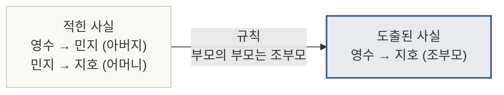
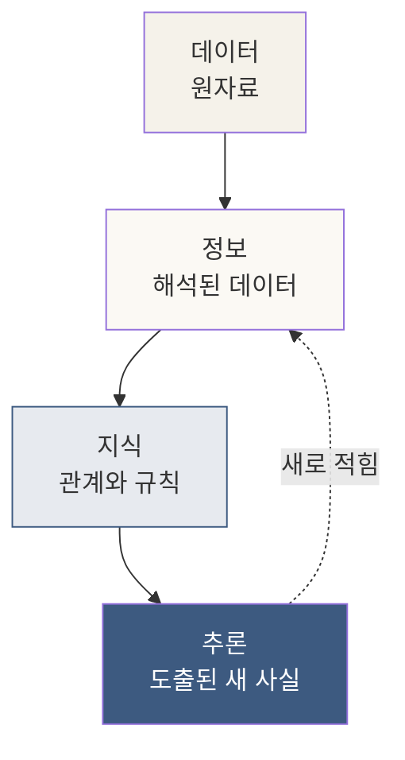
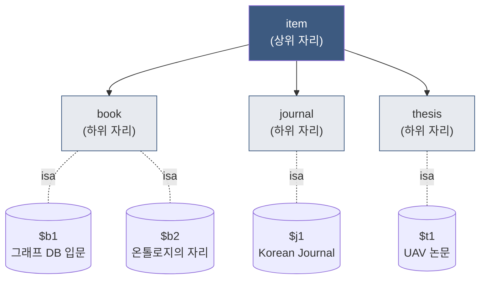
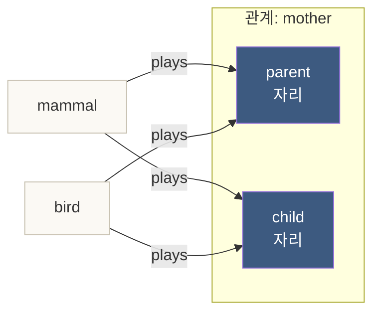
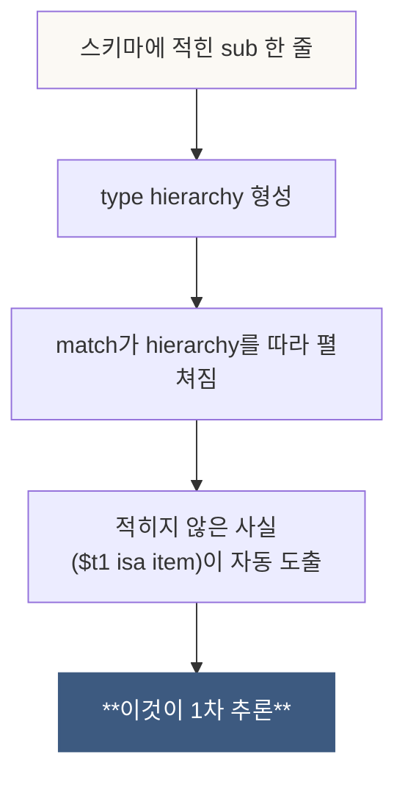

# 1장. 매칭은 이미 추론이다

> *추론은 무거운 단어다. 하지만 TypeDB에서는 — 가장 짧은 매칭 한 줄 안에서 이미 작동하고 있다.*

---

## 1.0 이 장이 답하는 질문

이 장이 풀어내는 한 질문은 이것이다.

> **`match $x isa drone;` 한 줄이 — 왜 *추론*이라고 불릴 만한가?**

이 질문에 답할 수 있다면, 책의 나머지 네 장이 *왜 그렇게 쌓아 올리는가*가 보인다. 추론은 *나중에 등장하는 고급 기능*이 아니라 — TypeDB의 가장 첫 줄부터 작동하는 토대다.

---

## 1.1 들어가며 — 추론이라는 단어의 무게

*추론(inference)*은 우리말에서 무겁게 들린다. 형사가 단서에서 범인을 추리하는 자리, 수학자가 공리에서 정리를 끌어내는 자리 — 그런 그림이 먼저 떠오른다.

그러나 정보과학에서 추론은 훨씬 작고 일상적인 자리에서 시작한다. **적힌 사실에서 — 적히지 않은 사실을 도출하는 모든 작업**이 추론이다.

### 가장 작은 추론

가족 관계로 예를 든다. 어느 가계도에 다음만 적혀 있다.

```
- 영수는 민지의 아버지다.
- 민지는 지호의 어머니다.
```

여기서 "*영수는 지호의 무엇인가?*"라고 누가 물으면 — 우리는 즉시 **할아버지**라고 답한다. 그런데 *할아버지*라는 단어는 위 두 줄 어디에도 없다. 우리 머릿속에 **부모의 부모는 조부모**라는 규칙이 있었고, 그 규칙을 적힌 두 사실에 적용해 — *적히지 않은 사실*을 끌어냈다.

이게 추론이다. 거창한 단어가 아니라 — *우리가 모든 대화에서 매 순간 하는 작업*. 정보과학은 이 작업을 *기계가 자동으로 하게* 만드는 도구를 만들어왔다.



### 데이터베이스와 추론

전통적인 데이터베이스 — PostgreSQL, MongoDB, Excel — 는 *적힌 것만* 알려준다. *적힌 것에서 도출되는 것*을 알고 싶으면, **사용자가 코드를 짜서** 도출해야 한다. 데이터베이스는 그 작업의 자리가 아니었다.

TypeDB가 자리를 달리하는 곳이 여기다. **적힌 사실에서 도출되는 사실을 — 데이터베이스가 직접 알려준다.** 그 첫 번째 모양이 — *매칭*이다.

---

## 1.2 데이터 · 정보 · 지식 — 세 가지 무게

본격적인 코드로 들어가기 전, 무게가 다른 세 단어를 정리한다.

| 무게 | 모양 | 예시 |
|---|---|---|
| **데이터** | 원자료, 의미 없는 기호 | `42`, `"NVIDIA"`, `2024-01-15` |
| **정보** | 데이터에 *해석*이 붙은 것 | `NVIDIA의 매출은 2024-01-15에 42억$였다` |
| **지식** | 정보들 사이의 *관계와 규칙* | `A가 B의 공급자이고, B가 C의 공급자면 — A의 변화가 C에 전파될 수 있다` |

데이터베이스는 전통적으로 *데이터*와 *정보*의 자리였다. 적힌 것을 빠르게 찾는 도구. *지식*은 — 사람의 머릿속, 분석 코드, 비즈니스 문서에 있었다.

**TypeDB의 입장**은 이렇다. *지식 — 즉 관계와 규칙 — 도 데이터베이스 안에 적혀야 한다*. 그래야 시스템이 *적힌 것에서 도출되는 것*까지 알려줄 수 있다.



이 그림에서 **K → R의 화살표**가 — 이 책 다섯 장이 머무는 자리다. TypeDB가 *어떻게 지식을 받아, 어떻게 추론을 생산하는가*.

---

## 1.3 첫 번째 매칭 — 도서관에서

가장 친숙한 도메인으로 시작한다. 도서관 장서.

### 스키마

```typeql
define
  entity item;
  entity book sub item, owns title, owns author, owns year;
  entity journal sub item, owns title, owns issn;
  entity thesis sub item, owns title, owns author, owns degree;

  attribute title, value string;
  attribute author, value string;
  attribute year, value long;
  attribute issn, value string;
  attribute degree, value string;
```

세 가지가 들어 있다.
- `item`은 *모든 장서의 부모* 자리
- `book`, `journal`, `thesis`는 각각 *item의 자식*
- 각 자식은 *자신의 속성*을 가진다 (`book`은 *제목·저자·출판연도*, `journal`은 *제목·ISSN*, …)

### 데이터

```typeql
insert
  $b1 isa book, has title "그래프 데이터베이스 입문", has author "김지훈", has year 2022;
  $b2 isa book, has title "온톨로지의 자리", has author "박서연", has year 2024;
  $j1 isa journal, has title "Korean Journal of AI", has issn "1234-5678";
  $t1 isa thesis, has title "다중 UAV 임무 할당", has author "이도현", has degree "박사";
```

장서 네 권이 들어왔다.

### 첫 매칭

여기 첫 번째 쿼리.

```typeql
match $x isa book;
fetch $x: title, author, year;
```

답:

```
[
  { "title": "그래프 데이터베이스 입문", "author": "김지훈", "year": 2022 },
  { "title": "온톨로지의 자리", "author": "박서연", "year": 2024 }
]
```

여기까지는 — 평범한 데이터베이스도 한다. SQL로 쓰면 `SELECT * FROM books;`다. 추론이라고 부를 만한 게 *아직* 없다.

---

## 1.4 sub의 자리 — type hierarchy

이제 한 줄을 바꾼다.

```typeql
match $x isa item;     ← book이 아니라 item을 묻는다
fetch $x: title;
```

답:

```
[
  { "title": "그래프 데이터베이스 입문" },        ← book
  { "title": "온톨로지의 자리" },                  ← book
  { "title": "Korean Journal of AI" },              ← journal
  { "title": "다중 UAV 임무 할당" }                 ← thesis
]
```

**네 개의 장서가 모두 잡혔다.** 데이터에는 *"이것은 item이다"*라고 적힌 적이 한 번도 없는데도.

이 자리에서 추론이 작동했다. *어떻게?*

### sub의 의미

스키마에 적힌 한 줄.

```typeql
entity book sub item;
```

이 한 줄을 시스템은 이렇게 읽는다.

> **"모든 book은 — 동시에 item이기도 하다."**

그래서 *book 인스턴스를 넣었을 때*, 시스템은 그것을 *book이자 동시에 item으로* 기억한다. 우리가 `match $x isa item;`이라고 물으면 — *book·journal·thesis 모두를* 잡는다.



`match $x isa item;`이 잡는 자리 — 트리의 **item 노드 아래 모든 하위 인스턴스**. 시스템이 *type hierarchy를 따라 자동으로 내려가며* 매칭한다.

### 이게 왜 추론인가

여기서 한 번 멈춘다. **"$t1은 item이다"라는 사실은 — 데이터에 적힌 적이 없다.** 우리가 적은 것은:

- `$t1 isa thesis` (적힌 사실 1)
- `thesis sub item` (적힌 사실 2 — 스키마)

이 두 줄에서 시스템이 *도출한* 사실이 — `$t1 isa item`이다. 이 도출이 **추론**이다.

전통적인 RDBMS라면 이게 자동으로 안 된다. *책 테이블*과 *학위논문 테이블*이 따로 있고, *둘을 합쳐 보고 싶으면* `UNION`을 사용자가 직접 짜야 한다. TypeDB는 — 스키마에 적힌 *sub 한 줄*만으로 — 그 작업을 자동으로 한다.

---

## 1.5 자동 일반화 — 왜 *추론*이라고 부르는가

이름을 한 번 더 정한다. 이 작업의 정확한 이름은 — **다형적 매칭(polymorphic matching)** 또는 **자동 일반화(automatic generalization)**다.

### 일반화의 사다리

| 매칭 | 잡는 자리 | 추론의 깊이 |
|---|---|---|
| `match $x isa book;` | book만 | 0차 (직접 매칭) |
| `match $x isa item;` | book + journal + thesis | 1차 (sub 한 단계) |
| `match $x isa entity;` | 모든 entity | 2차 이상 (sub 누적) |

위로 올라갈수록 — *적힌 한 줄이 더 넓은 자리를 잡는다*. 이게 *자동 일반화*다. 사람이 *모든 자식을 일일이 적지 않아도* 시스템이 *자기 트리를 알기에* 자동으로 펼친다.

### 코드로 보는 무게

```typeql
match
  $x isa item;
  $x has title $t;
fetch $t;
```

이 한 쿼리가 — *책의 제목, 학술지의 제목, 학위논문의 제목*을 모두 한 번에 가져온다. *세 가지가 모두 title을 가진다*는 사실은 어디에 적혔는가? `item`이 *직접* `owns title`을 가지지 않는데도?

답: `item`의 모든 *자식 entity*가 `owns title`을 적어둔 자리에서, 시스템이 *공통 부분을 인지*했다. 한 발 더 깊은 자동 일반화다.

> 이 부분은 책 후반에서 다시 짚는다. 4장 *constraint*에서 — `owns`도 *상속이 작동하는 자리*임을 본격적으로 본다.

---

## 1.6 plays — 한 개체가 여러 자리를 동시에

`sub`이 *분류의 일반화*라면, `plays`는 *역할의 일반화*다. 같은 자동 매칭 도구가, 다른 축에서 작동한다.

### 짧은 예 — 동물 분류

```typeql
define
  entity animal;
  entity mammal sub animal, plays mother:parent;
  entity bird sub animal, plays mother:parent;

  relation mother,
    relates parent,
    relates child;
```

`mother` 관계에는 *parent 자리*와 *child 자리*가 있다. *parent 자리*에는 — *포유류든 새든* — `animal`의 어떤 자식이라도 들어갈 수 있다.

### 데이터

```typeql
insert
  $tiger isa mammal;
  $cub isa mammal;
  $hawk isa bird;
  $chick isa bird;

  (parent: $tiger, child: $cub) isa mother;
  (parent: $hawk, child: $chick) isa mother;
```

### 매칭의 다형성

```typeql
match
  (parent: $p, child: $c) isa mother;
fetch $p, $c;
```

답:

```
[
  { "$p": tiger, "$c": cub },     ← 포유류 어미와 새끼
  { "$p": hawk, "$c": chick }     ← 새 어미와 새끼
]
```

**한 매칭이 — 두 종류 동물 모두를 잡았다.** 다른 종류의 개체가 *같은 자리(parent)*에 들어와 있을 때, 매칭이 *그 자리에서* 자동으로 *허용된 모든 타입*을 잡는다.



### 왜 중요한가

이 다형성은 *드론 도메인*에서 본격적으로 빛난다. *임무에 할당된 자리*에 — `quadcopter`도, `fixed_wing`도, `hybrid`도 동시에 들어갈 수 있다. 한 줄의 `plays`로 *세 타입을 한꺼번에 허용*하는 자리.

> 자세한 사례는 자매 책 — *드론 책 5장 스키마 짓기* — 에서.

---

## 1.7 학술적 짚음 — Liskov 치환 원칙

이 자리에 — *Liskov 치환 원칙(LSP)* 이라는 이름의 학술 어휘가 있다.

### Liskov가 한 말 (1987)

> *S가 T의 하위 타입이라면 — T의 자리에 S를 넣어도 프로그램이 망가지지 않아야 한다.*

객체지향 프로그래밍의 가장 유명한 원칙 중 하나. 보통 *클래스 상속*의 자리에서 쓰인다. *Bird가 Animal의 하위 타입이면, Animal을 기대하는 함수는 Bird를 받아도 작동해야 한다*.

**TypeDB의 매칭은 — 정확히 같은 원칙을 데이터에 적용한다.** `book sub item`이라고 적었으면 — *item을 기대하는 모든 매칭*이 *book을 자동으로 받는다*. *책을 학위논문 자리에 넣어도 작동하나?* — 아니. 그건 *역방향*이고, LSP가 금지하는 자리다.

### 작은 표

| OOP 어휘 | TypeDB 어휘 | 적용 |
|---|---|---|
| Class | Entity | 분류의 단위 |
| Superclass | Super-type | 상위 자리 |
| Subclass | Sub-type | 하위 자리 |
| Inheritance | `sub` | 속성·역할의 자동 전파 |
| Polymorphism | 다형적 매칭 | 한 매칭이 여러 타입을 잡는 자리 |
| LSP | 매칭의 안전성 | 상위 자리는 하위 자리로 채울 수 있음 |

같은 사고가 — *코드 (OOP)* 에서 *데이터 (TypeDB)* 로 이식된 자리. 1980년대의 통찰이 2020년대의 데이터베이스에 박혔다.

### ontological commitment — 한 줄로

*온톨로지를 짠다는 것*은 — *이 도메인에 무엇이 실재하는가에 대한 입장을 표명하는 일*이다(Gruber 1993). `entity book sub item`이라고 적는 순간 — 우리는 *책이 장서의 한 종류라는 입장*을 표명한 것이다. 그 입장이 데이터베이스의 작동을 결정한다.

이 짧은 학술 한 단락이, 다음 장들의 *복잡한 도출*이 *왜 합법인가*를 보장한다. **시스템이 도출하는 모든 추론은 — 우리가 처음에 표명한 입장에서 따라 나온다.** 그래서 *조용한 추론*이 아니라 *명시적인 추론*이다.

---

## 1.8 ◇ 1장 정리 — 손에 들어온 것

이 장에서 우리는 **추론이라는 단어가 — TypeDB의 가장 짧은 매칭 한 줄 안에서 이미 작동한다**는 사실을 보았다.

### 손에 잡힌 도구

- `entity X sub Y;` — 분류의 자리, 자동 일반화의 근원
- `match $x isa Y;` — Y 아래 *모든 하위 인스턴스*를 잡는 매칭
- `plays R:r` — 한 자리에 여러 타입이 들어올 수 있는 자리
- *Liskov 치환 원칙* — 매칭이 안전한 이유

### 손에 잡힌 사고



### 1장이 던지지 않은 질문 (다음 장으로)

매칭은 *적힌 사실의 정직한 펼침*이다. 그러나 — *전혀 다른 모양의 사실*을 만들고 싶을 때는 어떻게 하는가? 예를 들어:

- *책의 출판 연도가 2020년 이후이면서, 저자가 한국인인 책의 평균 페이지 수*?
- *한 사람의 모든 직간접 부하의 부하*?

이런 자리에서는 — **매칭만으로 부족하다**. 매칭을 *재사용 가능한 이름*으로 묶고, *합성*하는 도구가 필요하다. 그 도구가 **2장의 function**이다.

다음 장에서 — *적힌 사실에 새로운 모양을 입히는 작은 단위*를 손에 잡는다.

---

> *1장의 약속: 매칭이 추론의 첫 켜라는 것을 — 코드 한 줄과 그림 한 장으로 손에 잡기.*
>
> *다음 장의 약속: 그 첫 켜 위에 — 재사용 가능한 함수를 얹기.*

---

## 1.9 ◇ 연습문제 (선택)

다음 도메인을 1장의 도구만으로 짜 보라.

```
- entity vehicle
- entity car sub vehicle
- entity truck sub vehicle
- 데이터: car 인스턴스 3개, truck 인스턴스 2개
- 쿼리: vehicle 전체를 한 번에 잡기
- 쿼리: car만 잡기
- 쿼리: truck만 잡기
```

세 쿼리가 모두 잡혔다면 — *1장의 도구가 손에 들어온 것*이다. 다음 장으로 넘어갈 준비가 됐다.
