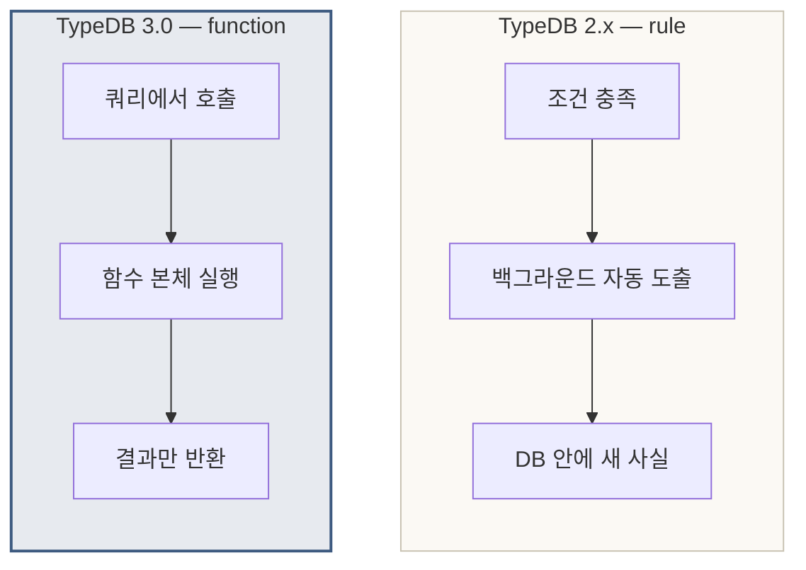
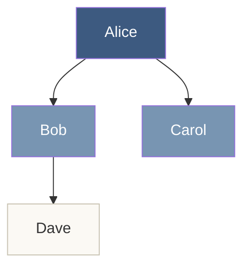
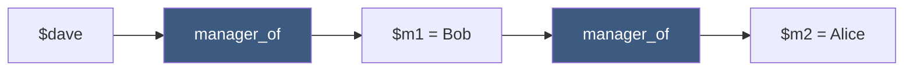
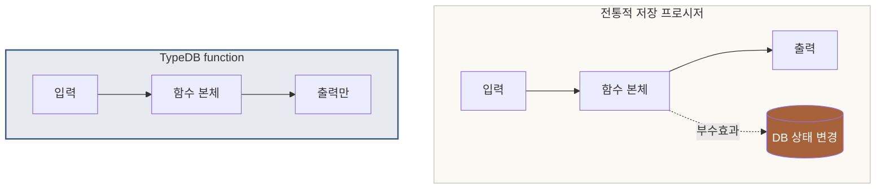
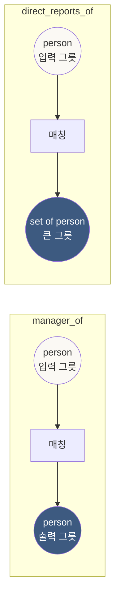
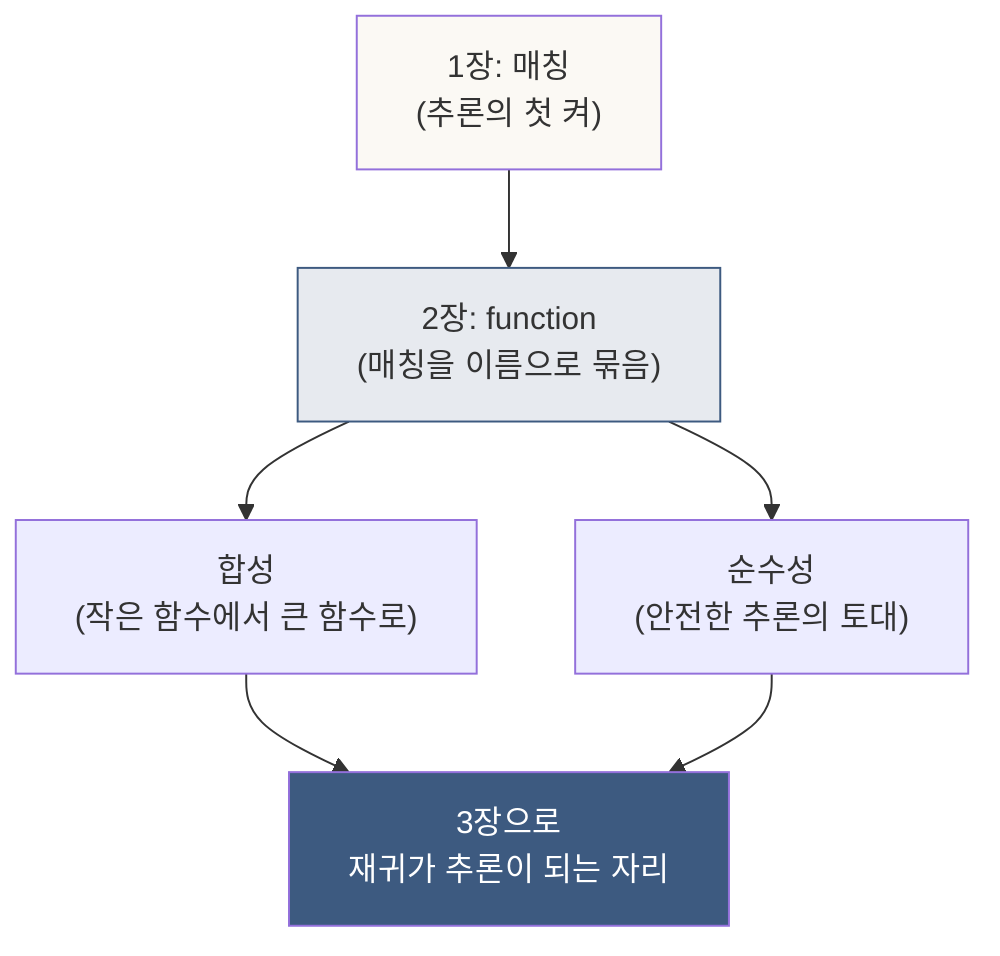

# 2장. function의 기초 — 사실을 변환하는 작은 단위

> *매칭이 추론의 첫 켜라면, function은 그 첫 켜에 — 이름을 붙이고 재사용하는 자리.*

---

## 2.0 이 장이 답하는 질문

이 장이 풀어내는 한 질문은 이것이다.

> **같은 매칭을 — 코드 안에서 여러 번 다시 쓰려면 어떻게 하는가?**

매칭 한 줄이 추론의 첫 켜라는 것을 1장에서 보았다. 그러나 *실전 도메인*에서는 — 같은 모양의 매칭이 *수십, 수백 번* 다시 등장한다. 매번 같은 줄을 다시 짜는 것은 — *코드의 중복*이고, *오류의 자리*다.

이 자리에 **function**이 들어온다. 매칭을 *이름으로 묶고, 재사용하고, 합성하는* 도구.

---

## 2.1 들어가며 — function이라는 결정

TypeDB의 역사에는 *작은 단절*이 한 번 있었다.

### TypeDB 2.x의 *rule*

2017년부터 2024년 초까지 — TypeDB 2.x 버전에서 추론의 본격 도구는 **rule**이었다. 모양은 이랬다.

```typeql
define
  rule grandparent_rule:
  when {
    (parent: $a, child: $b) isa parenthood;
    (parent: $b, child: $c) isa parenthood;
  } then {
    (grandparent: $a, grandchild: $c) isa grandparenthood;
  };
```

*조건이 충족되면 — 새로운 관계 인스턴스가 자동으로 도출됨*. 이 모양이 *RDF/OWL의 SWRL*과 비슷한 자리에 있었다.

### TypeDB 3.0의 *function*

2024년 말, TypeDB 3.0이 발표되면서 — *rule*이 사라지고 그 자리에 **function**이 들어왔다. 같은 예제를 function으로 짜면:

```typeql
fun grandparent_of($a: person) -> { person }:
  match
    (parent: $a, child: $b) isa parenthood;
    (parent: $b, child: $c) isa parenthood;
  return { $c };
```

겉모양은 비슷해 보이지만 — *작동의 자리가 다르다*.

| 항목 | rule (2.x) | function (3.0) |
|---|---|---|
| 작동 방식 | *자동 도출* — 백그라운드에서 새 사실을 생성 | *명시적 호출* — 쿼리에서 부를 때만 작동 |
| 결과의 자리 | 데이터베이스 안에 *물리적으로 들어감* | *쿼리 결과에만* 나타남 |
| 재사용 | rule 이름으로 참조 어려움 | function 이름으로 자유롭게 합성 |
| 디버깅 | *어디서 도출됐는지* 추적이 어려움 | 호출 스택이 명확 |
| 성능 제어 | 시스템이 알아서 — 사용자 통제 어려움 | 함수 호출 단위로 제어 가능 |

### 왜 바꿨는가

TypeDB 팀의 결정은 — *추론을 더 명시적이고 합성 가능하게* 만든 것이다. **함수형 패러다임의 도구가 — 데이터베이스 추론의 일급 도구가 된 자리**.

이 결정의 무게는 책 전체에 걸쳐 있다. 3장의 *재귀*, 5장의 *합성*은 — *function이 일급 시민*이기에 자연스러워진 자리다.



오른쪽이 — *명시적이고 합성 가능한* 새 모양이다.

---

## 2.2 가장 작은 function — 단일 반환

### 도메인: 조직도

연습용 도메인을 가장 단순하게 잡는다.

```typeql
define
  entity person, owns name;
  attribute name, value string;

  relation reporting,
    relates manager,
    relates direct_report;

  person plays reporting:manager;
  person plays reporting:direct_report;
```

회사의 *보고 관계*. 한 사람이 다른 사람의 *매니저*가 되거나 *직속 부하*가 되는 자리.

### 데이터

```typeql
insert
  $alice  isa person, has name "Alice";
  $bob    isa person, has name "Bob";
  $carol  isa person, has name "Carol";
  $dave   isa person, has name "Dave";

  (manager: $alice, direct_report: $bob)   isa reporting;
  (manager: $alice, direct_report: $carol) isa reporting;
  (manager: $bob,   direct_report: $dave)  isa reporting;
```

조직도가 이렇게 생겼다.



### 첫 번째 function

"*어떤 사람의 매니저를 묻는다*"는 작업을 function으로 짜 보자.

```typeql
fun manager_of($p: person) -> person:
  match
    (manager: $m, direct_report: $p) isa reporting;
  return first $m;
```

이 다섯 줄을 — 한 줄씩 해부한다.

#### 줄 1: `fun manager_of($p: person) -> person:`

| 조각 | 의미 |
|---|---|
| `fun` | 함수 정의의 시작. *지금부터 함수를 정의한다*는 표시 |
| `manager_of` | 함수의 이름. 한국어로 짜도 되지만, 관례는 영어 snake_case |
| `($p: person)` | 입력. *person 타입의 $p 하나를 받는다* |
| `-> person` | 출력 타입. *person 하나를 반환한다* |
| `:` | 본문 시작 |

#### 줄 2~3: `match ... ;`

함수 본문 안의 *매칭*. 1장에서 본 그 매칭이다. **달라진 것은 — `$p`가 외부에서 주어진다는 점**.

```typeql
match
  (manager: $m, direct_report: $p) isa reporting;
```

여기서 `$p`는 — *함수 입력으로 들어온 사람*이다. 그 사람이 *direct_report 자리*에 있는 reporting 관계를 찾는다. 그 관계의 *manager 자리*에 있는 사람을 `$m`이라는 이름으로 잡는다.

#### 줄 4: `return first $m;`

매칭에서 잡힌 `$m` 중 *첫 번째 하나만* 반환. `first` 키워드는 *반드시 하나만 반환된다는 약속*을 표명한다.

### 호출

```typeql
match
  $bob isa person, has name "Bob";
  let $m = manager_of($bob);
fetch $m: name;
```

답:

```
[ { "name": "Alice" } ]
```

**Bob의 매니저는 Alice**. 함수가 한 번 호출됐고, 답이 하나 나왔다.

### 무엇이 추론인가

이 자리에서 추론은 — *어떤 작업의 이름이 데이터베이스 안에 박힌 것*이다. *Bob의 매니저*라는 정보는 데이터에 *직접* 적혀 있지 않다. 데이터에 있는 것은 *(manager: Alice, direct_report: Bob)*이라는 reporting 관계 인스턴스 하나. 거기서 *Bob 입장에서의 매니저*를 끌어내는 작업이 — **함수가 이름으로 묶은 추론**이다.

---

## 2.3 집합 반환 — direct_reports_of

매니저는 *직속 부하를 여러 명* 가질 수 있다. Alice는 Bob과 Carol 둘을 가진다. 한 명이 아니라 *집합*을 반환해야 하는 자리.

### 함수 정의

```typeql
fun direct_reports_of($p: person) -> { person }:
  match
    (manager: $p, direct_report: $r) isa reporting;
  return { $r };
```

세 가지가 달라졌다.

| 변화 | 의미 |
|---|---|
| `-> { person }` | 출력이 *person의 집합*. 중괄호 `{}`가 집합을 표시 |
| `return { $r }` | `first`가 사라짐 — *매칭에서 잡힌 모든 $r*을 모아서 집합으로 |
| 매칭 방향 | `$p`가 *manager 자리*. 그 매니저의 부하들을 잡음 |

### 호출

```typeql
match
  $alice isa person, has name "Alice";
  let $rs = direct_reports_of($alice);
fetch $rs: name;
```

답:

```
[
  { "name": "Bob" },
  { "name": "Carol" }
]
```

**Alice의 직속 부하는 Bob과 Carol — 두 명**.

### 단일 vs 집합 — 한 표

| 반환 모양 | 시그니처 | return 키워드 | 호출 결과 |
|---|---|---|---|
| 단일 | `-> person` | `return first $m;` | *반드시 한 개* |
| 단일 (옵션) | `-> person?` | `return first $m;` | *0개 또는 1개* |
| 집합 | `-> { person }` | `return { $r };` | *0개 이상의 집합* |
| 튜플 | `-> person, long` | `return $a, $b;` | *튜플 한 개* |

대부분의 자리에서는 — *단일*과 *집합* 두 가지를 손에 익히면 충분하다. 옵션·튜플은 5장에서 필요해질 때 다시 등장한다.

---

## 2.4 합성성 — function의 진짜 가치

지금까지 본 두 함수만으로도 *추론의 기본*은 되지만, **function의 진짜 가치는 합성**이다.

### 합성이란 무엇인가

수학에서 *함수 합성*은 — *f(g(x))*. *g의 출력이 f의 입력*이 되는 자리. TypeDB에서 정확히 같은 모양이 작동한다.

### 예: 매니저의 매니저

"*Dave의 매니저의 매니저는 누구인가?*"를 합성으로 풀어 본다.

```typeql
match
  $dave isa person, has name "Dave";
  let $m1 = manager_of($dave);        ← Dave의 매니저
  let $m2 = manager_of($m1);          ← 그 매니저의 매니저
fetch $m2: name;
```

답:

```
[ { "name": "Alice" } ]
```

조직도를 다시 보면 — Dave → Bob → Alice. 두 단계가 한 쿼리에서 자연스럽게 이어졌다.



### 함수 안에서 함수 호출

쿼리에서만이 아니라 — *함수 정의 안에서도* 다른 함수를 호출할 수 있다.

```typeql
fun grandmanager_of($p: person) -> person?:
  match
    let $m1 = manager_of($p);
    let $m2 = manager_of($m1);
  return first $m2;
```

이제 *조부모 매니저*라는 추론이 — *그 자체로 이름을 가진 함수*가 되었다.

```typeql
match
  $dave isa person, has name "Dave";
  let $gm = grandmanager_of($dave);
fetch $gm: name;
```

답:

```
[ { "name": "Alice" } ]
```

같은 답이지만 — *추상화의 한 켜가 더 얹혔다*. 코드의 *의도*가 더 또렷해진 자리.

### 합성성의 깊은 의미

함수형 프로그래밍의 가장 깊은 통찰은 — *합성성이 모듈성을 만든다*는 것이다. 작은 함수를 잘 짜면 — *큰 함수를 그 합성으로 짤 수 있다*. 큰 함수를 한 번에 짜는 것보다 *훨씬 안전하고 디버깅이 쉽다*.

TypeDB의 function은 — 그 통찰을 *데이터베이스 추론*에 가져온다. 5장에서 보겠지만, *드론 손실 시나리오*처럼 복잡한 자리도 — *작은 함수 다섯 개의 합성*으로 풀린다.

---

## 2.5 순수 함수 — 부수효과 없음의 의미

여기서 한 학술 어휘를 짚고 간다. **순수 함수(pure function)**.

### 정의

함수가 *순수하다*는 것은 — 두 가지를 만족하는 자리.

1. **결정성**: 같은 입력에 — *항상 같은 출력*을 낸다
2. **부수효과 없음**: 함수 호출이 — *외부 상태를 바꾸지 않는다*

### TypeDB의 function은 순수하다

`manager_of(Bob)`은 — *언제 불러도 Alice*를 반환한다 (데이터가 안 바뀌는 한). 그리고 *호출했다고 데이터베이스가 바뀌지 않는다*. 함수는 *읽기 전용*의 자리.

### 왜 중요한가

| 순수성이 보장하는 것 | 어떻게 |
|---|---|
| 안전한 합성 | f(g(x)) — g의 호출이 f를 망가뜨릴 일 없음 |
| 캐시 가능성 | 시스템이 결과를 *기억해두고 재사용* 가능 |
| 병렬 처리 | 여러 함수를 *동시에 실행*해도 안전 |
| 디버깅 가능성 | 입력만 알면 — 출력이 재현 가능 |

전통적인 *저장 프로시저(stored procedure)*는 — *부수효과를 일으킬 수 있다*. UPDATE·INSERT·DELETE가 가능하기에. TypeDB의 function은 — *그 모양이 아니다*. **추론을 위한 도구**이지, *데이터 변경을 위한 도구가 아니다*.



오른쪽 — *깨끗한 입력→출력의 자리*. 이게 *추론의 정직한 모양*이다.

---

## 2.6 *그릇과 내용물*의 비유

함수형 프로그래밍에 무경험인 독자를 위해, 작은 비유 하나.

### 그릇과 내용물

`-> person`은 *그릇 하나*다. 그 안에 *한 사람을 담아 반환*한다.

`-> { person }`은 *그릇 여러 개를 담을 수 있는 큰 그릇*다. 그 안에 *여러 사람을 모아 반환*한다.

함수 합성은 — *한 그릇에서 꺼낸 것을, 다음 함수의 입에 넣는 작업*이다.



### 비유의 한계

비유는 — *함수형의 본격 어휘*를 다 담지 못한다. *모나드*, *함자*, *고차 함수* — 이런 개념까지는 TypeDB가 가지 않는다. **TypeDB의 function은 — 그릇과 내용물이라는 비유로 충분한 자리**. 더 깊은 자리는 *프로그래밍 언어*의 몫이다.

이 책은 그 자리만큼만 짚는다. 데이터베이스 추론에 *충분한 깊이*까지.

---

## 2.7 학술적 짚음 — Datalog와 Horn clause

이 자리에 학술 한 줄.

### Datalog

Datalog는 — 1970년대 후반에 *논리 프로그래밍*에서 자라난 *데이터베이스 쿼리 언어*다. 그 핵심 도구가 — *Horn clause*다.

```
어떤 X가 사람이고, 어떤 Y가 X의 부모면, Y는 X의 부모다.
parent(Y, X) :- person(X), parent(Y, X).
```

이런 한 줄을 — *조건이 충족되면 → 결론을 끌어낸다*의 모양으로 짠다. **TypeDB의 function이 정확히 같은 자리에 있다.**

| Datalog 어휘 | TypeDB 어휘 |
|---|---|
| Horn clause | function 본문 |
| `:-` (조건) | `match` 본문 |
| 머리 (head) | `return` |
| 재귀 규칙 | function의 재귀 호출 (3장) |

### Kowalski의 한 마디

영국의 논리학자 Robert Kowalski가 1974년에 한 말이 유명하다.

> *Algorithm = Logic + Control.*
> 알고리즘은 — *논리*와 *제어*다.

함수형 추론은 — *논리*만 적는 자리. *어떻게 답을 찾는가의 제어*는 시스템이 알아서 한다. 이게 *명령형 프로그래밍*과 *선언적 프로그래밍*의 갈림이다.

TypeDB의 function은 — *선언적 자리*에 있다. 우리는 *"매니저는 reporting 관계의 manager 자리에 있는 사람이다"*만 적고, *어떻게 찾는가*는 시스템이 결정한다.

이 정직한 분업이 — 다음 장의 *재귀*가 자연스럽게 작동하는 토대다.

---

## 2.8 ◇ 2장 정리 — 손에 들어온 것

이 장에서 우리는 **매칭을 — 이름으로 묶고, 재사용하고, 합성하는 도구**를 손에 잡았다.

### 손에 잡힌 도구

- `fun X($input) -> Y: match ... return ...;` — 함수 정의의 한 그릇
- `-> Y` vs `-> { Y }` — 단일 vs 집합 반환
- `let $x = fn(...)` — 함수 호출
- 함수 합성 — *한 함수의 출력이 다른 함수의 입력*
- 순수 함수의 약속 — *부수효과 없음의 자리*

### 손에 잡힌 사고



### 2장이 던지지 않은 질문 (다음 장으로)

지금까지의 합성은 — *유한한 깊이*다. 함수를 두 번, 세 번 합쳐도 — 결국 *정해진 횟수*에서 멈춘다. 그러나 도메인은 종종 ***모든 단계의 부하*** 같은 자리를 요구한다. *Alice의 부하의 부하의 부하의 부하…* — 깊이를 모르는 자리.

이 자리에서 — *함수가 자기 자신을 호출하는 도구*가 필요해진다. **재귀**다. 그리고 재귀에는 *수학적 무게* — *언제 멈추는가*에 대한 형식적 답 — 가 따라온다.

다음 장에서, **재귀가 추론이 되는 자리**를 본다.

---

> *2장의 약속: 매칭에 이름을 붙이고, 합성의 자리에 함수를 들이기.*
>
> *다음 장의 약속: 그 함수가 자기 자신을 호출하는 — 진짜 추론의 자리로 들어가기.*

---

## 2.9 ◇ 연습문제 (선택)

다음 도메인을 2장의 도구로 짜 보라.

```
- 회사에 5명 (A, B, C, D, E)
- A는 B와 C의 매니저
- B는 D의 매니저
- C는 E의 매니저

함수를 짜라:
1. manager_of(person) -> person?
2. direct_reports_of(person) -> { person }
3. peer_count_of(person) -> long?
   — 같은 매니저를 가진 사람의 수 (자기 자신 제외)
4. grandmanager_of(person) -> person?
   — 매니저의 매니저
```

네 함수가 모두 작동하면 — *2장의 도구가 손에 들어온 것*이다. 다음 장에서, *깊이를 모르는* 진짜 추론의 자리로 간다.
