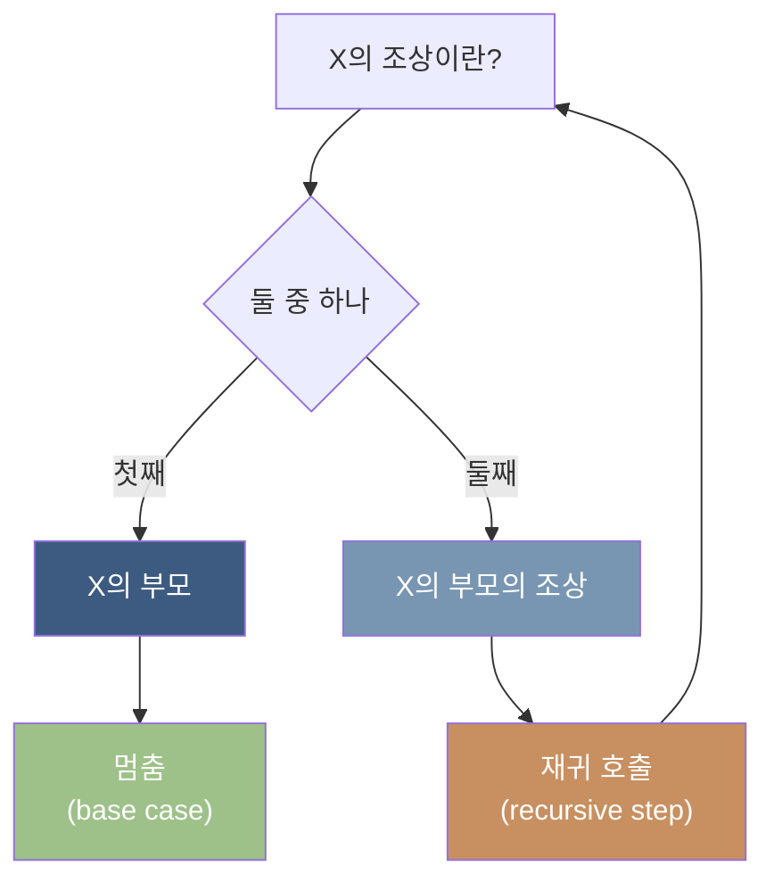
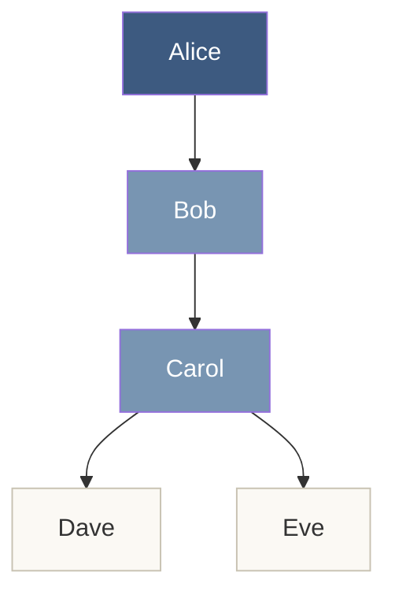
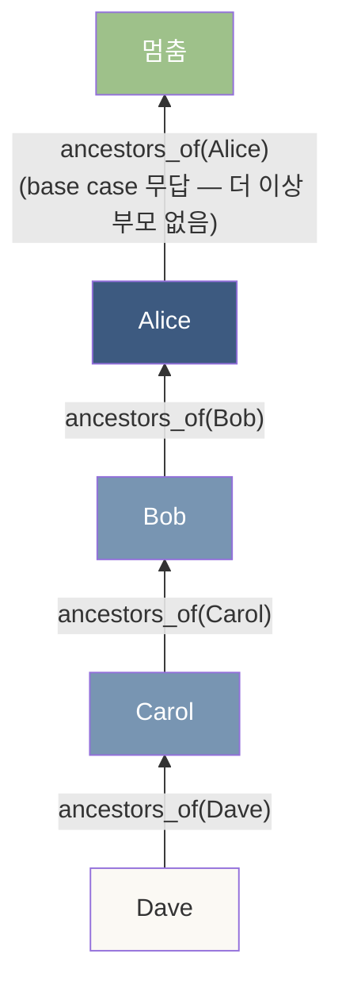
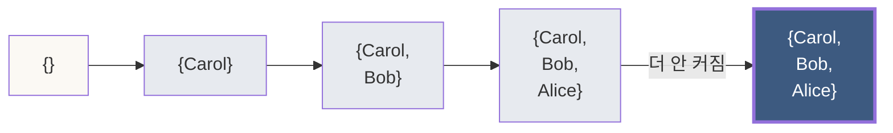
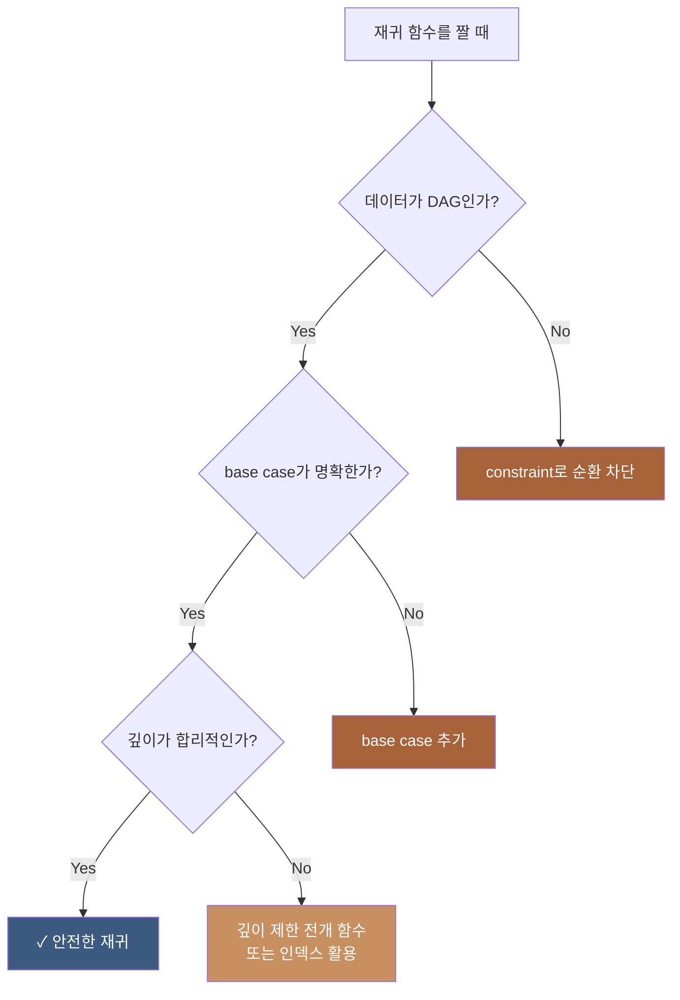
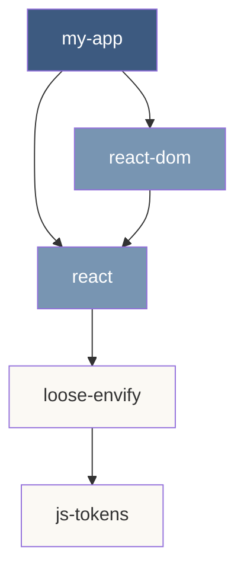
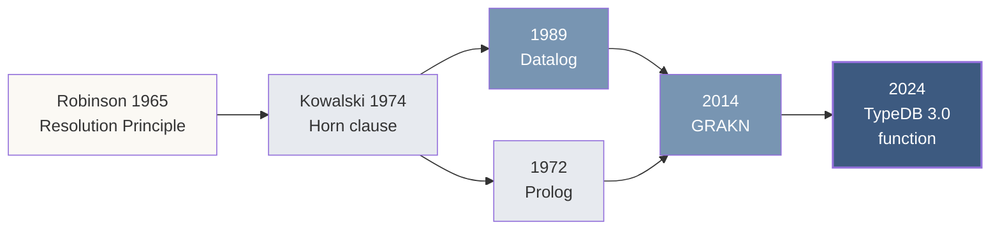
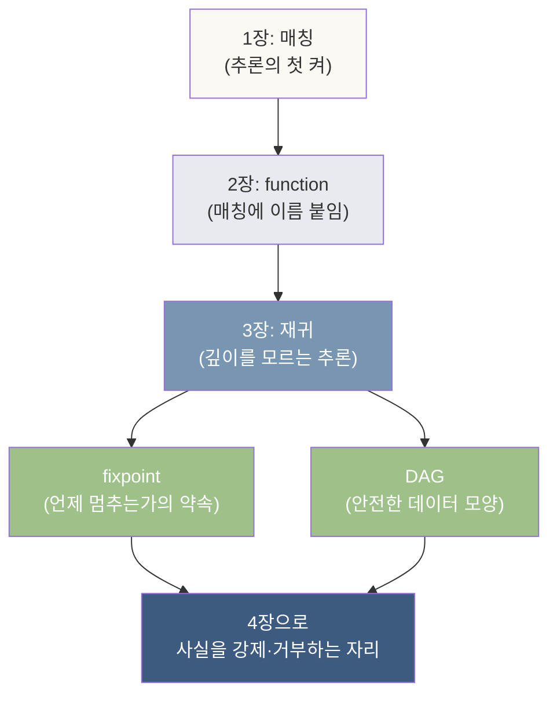

# 3장. 재귀가 추론이 되는 자리

> *함수가 자기 자신을 호출하는 자리에서 — 깊이를 모르는 추론이 시작된다.*

---

## 3.0 이 장이 답하는 질문

이 장이 풀어내는 한 질문은 이것이다.

> **데이터에 *직접 관계*만 적혀 있는데 — *간접 관계*는 어떻게 도출되는가?**

가족 트리에 *부모-자식*만 적혀 있다. *조부모-손자*는 어디에도 적혀 있지 않다. 그런데도 "*Alice의 모든 후손은?*"이라고 물을 수 있어야 한다. 깊이가 *2단계*인지 *10단계*인지 — 우리는 *미리 모른다*.

이 자리에 **재귀(recursion)**가 들어온다. 함수가 *자기 자신을 호출하는* 도구. 한 번 손에 잡으면 — 깊이를 모르는 추론이 자연스러워진다.

그리고 재귀에는 — *수학적 약속* 하나가 따라온다. **언제 멈추는가**의 형식적 답. 이 장이 그 답까지 짚는다.

---

## 3.1 들어가며 — 깊이를 모르는 자리

### 직접 관계와 간접 관계

도메인을 가족 트리로 잡는다.

```
Alice ── 부모 ──> Bob
Bob   ── 부모 ──> Carol
Carol ── 부모 ──> Dave
```

데이터에 적힌 것은 — *세 줄의 직접 관계*다. 그러나 도메인에는 *간접 관계*가 가득 있다.

| 적힌 관계 | 도출되는 관계 |
|---|---|
| Alice → Bob | Alice는 Bob의 *부모* |
|  | Alice는 Carol의 *조부모* |
|  | Alice는 Dave의 *증조부모* |
|  | Alice는 *Bob, Carol, Dave 모두의 조상* |

마지막 한 줄이 — *깊이를 모르는 자리*다. **조상(ancestor)**이라는 개념은 *몇 단계 위*인가를 묻지 않는다. *어느 단계든 위에 있으면* 조상이다.

2장의 *유한한 합성*으로는 — 이 자리를 풀 수 없다. 합성을 *몇 번* 해야 할지를 — 사람이 *미리 정해야* 하기에. 재귀가 필요해진다.

### 재귀의 직관

재귀의 직관은 한 줄에 담긴다.

> ***조상이란 — 부모이거나, 부모의 조상이다.***

이 문장을 다시 읽는다. *조상*이라는 단어가 — *조상의 정의 안에* 다시 등장한다. 이게 *재귀*의 모양이다.

처음 보면 *순환 정의*처럼 보이지만 — *멈출 자리*가 있다. *부모이거나*가 — *재귀가 멈추는 자리*다. *Alice의 직접 부모*에서 멈추고 — 거기서부터 *한 단계씩 위로* 올라가며 정답을 쌓는다.



이 두 부분이 — *재귀의 모든 자리*에 등장한다.
- **Base case**: 재귀가 *멈추는 자리*. 답이 *직접* 나오는 자리
- **Recursive step**: 자기 자신을 *한 단계 작은 입력으로* 다시 부르는 자리

---

## 3.2 도메인 — 가족 트리

이번 장의 연습용 도메인.

### 스키마

```typeql
define
  entity person, owns name;
  attribute name, value string;

  relation parenthood,
    relates parent,
    relates child;

  person plays parenthood:parent;
  person plays parenthood:child;
```

가장 단순한 *부모-자식 관계*. 2장의 reporting과 거의 같은 모양 — 이름만 다르다.

### 데이터

```typeql
insert
  $alice isa person, has name "Alice";
  $bob   isa person, has name "Bob";
  $carol isa person, has name "Carol";
  $dave  isa person, has name "Dave";
  $eve   isa person, has name "Eve";

  (parent: $alice, child: $bob)   isa parenthood;
  (parent: $bob,   child: $carol) isa parenthood;
  (parent: $carol, child: $dave)  isa parenthood;
  (parent: $carol, child: $eve)   isa parenthood;
```

가족 트리가 이렇게 생겼다.



이제 *조상* 함수를 짜 본다.

---

## 3.3 첫 번째 재귀 함수 — ancestors_of

### 함수 정의

```typeql
fun ancestors_of($x: person) -> { person }:
  match
    (parent: $a, child: $x) isa parenthood;
  return { $a };
  or
  match
    (parent: $a, child: $x) isa parenthood;
    let $b in ancestors_of($a);
  return { $b };
```

이 함수는 — *두 부분*으로 나뉜다. `or` 키워드가 두 부분을 잇는다.

#### 첫 부분: Base case

```typeql
match
  (parent: $a, child: $x) isa parenthood;
return { $a };
```

*X의 직접 부모를 잡는다.* 이게 — 재귀가 *멈추는 자리*다. Bob의 ancestors_of를 부르면 — *Alice가 직접 부모*이므로 이 자리에서 답이 나온다.

#### 둘째 부분: Recursive step

```typeql
match
  (parent: $a, child: $x) isa parenthood;
  let $b in ancestors_of($a);
return { $b };
```

*X의 직접 부모 $a를 잡고 — $a의 조상들을 다시 부른다.* `let $b in ancestors_of($a)`가 — *재귀 호출*의 자리. *$a의 조상 집합에서 각 원소를 $b로 받는다*는 뜻.

### or의 의미

`or`는 — *둘 중 하나라도 매칭되면* 결과에 포함시킨다는 뜻. 그래서 *base case의 결과*와 *recursive step의 결과*가 **합쳐져서** 반환된다.

이 모양이 — *Datalog의 Horn clause*가 작동하는 정확한 방식이다.

```
ancestor(A, X) :- parent(A, X).                  ← base
ancestor(A, X) :- parent(P, X), ancestor(A, P).  ← recursive
```

윗줄 둘이 — *or*로 합쳐진 한 정의. TypeDB가 *Datalog의 자손*임을 보여주는 자리.

### 호출

```typeql
match
  $dave isa person, has name "Dave";
  let $a in ancestors_of($dave);
fetch $a: name;
```

답:

```
[
  { "name": "Carol" },   ← 직접 부모
  { "name": "Bob" },     ← 조부모
  { "name": "Alice" }    ← 증조부모
]
```

**한 함수 호출이 — 세 단계 깊이를 자동으로 펼쳤다.** 우리가 *몇 단계인지를 미리 적은 적 없다*. 데이터에 직접 부모만 적혀 있는데도 — 모든 조상이 도출됐다.



---

## 3.4 반대 방향 — descendants_of

같은 도구로, *후손*도 짜 본다.

```typeql
fun descendants_of($x: person) -> { person }:
  match
    (parent: $x, child: $d) isa parenthood;
  return { $d };
  or
  match
    (parent: $x, child: $c) isa parenthood;
    let $d in descendants_of($c);
  return { $d };
```

ancestors_of와 거의 같은 모양인데 — *역할의 자리가 바뀌었다*. `$x`가 *parent 자리*에 있고, 그 child가 후손의 시작.

### 호출

```typeql
match
  $alice isa person, has name "Alice";
  let $d in descendants_of($alice);
fetch $d: name;
```

답:

```
[
  { "name": "Bob" },     ← 자식
  { "name": "Carol" },   ← 손자
  { "name": "Dave" },    ← 증손자
  { "name": "Eve" }      ← 증손녀
]
```

**Alice의 모든 후손 — 네 명이 자동으로 잡혔다.**

### 두 함수의 대칭

| 함수 | 시작점 | 방향 | 잡는 자리 |
|---|---|---|---|
| `ancestors_of(x)` | child | 위로 | x의 모든 조상 |
| `descendants_of(x)` | parent | 아래로 | x의 모든 후손 |

**같은 추론 구조 — 다른 방향**. 한 도메인의 *관계 그래프*를 *어느 방향에서든 펼칠 수 있는* 도구. 이게 재귀 함수의 자리다.

---

## 3.5 fixpoint 의미론 — 재귀는 언제 멈추는가

여기서 — *수학적 무게*를 한 단락 짚는다.

### 의문

재귀 함수의 본문 안에 *자기 자신*이 등장한다. 그러면 *순환 정의*가 아닌가? *답을 구하려면 답이 있어야* 하는 자리 아닌가?

이 의문에 답하는 것이 — **fixpoint 의미론**이다.

### Knaster-Tarski 정리 — 한 문단으로

수학자 *Knaster*와 *Tarski*가 1928년과 1955년에 — *모노톤 함수*에 대한 정리를 증명했다. 거칠게 풀이하면:

> *"한 집합이 점점 커지기만 하는 함수가 있으면 — 그 함수에는 반드시 고정점(fixpoint)이 있다. 그 고정점은 — 함수를 반복해서 적용하다가 *더 이상 안 커지는 자리*다."*

이 정리가 — *재귀 추론이 멈춘다는 보장*의 형식적 자리다.

### 그림으로

ancestors_of(Dave)를 — *반복 적용*의 자리에서 본다.

```
Step 0: {}                            ← 시작: 빈 집합
Step 1: {Carol}                       ← Dave의 직접 부모
Step 2: {Carol, Bob}                  ← + Carol의 부모
Step 3: {Carol, Bob, Alice}           ← + Bob의 부모
Step 4: {Carol, Bob, Alice}           ← Alice의 부모 없음 — 안 커짐
```

**Step 4에서 집합이 더 이상 커지지 않는다.** 이 자리가 — **fixpoint**다. Knaster-Tarski 정리가 보장하는 — *반드시 도달하는 멈춤의 자리*.



### 왜 이 정리가 중요한가

이 정리가 보장하는 자리는 — *재귀 추론이 결과를 낸다*는 사실. **시스템이 무한 루프에 빠지지 않고 — 반드시 답을 낸다는 약속이 — 수학으로 깔려 있다.**

이 약속이 없으면 — 우리가 재귀 함수를 부를 때마다 *멈춤 여부*를 직접 증명해야 한다. 그건 *데이터베이스의 자리*가 아니다. *논리 프로그래밍의 50년 역사*가 — 이 약속을 *디폴트로* 만들었다. TypeDB는 그 자손이다.

> 더 깊은 수학적 자리는 — *부록 B*의 학술 자료에서.

---

## 3.6 무한 재귀의 위험과 방지

Knaster-Tarski가 *멈춤의 자리*를 보장하지만 — *모든 재귀가 안전한 것은 아니다*. 두 가지 위험이 있다.

### 위험 1: 순환 데이터

데이터가 *순환*하면 — 재귀가 무한히 돈다.

```
- Bob is parent of Carol.
- Carol is parent of Bob.    ← 순환!
```

ancestors_of(Bob)을 부르면:

```
Step 1: {Carol}
Step 2: {Carol, Bob}
Step 3: {Carol, Bob, Carol, ...}  ← 무한
```

**fixpoint 의미론은 — 데이터가 모노톤인 경우에만 보장된다.** 도메인이 *DAG (Directed Acyclic Graph)*일 때.

#### 방지

가족 트리는 — *자연적으로 DAG*다. *부모가 자식의 자식이 될 수는 없다*(시간이 일방향이므로). 그러나 모든 도메인이 이렇진 않다. *조직도*에서는 일반적으로 DAG지만, *친구 관계*는 *대칭적*이라 — 재귀가 그대로 적용되면 무한 루프다.

#### 해결

- **데이터 차원**: constraint로 순환을 금지 (4장에서 자세히)
- **함수 차원**: 방문한 노드를 *기억하며 재귀* (depth 제한)

TypeDB 3.0은 — *방문한 노드 기억*을 내부적으로 처리한다. 그러나 *논리적 순환*은 — 스키마 설계자가 *방지해야 할 자리*다.

### 위험 2: 깊이 폭발

데이터가 *너무 깊으면* — fixpoint에 도달하는 시간이 길어진다.

```
1세대 → 2세대 → ... → 1000세대
```

1000세대 트리에서 *최상위 조상*을 묻는 재귀는 — 1000번의 함수 호출이 일어난다. *데이터베이스 응답이 느려지는 자리*.

#### 방지

- **함수 시그니처**: 깊이 제한을 두는 *얕은 함수*를 별도로 정의
- **인덱스**: TypeDB가 자주 호출되는 함수를 *캐시*할 수 있게

```typeql
fun direct_ancestors_3_levels_of($x: person) -> { person }:
  match
    (parent: $a1, child: $x) isa parenthood;
  return { $a1 };
  or
  match
    (parent: $a1, child: $x) isa parenthood;
    (parent: $a2, child: $a1) isa parenthood;
  return { $a2 };
  or
  match
    (parent: $a1, child: $x) isa parenthood;
    (parent: $a2, child: $a1) isa parenthood;
    (parent: $a3, child: $a2) isa parenthood;
  return { $a3 };
```

*깊이 3까지만* 보는 함수. 재귀가 아닌 *전개*. 재귀의 보편성을 포기하는 대신 — *예측 가능한 성능*을 얻는다.

### 정리 — 재귀를 안전하게 쓰는 자리



이 세 체크가 — 재귀를 *수사*가 아니라 *작동하는 도구*로 만드는 자리.

---

## 3.7 또 다른 도메인 — 의존성 그래프

가족 트리는 *직관적이지만 작다*. 같은 재귀 패턴이 *훨씬 큰 도메인*에서 작동하는 자리를 본다.

### 도메인: 패키지 의존성

소프트웨어 패키지는 — *다른 패키지에 의존*한다. *내가 import한 패키지가, 다시 다른 패키지를 import*하고… 깊이를 모르는 자리.

```typeql
define
  entity package, owns pkg_name, owns version;
  attribute pkg_name, value string;
  attribute version, value string;

  relation depends_on,
    relates dependent,
    relates dependency;

  package plays depends_on:dependent;
  package plays depends_on:dependency;
```

### 데이터 — 가상 시나리오

```typeql
insert
  $my_app   isa package, has pkg_name "my-app",   has version "1.0";
  $react    isa package, has pkg_name "react",    has version "18.2";
  $react_dom isa package, has pkg_name "react-dom", has version "18.2";
  $loose_envify isa package, has pkg_name "loose-envify", has version "1.4";
  $js_tokens isa package, has pkg_name "js-tokens", has version "4.0";

  (dependent: $my_app,   dependency: $react)         isa depends_on;
  (dependent: $my_app,   dependency: $react_dom)     isa depends_on;
  (dependent: $react,    dependency: $loose_envify)  isa depends_on;
  (dependent: $react_dom, dependency: $react)         isa depends_on;
  (dependent: $loose_envify, dependency: $js_tokens) isa depends_on;
```

이 그래프가 — *npm·pip*에서 흔한 모양이다.



### 재귀 함수

```typeql
fun all_dependencies_of($p: package) -> { package }:
  match
    (dependent: $p, dependency: $d) isa depends_on;
  return { $d };
  or
  match
    (dependent: $p, dependency: $d) isa depends_on;
    let $e in all_dependencies_of($d);
  return { $e };
```

ancestors_of와 — *구조가 같다*. 도메인이 *가족*에서 *패키지*로 바뀌었을 뿐.

### 호출

```typeql
match
  $my_app isa package, has pkg_name "my-app";
  let $d in all_dependencies_of($my_app);
fetch $d: pkg_name;
```

답:

```
[
  { "pkg_name": "react" },
  { "pkg_name": "react-dom" },
  { "pkg_name": "loose-envify" },
  { "pkg_name": "js-tokens" }
]
```

**한 함수가 — 직접·간접 의존을 모두 펼쳤다.** 같은 추론 패턴이 — *완전히 다른 도메인*에서 작동한다. 이게 *함수의 재사용성*이고 *추론의 보편성*이다.

> 자매 책 *드론 책 7장 분석 함수*에서 — 정확히 같은 패턴이 *통신 경로 재라우팅*에 쓰인다. 도메인이 다르면 *어휘*가 다를 뿐 — *추론의 모양*은 같다.

---

## 3.8 짧은 학술 짚음 — Robinson과 Kowalski의 유산

이 자리의 학술 한 단락.

### Robinson 1965 — 해소 원리

논리학자 *J. A. Robinson*이 1965년에 발표한 *Resolution Principle*은 — *컴퓨터가 자동으로 추론하는 자리*의 시작이었다. *"이 명제들이 모순인가?"*에 대해 — *완전한 알고리즘*을 처음으로 제시한 자리.

### Kowalski 1974 — Horn clause

영국의 *Robert Kowalski*가 — 해소 원리를 *프로그래밍 언어*로 환원할 수 있음을 보였다. *Horn clause*만으로도 — *튜링 완전*에 가까운 표현력이 나온다는 결과. 이게 — *Prolog*의 토대다.

### Datalog — 데이터베이스로 가져오기

1980년대 후반, *Datalog*가 — *Prolog의 데이터베이스 친화 버전*으로 등장. *재귀*는 허용하되 — *함수 기호*는 금지함으로써 *결정 가능성*과 *유한 종료*를 보장.

### TypeDB 3.0 — 2020년대의 자손

TypeDB의 function은 — 이 50년 계보의 *가장 최근 자손*이다. *PolyModel*이라는 새 추상 위에서 — Datalog의 *재귀 추론*을 *N항 관계와 역할*에 자연스럽게 적용.



**한 줄짜리 재귀 함수**가 — 50년 동안 다듬어진 *형식 의미론*과 *알고리즘*을 — *자동으로 활용*하는 자리. 이게 *데이터베이스 추론*의 자리다.

---

## 3.9 ◇ 3장 정리 — 손에 들어온 것

이 장에서 우리는 **재귀 함수가 — 깊이를 모르는 추론을 자동으로 펼친다**는 사실을 보았다.

### 손에 잡힌 도구

- **재귀의 두 부분**: base case + recursive step
- `or` 키워드 — 두 부분을 잇는 자리
- `let $x in fn(...)` — 재귀 호출의 자리
- **fixpoint 의미론** — 재귀가 멈춘다는 수학적 약속
- **안전 체크리스트** — DAG·base case·깊이의 세 가지

### 손에 잡힌 사고



### 추론의 두 얼굴

지금까지 — *적힌 사실에서 새 사실을 만드는 자리*를 보았다. 1장 매칭, 2장 합성, 3장 재귀 — 모두 ***긍정적 추론*** 의 자리. *"이게 사실이다"*를 시스템이 도출하는 자리.

다음 장에서 — *추론의 다른 얼굴*을 본다. ***"이건 사실이 될 수 없다"*** 를 시스템이 강제하는 자리. 한 줄로 **constraint**.

constraint는 — *제한*이 아니라 *약속*이다. 도메인의 무결성을 — 데이터베이스가 *조용한 오염* 없이 지키는 자리. 추론이 *건강하게 작동하는 토대*가 여기다.

---

> *3장의 약속: 재귀가 *수사*가 아니라 *작동하는 도구*임을 — 코드와 fixpoint 그림으로 손에 잡기.*
>
> *다음 장의 약속: 추론의 다른 얼굴 — 사실을 강제하고 거부하는 자리로.*

---

## 3.10 ◇ 연습문제 (선택)

다음을 짜 보라.

```
도메인: 회사 임직원 보고 체계
- 한 회사에 임직원 10명
- A는 CEO (매니저 없음)
- A는 B, C의 매니저
- B는 D, E의 매니저
- C는 F, G의 매니저
- D는 H의 매니저
- E는 I, J의 매니저

함수를 짜라:
1. all_subordinates_of(person) -> { person }
   — 한 사람의 모든 직간접 부하
2. depth_of(person) -> long
   — CEO로부터의 깊이 (재귀로)
3. is_descendant_of(person, person) -> bool
   — 첫 사람이 둘째 사람의 후손인가
```

세 함수가 모두 작동하면 — *3장의 도구가 손에 들어온 것*이다. 4장에서, *constraint의 자리*로 간다.
