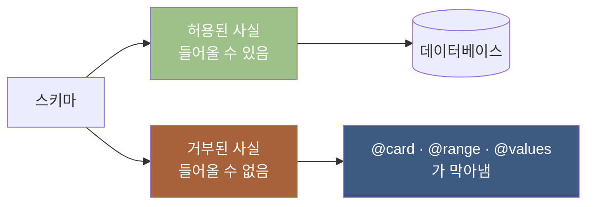
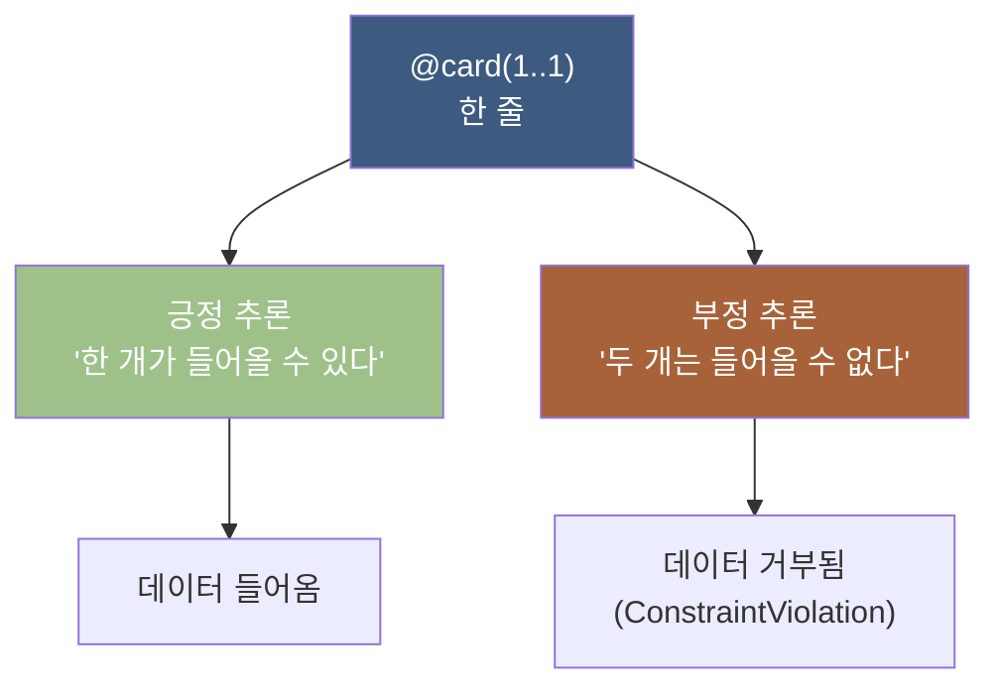
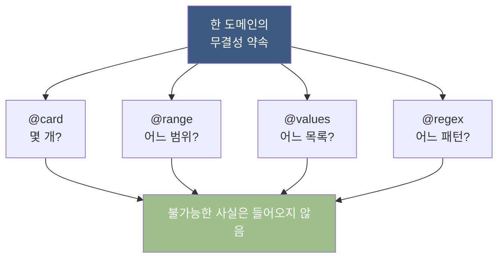
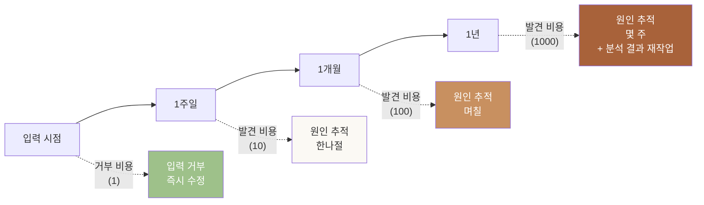
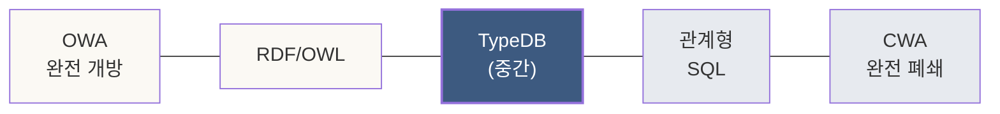
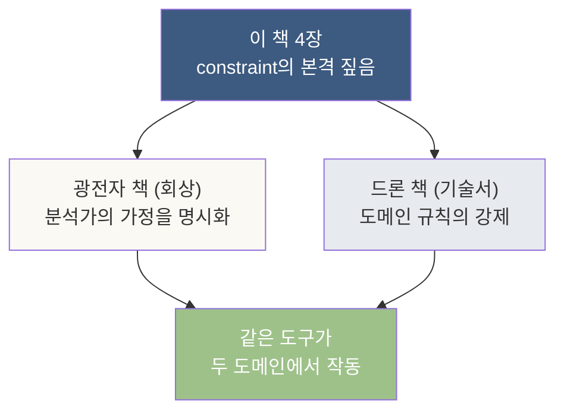
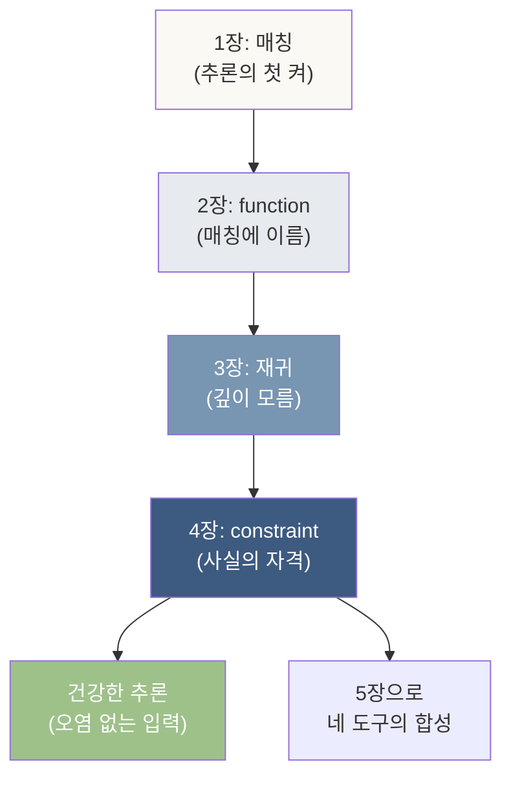

# 4장. constraint — 사실을 강제하고 거부하는 자리

> *추론이 사실을 만드는 자리라면, constraint는 사실의 자격을 정하는 자리.*

---

## 4.0 이 장이 답하는 질문

이 장이 풀어내는 한 질문은 이것이다.

> **데이터베이스에 — *불가능한 사실*이 적히지 않도록, 어떻게 막는가?**

1~3장에서 우리는 — *사실을 만드는 자리*를 보았다. 매칭, 함수, 재귀. 추론의 *생산 측면*.

그런데 추론에는 *다른 얼굴*이 있다. *"이건 사실이 될 수 없다"*를 시스템이 *미리 알고 거부하는* 자리. 이 자리에 — **constraint**가 들어온다. 추론의 *경계*를 짓는 도구.

이 장은 *제약*이라는 단어를 — *제한*이 아니라 *약속*으로 다시 본다.

---

## 4.1 들어가며 — 도메인의 회칙

자매 책 *드론 책 0.1절*의 비유를 — 한 번 더 끌고 온다. **동호회 회칙**.

축구 동호회의 회칙에는 — *적혀 있는 것*과 *적혀 있지 않은 것*이 있다.

| 적혀 있는 것 | 적혀 있지 않은 것 |
|---|---|
| 회장은 한 명이다 | 회장이 두 명이어도 된다는 가능성 |
| 정기 모임은 매주 토요일이다 | 일요일 모임의 가능성 |
| 회비는 월 1만원이다 | 무료 가입의 가능성 |

회칙이 *"회장은 한 명이다"*라고 적는 순간 — *동시에 회장이 두 명일 가능성을 거부*한다. **회칙은 — 동시에 *허용*과 *거부*의 자리**다.

데이터베이스에서 — 이 자리가 *스키마*다. 그리고 그 스키마에 *허용과 거부의 경계*를 박는 도구가 — **constraint**다.



이 그림이 — 4장의 한 그림이다.

---

## 4.2 가장 작은 constraint — @card

**카디널리티(cardinality)**는 *어떤 자리에 몇 개가 들어올 수 있는가*의 약속이다.

### 일상의 카디널리티

| 일상의 약속 | 카디널리티 |
|---|---|
| 사람에게는 어머니가 *정확히 한 명* 있다 | `@card(1..1)` |
| 사람에게는 자녀가 *0명 이상* 있을 수 있다 | `@card(0..*)` |
| 한 자동차에는 운전자가 *동시에 한 명만* | `@card(1..1)` |
| 한 학생은 *최소 1개, 최대 6개* 과목을 듣는다 | `@card(1..6)` |

`@card(min..max)`의 모양으로 — *최소와 최대*를 적는다. `*`는 *상한 없음*.

### 스키마에서

도메인을 *학생 수강 관계*로 잡는다.

```typeql
define
  entity student, owns student_id;
  entity course, owns course_code;
  attribute student_id, value string;
  attribute course_code, value string;

  relation enrollment,
    relates enrolled_student @card(1..1),
    relates taken_course     @card(1..1),
    owns semester            @card(1..1);

  attribute semester, value string;

  student plays enrollment:enrolled_student;
  course  plays enrollment:taken_course;
```

읽어 보면:

| 한 줄 | 의미 |
|---|---|
| `relates enrolled_student @card(1..1)` | 한 enrollment에는 *정확히 한 명*의 학생 |
| `relates taken_course @card(1..1)` | 한 enrollment에는 *정확히 한 개*의 과목 |
| `owns semester @card(1..1)` | 한 enrollment에는 *정확히 한 개*의 학기 |

### 데이터 — 올바른 자리

```typeql
insert
  $s1 isa student, has student_id "S001";
  $c1 isa course,  has course_code "CS101";

  (enrolled_student: $s1, taken_course: $c1) isa enrollment,
    has semester "2024-Spring";
```

이건 — *통과*한다. 카디널리티가 모두 충족.

### 데이터 — 거부되는 자리

```typeql
insert
  $s1 isa student, has student_id "S001";
  $s2 isa student, has student_id "S002";
  $c1 isa course,  has course_code "CS101";

  (enrolled_student: $s1,
   enrolled_student: $s2,        ← 두 학생이 한 enrollment에?
   taken_course: $c1) isa enrollment,
    has semester "2024-Spring";
```

이건 — *데이터베이스가 거부*한다. `enrolled_student @card(1..1)`이 — *두 명을 허용하지 않기 때문*.

**오류 메시지**:

```
ConstraintViolation: relation enrollment requires exactly one
enrolled_student, but 2 were provided.
```

### 왜 이게 *부정 추론*인가

이 자리에서 — 한 학술 어휘를 짚는다. **부정 추론(negative inference)**.

`@card(1..1)`이라고 적은 한 줄은 — 두 가지를 동시에 말한다.

1. *정방향*: 한 학생이 있다 → 한 enrollment에 들어올 수 있다 (긍정)
2. *역방향*: 두 학생을 한 enrollment에 넣으려 한다 → **거부** (부정)

이 *역방향*이 — *부정 추론*이다. *시스템이 "이건 사실이 될 수 없다"는 추론을 자동으로 한다*. 우리가 *거부 조건*을 따로 적은 적 없는데도.



---

## 4.3 @range — 수치의 자리

수치 속성에는 — *허용된 범위*가 있다.

### 예: 학점

```typeql
define
  entity grade_record, owns gpa;
  attribute gpa, value double @range(0.0..4.5);
```

`@range(0.0..4.5)`는 — *GPA가 0.0에서 4.5 사이여야 한다*는 약속.

### 데이터 — 거부

```typeql
insert
  $g isa grade_record, has gpa 5.2;    ← 범위 초과
```

거부.

```
ConstraintViolation: attribute gpa value 5.2 outside @range(0.0..4.5)
```

### 일상의 @range

| 도메인 | 속성 | 범위 |
|---|---|---|
| 학점 | gpa | 0.0 ~ 4.5 |
| 사람 | age | 0 ~ 150 |
| 비행기 | altitude | 0 ~ 50000 |
| 드론 | battery_level | 0 ~ 100 (%) |
| 통신 | link_quality | 0.0 ~ 1.0 |

**범위 밖의 값은 — 도메인이 의미를 부여하지 않은 자리**. constraint가 *조용한 오염*을 막는다.

---

## 4.4 @values — 열거의 자리

수치가 아닌 *문자열·기호*에 — *허용된 값 목록*을 둘 때.

### 예: 학사 학위 단계

```typeql
define
  entity student, owns degree_level;
  attribute degree_level, value string
    @values("학사", "석사", "박사", "박사후");
```

`@values(...)`는 — *목록 안에 있는 값만 허용*.

### 데이터 — 거부

```typeql
insert
  $s isa student, has degree_level "고등학생";    ← 목록에 없음
```

거부.

```
ConstraintViolation: degree_level value "고등학생" not in
@values("학사", "석사", "박사", "박사후")
```

### 일상의 @values

| 도메인 | 속성 | 허용 값 |
|---|---|---|
| 사람 | 성별 | "남", "여", "기타" |
| 결제 | 상태 | "대기", "완료", "취소", "환불" |
| 드론 | 비행 상태 | "대기", "이륙", "비행중", "착륙", "긴급" |
| 의료 | 환자 단계 | "I", "II", "III", "IV" |

**문자열 자유 입력보다 — *허용된 어휘만* 받는 자리**. 데이터의 *일관성*이 *스키마 차원에서* 보장됨.

---

## 4.5 @regex — 패턴의 자리

문자열이 *특정 패턴*을 따라야 할 때.

### 예: 학번 형식

```typeql
define
  entity student, owns student_id;
  attribute student_id, value string @regex("[A-Z][0-9]{3}");
```

`@regex(...)`는 — *정규표현식 패턴*. "*대문자 1개 + 숫자 3개*"의 학번 형식만 허용.

### 데이터

```typeql
insert
  $s1 isa student, has student_id "S001";    ← 통과
  $s2 isa student, has student_id "12345";   ← 거부 (대문자 시작 아님)
```

### 일상의 @regex

| 도메인 | 속성 | 패턴 |
|---|---|---|
| 이메일 | email_address | `^[^@]+@[^@]+\.[^@]+$` |
| 한국 전화번호 | phone | `^010-[0-9]{4}-[0-9]{4}$` |
| ISBN | isbn | `^[0-9]{3}-[0-9]+$` |
| 차량 번호 | plate | `^[0-9]{2,3}[가-힣][0-9]{4}$` |

---

## 4.6 네 가지 constraint의 한 자리

지금까지 본 네 가지를 — 한 표로.

| 키워드 | 자리 | 무엇을 거부하는가 |
|---|---|---|
| `@card(min..max)` | 관계의 자리 수, 속성의 개수 | 너무 많거나 너무 적은 자리 |
| `@range(min..max)` | 수치 속성 | 범위 밖의 값 |
| `@values(...)` | 모든 속성 | 목록에 없는 값 |
| `@regex(...)` | 문자열 속성 | 패턴을 안 따르는 문자열 |

이 네 가지를 — 손에 익히면 *대부분의 도메인 무결성*이 자리잡는다.



---

## 4.7 정직한 거부가 조용한 오염보다 낫다

여기서 — 4장의 **철학적 한 단락**을 짚는다.

### 두 가지 데이터베이스의 호흡

| 호흡 1: 유연한 자리 | 호흡 2: 엄격한 자리 |
|---|---|
| 무엇이든 받음 | 약속에 어긋나면 거부 |
| 즉시 입력됨 | 가끔 입력이 막힘 |
| 사용 시점에 오류 발견 | 입력 시점에 오류 발견 |
| MongoDB의 기본 모양 | TypeDB의 기본 모양 |
| 빠른 프로토타입 | 안정적 운영 |

두 자리 모두 *정당한 선택*이다. 빠른 프로토타입에서는 — *유연한 자리*가 손에 맞는다. 그러나 *오래 운영되는 도메인*에서는 — *엄격한 자리*가 답을 한다.

### *조용한 오염*의 자리

데이터가 *유연하게 들어왔는데* — *나중에 분석할 때* 잘못된 값이 발견되는 자리. 이게 **조용한 오염(silent corruption)**이다.

예를 들어:

```
- 학생 100명 데이터에 — gpa가 100.0인 학생 한 명
  (실수로 100점 만점을 그대로 입력)
- 1년 후 분석할 때 — 평균 GPA가 5.5로 나옴
- 원인 추적에 며칠 소요
```

이 자리에서 — `@range(0.0..4.5)`라는 한 줄이 *입력 시점에* 막았으면 — *애초에 일어나지 않았을 일*. **데이터의 무결성은 — 늦게 발견될수록 비싸진다.** 입력 시점이 가장 싸다.

### *정직한 거부*의 자리

거부는 — 사용자 입장에서는 *불편*하다. *왜 안 들어가지?*라는 의문이 생긴다. 그러나 그 의문이 — **입력 시점에 답을 듣는 자리**다.

```
ConstraintViolation: attribute gpa value 100.0 outside @range(0.0..4.5)
```

이 한 줄을 *1년 후 분석에서 발견*하는 것보다 — *입력 시점에 거부 메시지로 받는* 게 훨씬 싸다. **거부가 친절한 자리**가 여기다.



**시간이 지날수록 — 오염의 비용이 기하급수적으로 커진다**. constraint는 — *왼쪽 끝의 자리에서 막는 도구*.

### TypeDB의 호흡

TypeDB는 — *엄격한 자리*에 명확히 서 있다. PolyModel의 *관계형 측면*이 강한 자리. 이게 *느슨함이 아닌 정확성을 우선*하는 데이터베이스의 모양이다.

이 호흡은 — 다음 장의 *합성*에서 *건강한 추론의 토대*가 된다. constraint가 막아낸 *불가능한 사실*은 — 추론에서 *오답을 만들지 않는다*. **constraint는 추론의 입구 위생이다.**

---

## 4.8 학술적 짚음 — OWA vs CWA

여기서 *추론 철학의 가장 큰 분기*를 한 단락 짚는다.

### Open World Assumption (OWA) — RDF/OWL의 자리

**OWA**는 — *적혀 있지 않은 것은 — 모른다*는 입장.

> *Alice의 형제가 데이터에 적혀 있지 않다 → Alice에게 형제가 없다고 단정할 수 없음. 우리가 단지 모를 뿐일 수도 있음.*

이 입장이 — *시맨틱 웹*과 *RDF/OWL*의 기본이다. **세계는 무한히 넓고, 데이터는 그 일부**.

### Closed World Assumption (CWA) — 관계형 DB의 자리

**CWA**는 — *적혀 있지 않은 것은 — 거짓이다*는 입장.

> *Alice의 형제가 데이터에 적혀 있지 않다 → Alice에게는 형제가 없다.*

이 입장이 — *전통적 관계형 DB*와 *Datalog*의 기본이다. **데이터베이스는 — 도메인의 완전한 표상**.

### TypeDB의 자리 — 중간 어딘가

TypeDB는 — *완전히 CWA도, 완전히 OWA도 아닌* 자리에 있다. 더 정확히는:

| 자리 | 입장 |
|---|---|
| `@card` 같은 constraint | *CWA의 자리* — 카디널리티가 정확하다고 본다 |
| 매칭의 결과 | *CWA의 자리* — 매칭이 안 되면 *없음* |
| 추론 가능한 사실의 도출 | *OWA에 가까운 자리* — *적혀 있지 않으면 모름* 인정 |

이 절충이 — *PolyModel의 일부*다. *관계형의 정확성*과 *온톨로지의 개방성*을 — 동시에 가지는 자리.



> 이 자리의 깊은 이론적 토대는 — *부록 B*의 학술 자료에서.

---

## 4.9 자매 책 두 권의 자리 — 회수와 적용

이 책의 *시리즈 안의 자리*를 — constraint의 관점에서 짚어 본다.

### *광전자 책* — 회상의 자리

자매 책 *광전자에서 시작된 한 권의 책*에서, *반도체 밸류체인*을 짜는 자리. 한 예제:

```typeql
relation supply,
  relates supplier @card(1..1),       ← 한 공급 사건에 공급자는 한 명
  relates customer @card(1..1),       ← 수요자도 한 명
  relates supplied_product @card(1..1),
  owns since_year @card(1..1),
  owns revenue_share @card(0..1);     ← 매출 비중은 옵션
```

여기서 *분석가의 시점*에서 보면 — `@card(1..1)`이 *공급 사건의 정의*를 *명시적으로* 박는다. *"한 공급 사건은 — 공급자 한 명과 수요자 한 명을 잇는다"*는 분석가의 가정이 — **데이터베이스 차원에서 강제**되는 자리.

### *드론 책* — 기술서의 자리

자매 책 *드론 책 5장*의 스키마.

```typeql
relation assigned_to,
  relates assigned_drone @card(1..1),
  relates target_mission @card(1..1),
  relates assigned_role  @card(1..1),
  owns assignment_start_time @card(1..1),
  owns assignment_end_time   @card(0..1);   ← 종료 시점은 옵션
```

여기서는 — *드론 한 대가 한 임무에서 한 역할*만 차지한다는 약속을 *@card(1..1)*로 박는다. *"한 드론이 동시에 리더이면서 관측자일 수는 없다"*는 도메인 규칙이 — **스키마로 표명**되는 자리.

### 이 책의 자리

이 두 자매 책에서 — *암묵적으로 작동하던 constraint*를, 이 책 4장이 *명시적으로 짚는다*. 자매 책을 읽고 다시 이 책으로 와도, *처음 이 책부터 읽고 자매 책으로 가도* — *constraint의 자리*가 또렷이 보인다.



---

## 4.10 ◇ 4장 정리 — 손에 들어온 것

이 장에서 우리는 **추론의 다른 얼굴 — 사실을 강제하고 거부하는 자리**를 손에 잡았다.

### 손에 잡힌 도구

- `@card(min..max)` — 카디널리티의 약속
- `@range(min..max)` — 수치 범위의 약속
- `@values(...)` — 허용된 값 목록
- `@regex(...)` — 문자열 패턴
- **부정 추론**의 자리 — *거부도 추론이다*
- **OWA vs CWA** — TypeDB의 절충

### 손에 잡힌 사고



### 다음 장으로

지금까지 — 네 개의 도구를 *따로따로* 익혔다.

1. 매칭 (1장)
2. 함수 (2장)
3. 재귀 (3장)
4. constraint (4장)

다음 장에서 — **이 네 도구가 *한 쿼리 안에서 동시에* 작동하는 자리**를 본다. 자매 책 *드론 책 8장의 손실 시나리오*를 — *추론의 관점*에서 다시 본다. 그리고 마지막으로 — *추론의 한계*와 *LLM과의 결합 미래*까지.

5장은 — 시리즈의 *완결편*이다.

---

> *4장의 약속: constraint가 *제한*이 아닌 *약속*임을 — 거부의 메시지와 함께 손에 잡기.*
>
> *다음 장의 약속: 네 도구가 한 자리에서 합쳐지는 — 합성의 자리로.*

---

## 4.11 ◇ 연습문제 (선택)

다음 도메인의 스키마를 — constraint를 넣어 짜 보라.

```
도메인: 학교 수강 관리

요구사항:
1. 학생은 학번(S로 시작 + 숫자 4자리), 이름, 학년(1~6)을 가진다.
2. 과목은 과목코드(영문 3자 + 숫자 3자 형식), 이름을 가진다.
3. 한 학생은 한 학기에 최소 1과목, 최대 6과목 수강.
4. 한 과목은 한 학기에 0~100명 수강 가능.
5. 학점은 "A", "B", "C", "D", "F" 중 하나.
6. 학기는 "2024-Spring", "2024-Fall" 등의 형식 (정규표현식).

스키마를 짜고 — 다음 데이터가 *어느 줄에서 거부되는지* 답해 보라:

a) 학번 "A001"인 학생
b) 학번 "S0001"인 학생  ← 자릿수가 다름
c) 학년 7인 학생
d) 한 학기에 7과목 수강 시도
e) 학점 "P"
f) 학기 "spring 2024"
```

여섯 가지 거부의 자리를 — 모두 짚을 수 있다면, *4장의 도구가 손에 들어온 것*이다. 다음 장에서, *네 도구의 합성*으로 간다.
