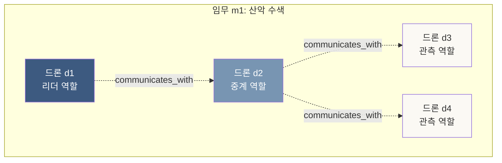
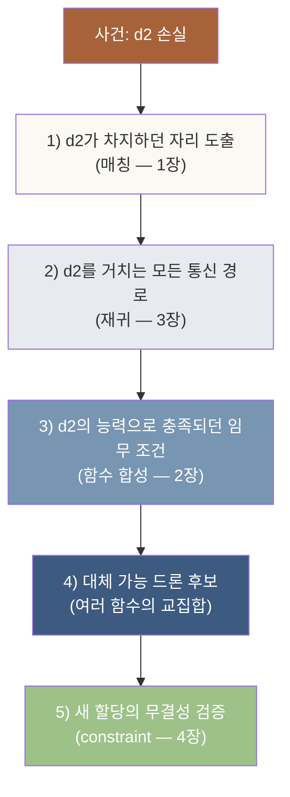
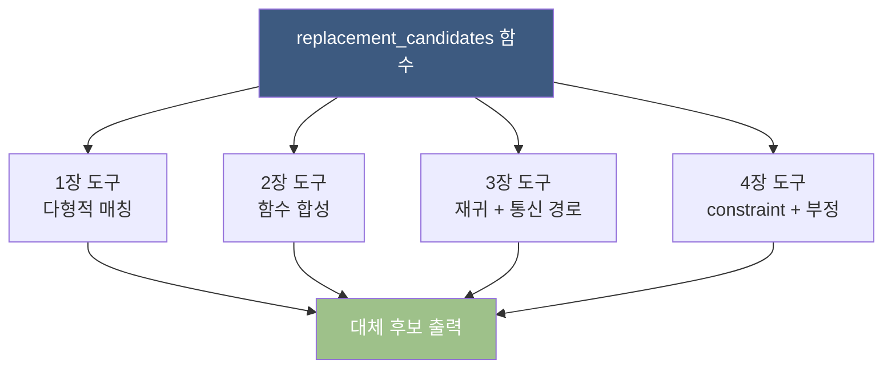
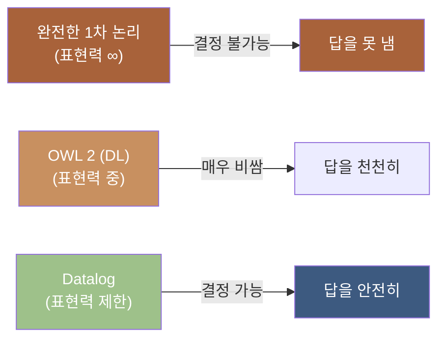
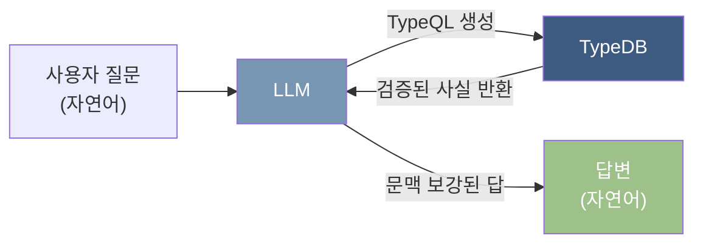
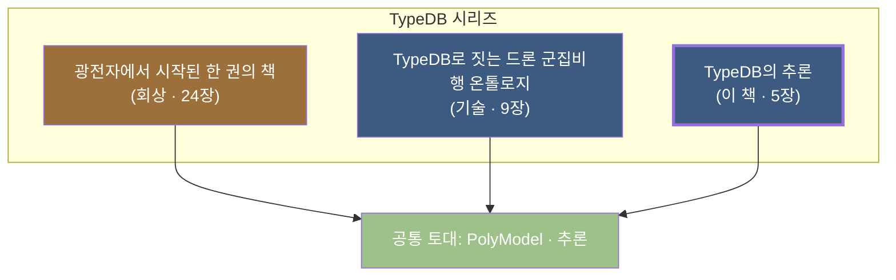
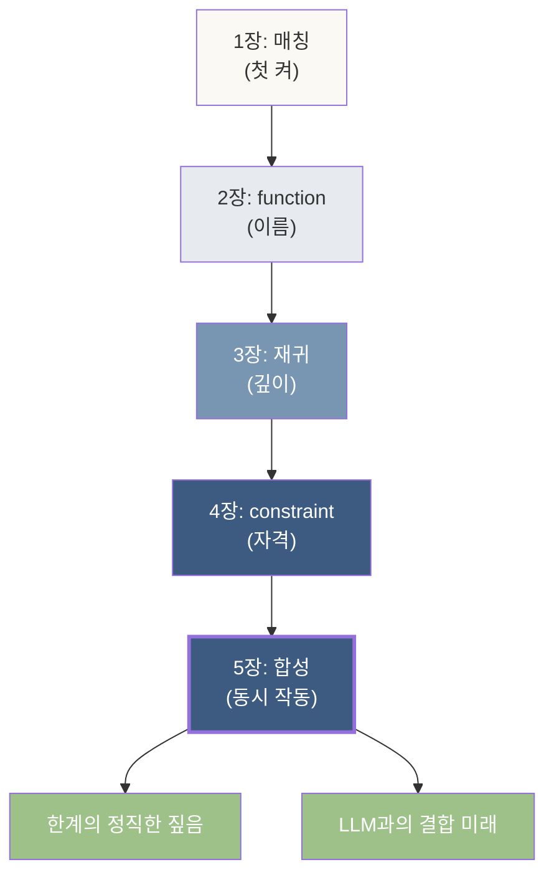

# 5장. 합성 — 네 도구가 한 쿼리에서 동시에 작동하는 자리

> *지금까지의 네 장이 — 한 쿼리 안에서 동시에 들이쉬는 자리. 그리고 추론의 한계를 정직하게 짚는 자리.*

---

## 5.0 이 장이 답하는 질문

이 장이 풀어내는 두 질문은 이것이다.

> **첫째: 1~4장의 네 도구가 — 한 도메인 안에서 *동시에* 작동하는 모양은 어떻게 생겼는가?**
>
> **둘째: TypeDB의 추론에는 — 어디까지가 *작동의 자리*이고, 어디부터가 *침묵의 자리*인가?**

5장은 — 시리즈의 *완결편*이다. 자매 책 *드론 책 8장의 손실 시나리오*를 *추론의 관점*에서 다시 보고, *추론의 한계*를 짚고, *LLM과의 결합 미래*까지 본다.

---

## 5.1 들어가며 — 한 쿼리의 두께

지금까지 — 네 도구를 하나씩 익혔다.

| 장 | 도구 | 자리 |
|---|---|---|
| 1장 | `sub` · `plays` (매칭) | 적힌 사실의 자동 펼침 |
| 2장 | `fun` (함수) | 매칭에 이름 붙이기 |
| 3장 | 재귀 | 깊이를 모르는 추론 |
| 4장 | `@card` 등 (constraint) | 사실의 자격 정하기 |

각각이 — *서로 다른 추론의 켜*. 그러나 *실전 도메인*에서는 — 이 네 가지가 *한 쿼리 안에서 동시에* 작동한다.

이 자리를 — *드론 군집비행 도메인*에서 본다. 자매 책 *드론 책*에서 도메인은 이미 짜였다. 이 장은 — *그 도메인이 추론적으로 어떻게 작동하는가*를 짚는 자리.

---

## 5.2 도메인 회수 — 드론 군집비행

자매 책 *드론 책 5장*의 스키마를 — 가장 단순한 모양으로 회수한다.

### 스키마 요약

```typeql
define
  # === 분류 (1장의 자리) ===
  entity vehicle;
  entity drone sub vehicle;
  entity quadcopter sub drone;
  entity fixed_wing sub drone;
  entity hybrid     sub drone;

  # === 능력 분류 ===
  entity capability;
  entity sensing       sub capability;
  entity communication sub capability;
  entity propulsion    sub capability;

  # === 임무 분류 ===
  entity mission;
  entity surveillance      sub mission;
  entity search_and_rescue sub mission;
  entity delivery          sub mission;

  # === N항 관계 + constraint (4장의 자리) ===
  relation assigned_to,
    relates assigned_drone   @card(1..1),
    relates target_mission   @card(1..1),
    relates assigned_role    @card(1..1),
    owns assignment_start_time @card(1..1),
    owns assignment_end_time   @card(0..1);

  relation has_capability,
    relates capable_drone   @card(1..1),
    relates capability_type @card(1..1),
    owns capability_grade   @card(1..1);

  relation communicates_with,
    relates link_endpoint @card(2..2),     ← 정확히 두 드론
    owns link_quality     @card(1..1);

  attribute capability_grade, value long @range(1..5);
  attribute link_quality, value double @range(0.0..1.0);

  # === 역할 ===
  entity role;
  entity leader_role   sub role;
  entity observer_role sub role;
  entity relay_role    sub role;
```

이 스키마 안에 — *네 장의 도구가 모두 들어 있다*.

- *분류*: `vehicle → drone → quadcopter` 같은 sub 계층 (1장)
- *N항 관계*: `assigned_to`의 세 자리 + 두 속성 (1장 + 5장)
- *constraint*: `@card`, `@range` (4장)
- *재귀의 자리*: `communicates_with`의 그래프 (3장)

함수는 — *데이터 위에서* 작동하기 시작한다.

### 데이터 — 12대 드론, 1개 임무

```typeql
insert
  # 12대 드론 (분류는 다양)
  $d1 isa quadcopter;
  $d2 isa quadcopter;
  $d3 isa fixed_wing;
  ...
  $d12 isa hybrid;

  # 1개 임무
  $m1 isa search_and_rescue;

  # 3가지 역할 인스턴스
  $r_lead     isa leader_role;
  $r_obs      isa observer_role;
  $r_relay    isa relay_role;

  # 12대를 임무에 할당
  (assigned_drone: $d1, target_mission: $m1, assigned_role: $r_lead)
    isa assigned_to, has assignment_start_time "2024-06-01T08:00";
  (assigned_drone: $d2, target_mission: $m1, assigned_role: $r_relay)
    isa assigned_to, has assignment_start_time "2024-06-01T08:00";
  ...

  # 능력 — 각 드론이 1~3가지 능력
  $cap_night_camera   isa sensing;
  $cap_thermal        isa sensing;
  $cap_mesh_radio     isa communication;

  (capable_drone: $d1, capability_type: $cap_night_camera)
    isa has_capability, has capability_grade 4;
  ...

  # 통신 토폴로지 — 메시 그래프
  (link_endpoint: $d1, link_endpoint: $d2) isa communicates_with,
    has link_quality 0.92;
  (link_endpoint: $d2, link_endpoint: $d3) isa communicates_with,
    has link_quality 0.81;
  ...
```

자세한 데이터는 — *드론 책 6장*에 있다. 여기서는 *추론의 관점*에 집중한다.



---

## 5.3 손실 시나리오 — 추론으로 풀어 보기

자매 책 *드론 책 8장*의 시나리오를 — 5개 켜의 *추론 시퀀스*로 본다.

### 사건

```
시점: 2024-06-01T08:42
사건: 드론 d2 (중계 역할)가 통신 두절
원인: 배터리 급강하
```

이 한 사건이 — *시스템에 어떤 추론을 요구하는가*.

### 추론 시퀀스



각 켜를 — 함수로 풀어 본다.

### 켜 1 — d2가 차지하던 자리

```typeql
match
  $d2 isa drone, has drone_id "D-002";
  (assigned_drone: $d2,
   target_mission: $m,
   assigned_role: $r) isa assigned_to;
fetch $m, $r;
```

답: *임무 m1, 중계 역할*.

이 줄에서 — *1장의 매칭*이 작동했다. `$d2 isa drone`이 — `drone` 트리 아래의 모든 자식 (`quadcopter`, `hybrid`, …)을 잡는 자리.

### 켜 2 — d2를 거치는 모든 통신 경로

```typeql
fun connected_through($via: drone) -> { (drone, drone) }:
  match
    (link_endpoint: $a, link_endpoint: $via) isa communicates_with;
    (link_endpoint: $via, link_endpoint: $b) isa communicates_with;
    $a != $b;
  return { ($a, $b) };
```

답: *d1↔d3, d1↔d4, d3↔d4 ...* — d2를 *중간 노드*로 가지는 모든 경로.

이 함수는 — *재귀가 아닌 직접 매칭*. 깊이 1의 통과 경로만. 더 깊은 경로는:

```typeql
fun all_paths_through($via: drone) -> { (drone, drone) }:
  match
    let ($a, $b) in connected_through($via);
  return { ($a, $b) };
  or
  match
    (link_endpoint: $a, link_endpoint: $via) isa communicates_with;
    let ($via, $b) in all_paths_through($via);
  return { ($a, $b) };
```

*3장의 재귀*가 작동한 자리. d2가 *깊은 중계 체인*의 중간에 있다면 — 그 모든 체인이 잡힌다.

### 켜 3 — d2의 능력 충족 조건

```typeql
fun capabilities_of($d: drone) -> { capability }:
  match
    (capable_drone: $d, capability_type: $c) isa has_capability;
  return { $c };
```

답: d2의 능력 — *mesh_radio (등급 5), night_camera (등급 3), thermal (등급 4)*.

이 능력들이 — *어느 임무의 어느 자리*에서 *필요했는가*를 묻는 다음 함수:

```typeql
fun missions_requiring($c: capability) -> { mission }:
  match
    (capable_drone: $d, capability_type: $c) isa has_capability;
    (assigned_drone: $d, target_mission: $m, assigned_role: $r) isa assigned_to;
  return { $m };
```

함수 두 개의 — *합성*. *2장의 합성*의 자리.

### 켜 4 — 대체 가능 드론

가장 무거운 자리. *세 가지 조건의 교집합*.

```typeql
fun replacement_candidates($lost: drone) -> { drone }:
  match
    # 조건 1: 같은 임무에 아직 할당되지 않은 다른 드론
    $other isa drone;
    $other != $lost;
    not { (assigned_drone: $other) isa assigned_to; };

    # 조건 2: lost와 같은 능력을 *충분한 등급*으로 가짐
    let $cap in capabilities_of($lost);
    (capable_drone: $other, capability_type: $cap) isa has_capability,
      has capability_grade $g;
    $g >= 3;

    # 조건 3: 통신 가능 (직접 또는 재귀)
    (link_endpoint: $other, link_endpoint: $other_neighbor)
      isa communicates_with;
  return { $other };
```

이 한 함수 안에 — **네 도구가 모두 들어 있다**.

| 줄 | 작동하는 도구 |
|---|---|
| `$other isa drone` | 1장 — 다형적 매칭 (모든 드론 자식 잡음) |
| `let $cap in capabilities_of($lost)` | 2장 — 함수 합성 |
| `capability_grade $g; $g >= 3` | 4장의 친척 — 조건 필터링 |
| `not { ... }` | 4장 — 부정 (CWA 위에서 작동) |

### 켜 5 — 새 할당의 무결성

대체 드론이 결정되면 — 새 `assigned_to` 인스턴스가 입력된다.

```typeql
insert
  (assigned_drone: $new_drone,
   target_mission: $m1,
   assigned_role: $r_relay) isa assigned_to,
   has assignment_start_time "2024-06-01T08:45";
```

이 입력이 — *constraint를 통과한다*.

- `assigned_drone @card(1..1)`: 한 명만 ✓
- `target_mission @card(1..1)`: 한 임무만 ✓
- `assigned_role @card(1..1)`: 한 역할만 ✓
- 시간 형식 검증 ✓

**무결성이 자동으로 확인된 자리**. 만일 우리가 *동시에 두 드론을 같은 자리에 넣으려* 하면 — *4장의 거부 메시지*가 나온다.

### 정리

5장의 함수 하나가 — 네 장의 모든 도구를 *동시에 들이쉰다*. 이게 **합성의 자리**다.



---

## 5.4 추론의 한계 — 시스템이 침묵하는 자리

이제 — *정직한 한 단락*. **TypeDB의 추론이 — 어디서 멈추는가**.

### 한계 1: Closed-world의 자리

4장에서 — *OWA vs CWA*를 짚었다. TypeDB가 *부분적 CWA*의 자리에 있다는 입장. 이게 *추론의 한 한계*다.

#### 예: *d2의 형제*는?

```typeql
match
  $d2 isa drone, has drone_id "D-002";
  (sibling: $d2, sibling: $other) isa drone_siblings;
fetch $other;
```

데이터에 *형제 관계*가 적혀 있지 않으면 — 답은 *빈 집합*. TypeDB는 *"d2에게 형제가 없다"*라고 답한다.

그러나 *실제 세계*에서는 — *d2에게 형제가 있을 수 있고, 단지 데이터에 안 적혔을 뿐*일 수 있다. TypeDB는 — *이 가능성을 모른다*.

이게 — *시맨틱 웹의 OWA*가 답하려던 자리. *RDF/OWL*은 *모른다는 것을 모름*과 *모른다는 것을 앎*을 구분한다. TypeDB는 — 그 자리까지 가지 않는다. **선택의 자리**다.

### 한계 2: 결정 가능성의 자리

*3장의 fixpoint 의미론*은 — *DAG에서만* 보장된다. *순환 데이터*에서는 — 추론이 *발산할 수 있다*.

또, *너무 복잡한 추론*은 — *결정 불가능*할 수 있다. 일반적 *1차 술어 논리*의 추론은 — *튜링 머신의 정지 문제*와 동치. 컴퓨터가 *완전히 풀 수 없는 문제*다.

TypeDB는 — *Datalog의 전통*을 따라, *결정 가능한 영역*에 머문다. 그 대가로 — *완전한 표현력은 포기*한다.



**TypeDB는 — 가장 오른쪽**. *덜 표현하는 대가로 — 답을 약속한다*.

### 한계 3: 성능의 자리

*수십만 개체*가 들어 있는 데이터베이스에서, *깊이 10단계*의 재귀를 부르면 — 응답이 *초 단위로 길어진다*. *수억 개체*면 — *분 단위*도 가능.

TypeDB 3.0이 *Rust로 다시 짠 엔진*은 — 성능을 크게 끌어올렸지만, *데이터의 폭발*에는 한계가 있다.

#### 실전적 자리

이 책의 1~4장에서 짠 도메인은 — *작은 도메인*이다. 실전에서는:

- **인덱스**: 자주 호출되는 함수에 시스템이 자동으로 인덱스
- **캐싱**: 같은 함수 호출 결과를 *기억해두고 재사용*
- **한정 함수**: *깊이 제한* 버전을 별도로 정의 (3장 6절)

이런 기술적 자리는 — *부록 B*와 *TypeDB 공식 문서*가 다룬다.

### 한계 4: 확률적 자리의 침묵

TypeDB는 — *결정적 추론*만 한다. *확률*이라는 도구가 없다.

| 결정적 추론 | 확률적 추론 |
|---|---|
| 사실 ⊢ 결론 (100%) | 사실 ⊨ 결론 (P=0.87) |
| TypeDB의 자리 | LLM·베이지안 네트워크의 자리 |

*"드론 d2가 손실됐을 때 — d5가 대체 후보일 확률은?"* 같은 질문은 — TypeDB가 답하지 않는다. *대체 후보의 집합*은 답하지만, *확률*은 답하지 않는다.

이 자리에 — **추론의 미래**가 있다.

---

## 5.5 추론과 LLM — 결합의 미래

이 책의 *마지막 학술적 짚음*. **결정적 추론과 확률적 추론이 만나는 자리**.

### 두 가지 추론의 자리

| 결정적 추론 | 확률적 추론 |
|---|---|
| 사실에서 사실로 | 데이터에서 패턴으로 |
| 형식 의미론 (Datalog, OWL) | 통계 학습 (LLM) |
| 설명 가능성 ✓ | 설명 가능성 △ |
| 새 도메인 빠른 적응 △ | 새 도메인 빠른 적응 ✓ |
| 정확성 ✓ | 정확성 P% |
| 어휘가 명시적 | 어휘가 암묵적 |

**둘은 — 대체재가 아니라 보완재**다. 도메인의 *무거운 작업*은 — 두 가지를 같이 써야 풀린다.

### 결합의 세 가지 자리

#### 자리 1: LLM이 자연어 → 매듭으로

```
사용자: "드론 d2가 손실됐는데, 같은 임무에서 대체할 수 있는
        야간 광학 능력의 드론은?"

↓ (LLM)

TypeQL:
match
  let $cands in replacement_candidates($d2);
  (capable_drone: $cands, capability_type: $night_cam) isa has_capability;
fetch $cands;
```

LLM이 — *자연어를 추론 함수의 호출로 변환*하는 자리. *지식 그래프의 진입로*.

#### 자리 2: TypeDB가 LLM의 외부 메모리로

LLM은 *환각(hallucination)*을 한다. 그러나 *TypeDB의 검증된 사실*을 — *문맥으로* 받으면, 환각이 *크게 줄어든다*. 이게 — *RAG (Retrieval-Augmented Generation)*의 자리.



#### 자리 3: TypeDB의 결과를 LLM이 해석

TypeDB가 *대체 후보 5명*을 반환했을 때, *왜 이 다섯이 후보가 됐는가*를 — LLM이 *자연어로 설명*하는 자리. **설명 가능한 AI**의 한 모양.

### 산업의 흐름

2025년 시점 — 이 결합은 *연구의 자리*에서 *산업의 자리*로 이동 중이다.

- *Anthropic의 MCP (Model Context Protocol)* — LLM과 외부 도구의 표준 인터페이스
- *Microsoft의 Graph RAG* — 지식 그래프 위의 LLM
- *Vaticle (TypeDB 개발사)의 LangChain·LlamaIndex 통합*

자매 책 두 권의 도메인 — *반도체 분석*과 *드론 군집비행* — 모두 이 자리의 직접 응용처다.

---

## 5.6 시리즈의 자리 — 세 권이 한 그림이 되는 자리

이 책이 시리즈의 *완결편*임을 — 한 그림으로 정리한다.



### 세 권의 다른 호흡

| 책 | 호흡 | 자리 |
|---|---|---|
| *광전자 책* | 회상 · 에세이 | 분석가의 머릿속에서 작동하는 추론 |
| *드론 책* | 기술서 · 도메인 사이클 | 한 도메인의 전체 작동 |
| *이 책* | 심화서 · 개념 깊이 | 추론이라는 단어의 정확한 무게 |

세 권이 — **같은 도구의 세 얼굴**. 어느 책부터 들어와도, *나머지 두 권*이 자연스럽게 이어진다.

### 읽기 순서의 제안

- **추론 자체를 손에 잡고 싶다면**: 이 책 → 드론 책 → 광전자 책
- **도메인에서 손에 잡고 싶다면**: 드론 책 → 이 책 → 광전자 책
- **분석가의 시점에서 들어오고 싶다면**: 광전자 책 → 드론 책 → 이 책

세 길이 — 모두 같은 자리에 도착한다.

---

## 5.7 ◇ 5장 정리 — 손에 들어온 것

이 마지막 장에서 우리는 **네 도구가 — 한 쿼리 안에서 동시에 작동하는 모양**을, 그리고 **TypeDB 추론의 정직한 한계**를 손에 잡았다.

### 손에 잡힌 도구

- **합성의 자리** — 매칭·함수·재귀·constraint가 한 함수에서 동시에 작동
- **드론 손실 시나리오** — 5개 켜로 풀어지는 실전 추론
- **추론의 4가지 한계**
  - Closed-world의 자리
  - 결정 가능성의 자리
  - 성능의 자리
  - 확률적 자리의 침묵
- **LLM과의 결합** — 결정적 추론과 확률적 추론의 보완

### 손에 잡힌 사고



---

## 5.8 책의 마지막 한 단락

이 책을 시작할 때 — 한 줄을 던졌다.

> *데이터베이스가 답하는 것은 — 적힌 것에 멈추지 않는다. 적힌 것에서 도출되는 것까지다.*

이 한 줄을 — 다섯 장에 걸쳐 풀어내는 책이었다.

1장에서 — *매칭이 이미 추론*임을 보았다.
2장에서 — *함수가 매칭에 이름과 합성을 주는 자리*를 보았다.
3장에서 — *재귀가 깊이를 모르는 추론*임을 보았다.
4장에서 — *constraint가 사실의 자격을 정하는 자리*를 보았다.
5장에서 — *네 도구가 동시에 작동하는 자리*를 보았다.

그리고 — *시스템이 침묵하는 자리*도 정직하게 짚었다.


이 흐름이 — TypeDB의 추론이다. *수사*가 아니라 *작동하는 도구*. *추상적 학문*이 아니라 *코드 한 줄*. 다섯 장이 — 그 자리를 손에 잡게 한다면, 이 책은 자기 할 일을 한 것이다.

---

> ***다음 발걸음***
>
> - **자매 책 두 권으로**: *드론 책*에서 한 도메인의 작동을, *광전자 책*에서 분석가의 시점을 본다
> - **부록 B**: Datalog에서 PolyModel까지의 학술 자료
> - **TypeDB 공식 문서**: typedb.com/docs
> - **자기 도메인으로**: 가장 친숙한 도메인에 — 이 책의 5장을 그대로 적용

---

## 5.9 ◇ 시리즈 완결 연습 — 합성

다음을 *5장의 도구로 짜 보라*. 자매 책 두 권을 참고할 수 있다.

```
도메인: 한 회사의 프로젝트 할당

스키마 (요약):
- entity employee, owns skill
- entity project, owns deadline, owns status
- relation assigned, relates worker, relates target_project, relates project_role
  with @card(1..1) on worker, @card(1..1) on target_project
- entity skill — 분류 (programming, design, management, ...)
- relation depends_on (project → project)

함수를 짜라:
1. all_skills_required($p: project) -> { skill }
   — 한 프로젝트의 모든 필요 기술 (직접 + 의존 프로젝트의)
2. employees_for($p: project) -> { employee }
   — 한 프로젝트에 적합한 모든 직원 (필요 기술을 모두 보유)
3. critical_path_employees($p: project) -> { employee }
   — 한 프로젝트와 그 모든 의존 프로젝트에 *동시에 필요한* 직원

세 함수가 — 다섯 장의 도구를 모두 동원해야 한다.
```

이 연습이 손에 잡히면 — *책 한 권을 손에 닫고, 자기 도메인을 짤 준비가 된 것*이다.

---

## **F I N**

> *적힌 것에서 — 도출되는 것까지.*
> *기계가 — 우리의 약속을 함께 짚어주는 자리.*
> *이게 — TypeDB가 자리잡은 한 지점.*

이 책의 자매 두 권 *광전자 책*과 *드론 책*이, 한 도메인에서 — 같은 추론을 보인다. 상단 탭에서 옮겨가 본다.

— *끝.*
